# ARM汇编基础

ARM(用户模式)
 寄存器的使用必须满足下面的规则:
 (1)函数间通过寄存器 R0~R3 来传递参数，低于 32 位的函数返回值存于 R0。
 (2)在函数中，使用寄存器 R4~R11 来保存局部变量。函数进入时必须保存所用到的局部变量寄存器的值，在返回前必须恢复这些 寄存器的值;对于函数中没有用到的寄存器则不必进行这些操作。在 Thumb 中，通常只能使用寄存器 R4~R7 来保存局部变量。

(3)寄存器 R12 ：用作函数间的scratch寄存器，记做IP
 (4)寄存器 R13：用作数据栈指针，记做SP。函数调用前后必须保持堆栈平衡。
 (5)寄存器 R14：称为链接寄存器，记做LR. 它用作保存函数的返回地址。如果在函数里面保存了返回地址，寄存器R4则可以用作其他用途。
 (6)寄存器 R15 是程序计数器，记作 PC。

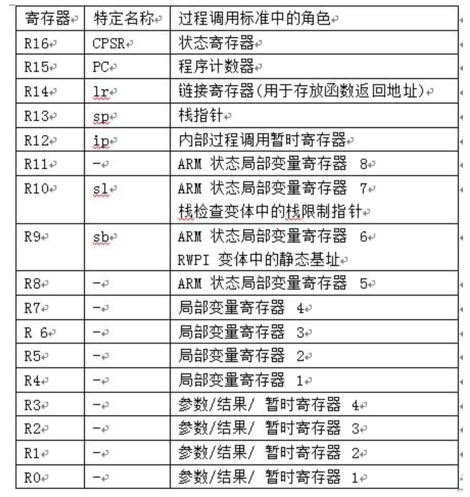

R12,R13,R14,R15,R16  就很重要...

## 函数调用

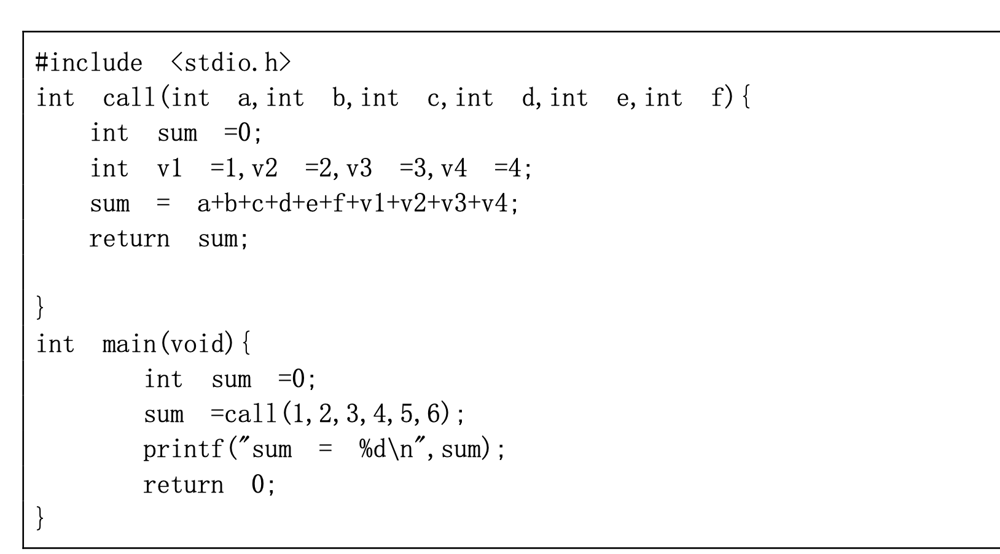

一般采用 B 系列指令执行函数的跳转执行，其中 BL 指令将返回地址存储于 LR 寄存器，BLX 指令除了地址存储于 LR 寄存器，还对 要执行的指令进行判断(ARM or Thumb)。 在参数传递时，将所有参数看作是存放在连续的内存单元中的字数据。然后，依次将各字数据传送到寄存器 R0~R3 中，如果参数多 于 4 个，则通过栈进行存储，入栈的顺序与参数顺序相反，即最后一个字数据先入栈。

局部变量可以存储在寄存器中，也可以有栈来分配。
 函数执行完后,若结果 32 位的整数时，可以通过寄存器返回(一般使用 R0)。 64 位整数时，可以通过寄存器 R0 和 R1 返回，依 次类推(不含浮点运算结果)。最后将之前保存的函数地址赋予到 PC(可以是 LR，也可以是其他寄存器)。

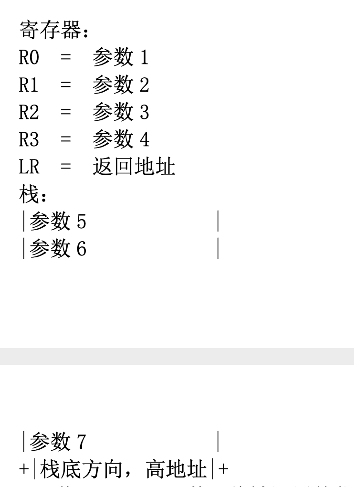

ARM进行函数内压栈和出栈往往使用如下的语句：
 stmfd sp!, {r0-r9, lr}  ; 满递减入栈,给寄存器r0-r9,lr压栈,sp不断减4
 ldmfd sp!, {r0-r9, pc}  ; 满递减出栈,给寄存器r0-r9出栈，并使程序跳转回函数的调用点,sp不断增4

常用的函数内外跳转指令有mov和BL，ARM有两种跳转方式：
 （1）mov pc, <跳转地址〉
  这种向程序计数器PC直接写跳转地址，能在4GB连续空间内任意跳转。
 （2）通过 B BL BLX BX 可以完成在当前指令向前或者向后32MB的地址空间的跳转（为什么是32MB呢？寄存器是32位的，此时的值是24位有符号数，所以32MB？后面再查查看）。B是最简单的跳转指令。要注意的是，跳转指令的实际值不是绝对地址，而是相对地址——是相对当前PC值的一个偏移量，它的值由汇编器计算得出。BL很常用,它在跳转之前会在寄存器LR(R14)中保存PC的当前内容。


## arm汇编语法

在Arm汇编里面，立即数的前面必须加上#  ，比如#100就是代表立即数100.

STR指令的格式为：
STR{条件}  源寄存器，<存储器地址>
STR指令用亍从源寄存器中将一个32位的字数据传送到存储器中。该指令在程序设计中比较常
用，寻址方式灵活多样，使用方式可参考指令LDR。

指令示例：
STR R0，[R1]，＃8       ；将R0中的字数据写入以R1为地址的存储器中，并将新地址R1＋8写入R1。

STR R0，[R1，＃8]!       ；将R0中的字数据写入以R1＋8为地址的存储器中。”

str   r1, [r0]            ；将r1寄存器的值，传送到地址值为r0的（存储器）内存中

mov的用法

在ARM体系中，mov只能用于数据在寄存器之间的移动或者往寄存器中写入立即数。格式如下：**mov{条件}{s} 目的寄存器，源操作数**

```s
MOV     R1,R2    ;R1=R2
```

ldr：
当第二个操作数前面没有“=”时，表示内存访问指令，从内存中读取4Byte数据到寄存器，语法格式如下：
ldr{条件} 目的寄存器， 存储器地址
如果第二个操作数前面有“=”，表示大范围地址读取伪指令，用于加载32位的立即数或一个地址到指定寄存器，语法格式如下：
ldr 目的寄存器， =32位立即数/地址

**LDM**：L的含义仍然是LOAD，即是Load from memory into register。

虽然貌似是LDR的升级，但是，千万要注意，这个指令运行的方向和LDR是不一样的，是从左到右运行的。该指令是将内存中堆栈内的数据，批量的赋值给寄存器，即是出栈操作；其中堆栈指针一般对应于SP，注意SP是寄存器R13，实际用到的却是R13中的内存地址，只是该指令没有写为[R13]，同时，LDM指令中寄存器和内存地址的位置相对于前面两条指令改变了，下面的例子：

LDMFD   SP! ,  {R0, R1, R2}

实际上可以理解为：  LDMFD   [SP]!,  {R0, R1, R2}

意思为：把sp指向的3个连续地址段（应该是3*4=12字节（因为为r0,r1,r2都是32位））中的数据拷贝到r0,r1,r2这3个寄存器中去

LDMFD   SP! ,  {R1- R7} 寄存器R1-R7


数据处理指令有：

**MOV、ADD、ADDS、ADC、SUB、**

**SUBS、SBC、RSB、MUL、AND、**

**ORR、EOR、BIC、CMP、TST、**

**TEQ、LSL、LSR、ASR、RORV**

**数据处理指令语法**

```html
<操作{<cond>}{S}> <Rd>, <Rn>, <Operand2>
<操作码> <目标寄存器Rd> <第一操作寄存器Rn> <第二操作数Operand2>
```

**加法指令 ADD**

```
;加法指令执行时，若没有进位 CPSR 'C' 位置 0
mov r0, #1
mov r1, #1
add r2, r1, r0　　;r2 = r1 + r0
```

## Arm下的系统调用

 在 ARM 架构上，所有的系统调用都是通过 SWI 软中断来实现的，指令如下:
 SWI{cond} immed_24，具体的调用号存放在寄存器 R7 中，调用函数的参数和之前提到的传参方式相同。例如:exit(0) MOV R0,#0
 MOV R7,#7
 SWI #0

## arm基本数据类型

-   字(Word):在 ARM 体系结构中，字的长度为 32 位。记得区别于x86，x86里面一个字是16位的。
-   半字(Half-Word):在 ARM 体系结构中，半字的长度为 16 位。
-   字节(Byte):在 ARM 体系结构中，字节的长度为 8 位。

1. ARM 体系结构 V4 以上版本支持所有 3 种数据结构，ARMv4 以前版本仅支持字节和字。

2. 当将这些数据类型中的任一种声明为 unsigned 类型时，
    N 位数据值表示范围为 0~2N次方 -1 的非负整数，使用通常的二进制格式。

3. 当将这些数据类型的任一种声明为 signed 类型时，


    N 位数据值表示范围为-2N次方~2N次方-1 的整数，使用二进制的补码格式

4. 所有数据操作(如 ADD)以字进行处理。

5. 加载和存储操作可以按照字节、半字和字的大小向(和从)存储器传送数据。

   加载时自动进行字节或半字的零扩展或符号扩展。

6. ARM 指令恰好是一个字(与 4 字节边界对齐)。Thumb 指令恰好是一个半字(与 2 字节边界对齐)。

# ARM处理器编程模型

## arm处理器工作状态

从编程的角度看，ARM 微处理器的工作状态一般有两种，并可在两种状态之间切换:

-   第一种为 ARM 状态，此时处理器执行 32 位的字对齐的 ARM 指令。
-   第二种为 Thumb 状态，此时处理器执行 16 位的半字对齐的 Thumb 指令。

当 ARM 处理器执行 32 位的 ARM 指令集时，工作在 ARM 状态;当 ARM 处理器执行 16 位的 Thumb 指令时， 工作在 Thumb 状态。在程序的执行过程中，处理器可以随时通过指令在两种工作状态之间切换， 而且处理器工作状态的转变并不影响处理器的工作模式和相应寄存器中的内容。
 但 ARM 处理器在开始执行代码时，应该处于 ARM 状态。

ARM 处理器进入两种工作状态的方式为:

-   进入 Thumb 状态。当操作数寄存器的状态位(位[0])为 1 时，可通过执行 BX 指令使处理器从 ARM 状态切换到 Thumb 状态。 如果处理器在 Thumb 状态进入异常，
   则当异常处理(IRQ、FIQ、Undef、Abort 和 SWI)返回时，自动转换到 Thumb 状态。
-   进入 ARM 状态。当操作数寄存器的状态位(位[0])为 1 时，可通过执行 BX 指令使处理器从 Thumb 状态切换到 ARM 状态。 另外，在处理器进行异常处理(IRQ、FIQ、Undef、Abort 和 SWI)时，
   把 PC 放入异常模式连接寄存器中，并从异常向量地址开始执行程序，也可进入 ARM 状态。

## arm处理器模式

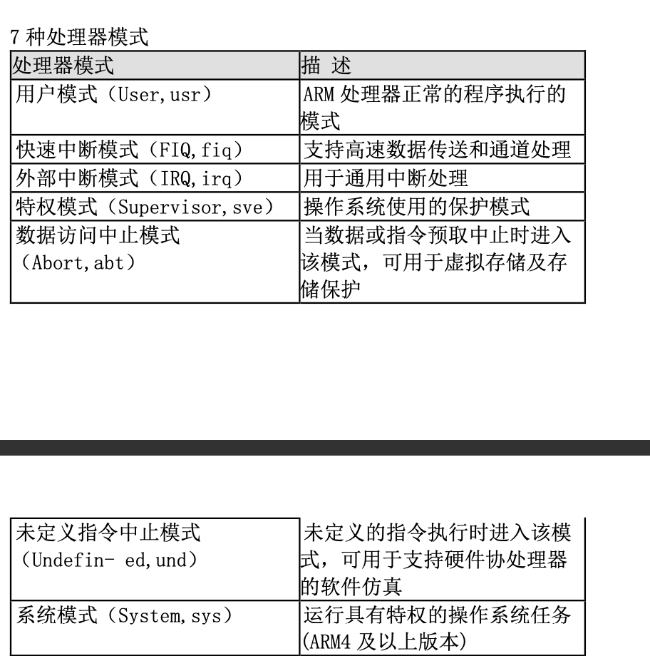

ARM处理器模式可以通过软件改变，此外，外部中断或者异常处理也可以引起处理器模式发生改变。

大多数应用程序运行用户模式下，当处理器工作在用户模式的时候，正在执行的程序不能访问某些被操作系统保护的资源，也不能直接改变工作模式，除非异常发生。这种体系结构可以使操作系统控制整个系统资源的使用。

除用户模式外，其他6种模式统称为“特权模式”，这些模式里面，程序可以自由的访问系统资源和改变处理器模式。

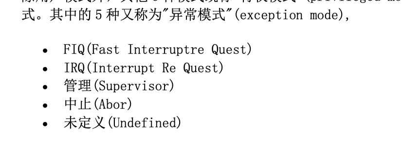

1. 当特定的异常出现时，进入相应的异常模式。每一种异常模式下都有某些专用的寄存器提供给异常处理程序使用，以避免异常出现 时用户模式的状态不可靠。

2. 系统模式，仅 ARM4 及以上版本有该模式。不能由于任何异常而进入该模式。它与用户模式有完全相同的寄存器，然而它属于特权 模式，不受用户模式的限制。它供需要访问系统资源的操作系统任务使用，但避免使用与异常模式有关的附加寄存器。这样就能够 保证当任何异常出现时，都不会使任务的状态变得不可靠。

## ARM寄存器

ARM 处理器共有 37 个 32 位寄存器，其中 31 个为通用寄存，6 个为状态寄存器。

-   31 个通用寄存器，包括 1 个程序计数器(PC)和 30 个通用寄存器。
-   6 个状态寄存器。包括 1 个 CPSR 和 5 个 SPSR，这些寄存器都是 32 位的，但只使用了其中的 12 位。

值得注意的是，这些寄存器不能被同时访问，具体哪些寄存器是可编程访问的，取决于处理器的工作状态及具体的运行模式。然而 在任何时候，通用寄存器 R0~R14、程序计数器、一个或两个状态寄存器都是可访问的。 如果将所有的寄存器划分成部分重叠的组，那么每种处理器模式使用不同的寄存器组以图 3.1 所示。在任何时候，15 个通用寄存 器(R0~R14)、1 或 2 个状态寄存器和程序计数器都是可见的。图 3.1 的每列都是在对应的处理器模式下可见的寄存器，具体功能分 述如下。

寄存器 R0-R7 对于所有 CPU 模式都是相同的，它们不会被分块。

对于所有的特权 CPU 模式，除了系统 CPU 模式之外，R13 和 R14 都是分块的。也就是说，每个因为一个异常(exception)而可以 进入模式，有其自己的 R13 和 R14。这些寄存器通常分别包含堆栈指针和函数调用的返回地址。

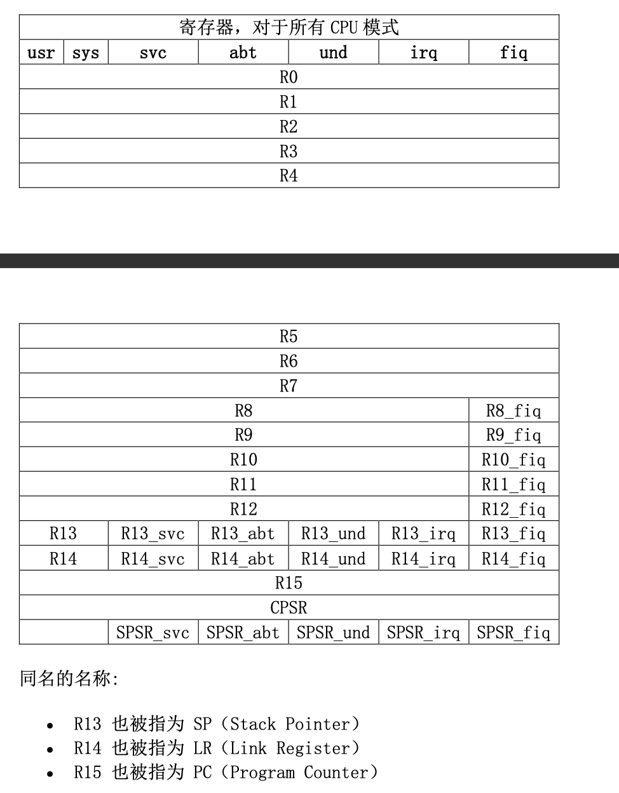

## 通用寄存器

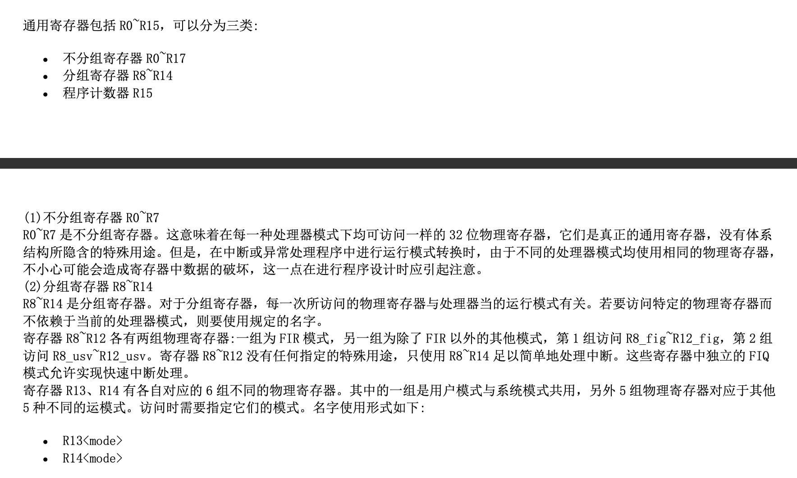

### 重要寄存器：

R13 ---》 SP 堆栈指针

1. 每种异常模式都有自己的分组 R13，通常 R13 在初始化时被指向该异常运行模式所分配的 堆栈空间。这样，在入口处，异常处理程序可将用到的其他寄存器的值保存到堆栈中。返回时，重新将这些值加载到寄存器。这种 异常处理方法保证了异常出现后不会导致执行程序的状态不可靠。

R14 程序链接寄存器，连接寄存器LR，当自带执行连接分支BL指令的时候，相应的分组寄存器都将用来保存R15的返回值。

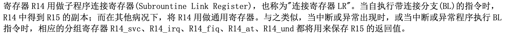

在每种模式下，相应的R14用于保存程序的返回地址。当用BL或BLX指令完成子程序调用时，将R14设置成子程序返回地址。当将R14复制回程序指针PC时，即子程序返回。

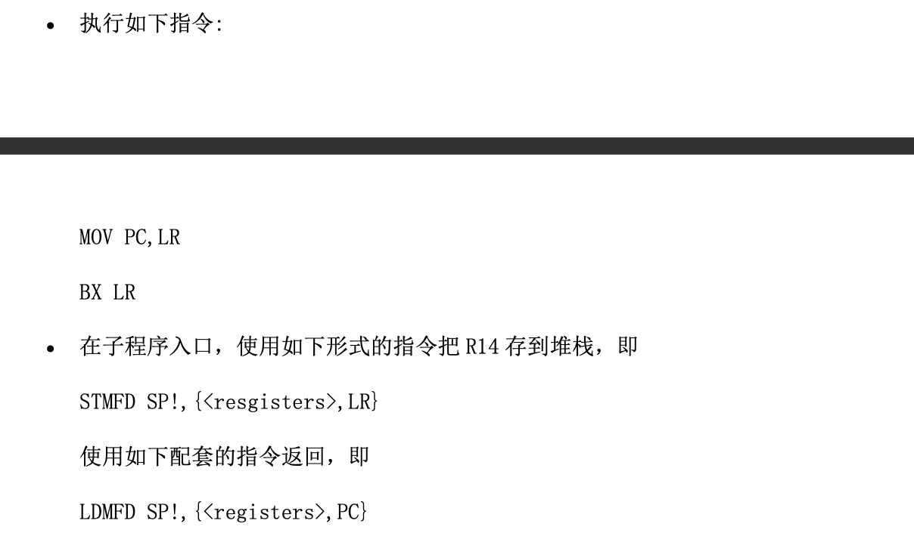

# 举个栗子：

一个音乐app：

我们可以先用burp 抓包，一般比较大的apk工具的话，我们都难以直接逆向到有用信息，所以的话，我们要先测试其功能，对需要逆向的功能进行逆向（这跟ctf逆向关键算法是一个道理），比如下载功能:

1. 我们进行下载的时候可以抓到下载的url
2. apk文件放入androidkiller 进行逆向，搜索字符串url：

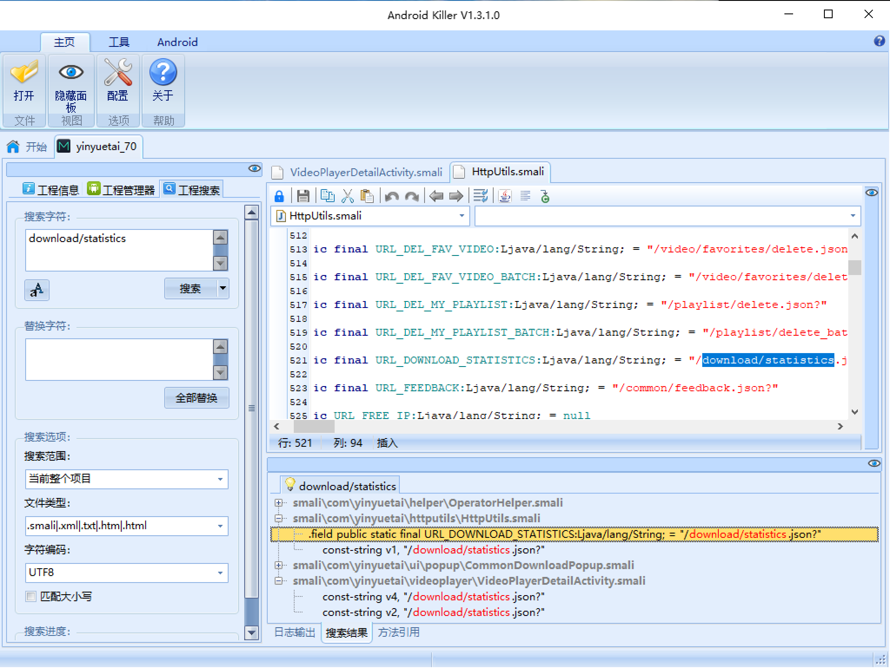

3. httputils猜测可能是http请求都通过这个包进行操作。
4. 但是音悦台这个app坏掉了，
5. 所以我们直接分析里面很重要的下载时的加密算法，方便我们理解arm汇编，因为我们就是为了汇编来的
6. 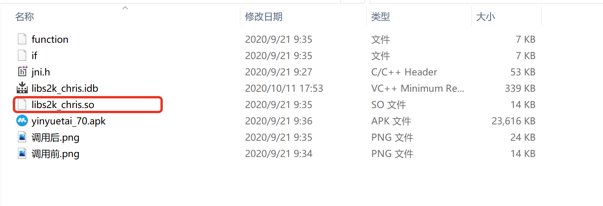
7. 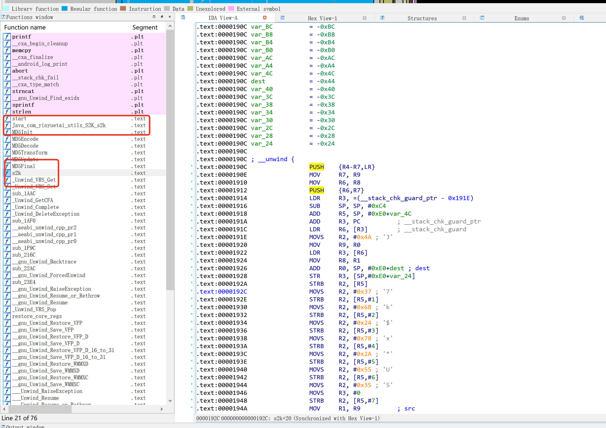
8. ida打开我们可以看到两个函数，一般先看java的那一个，可以看到一串输入被当做参数给了s2函数，
9. 分析s2函数：md5加密，加上一串字符的左边6位。


