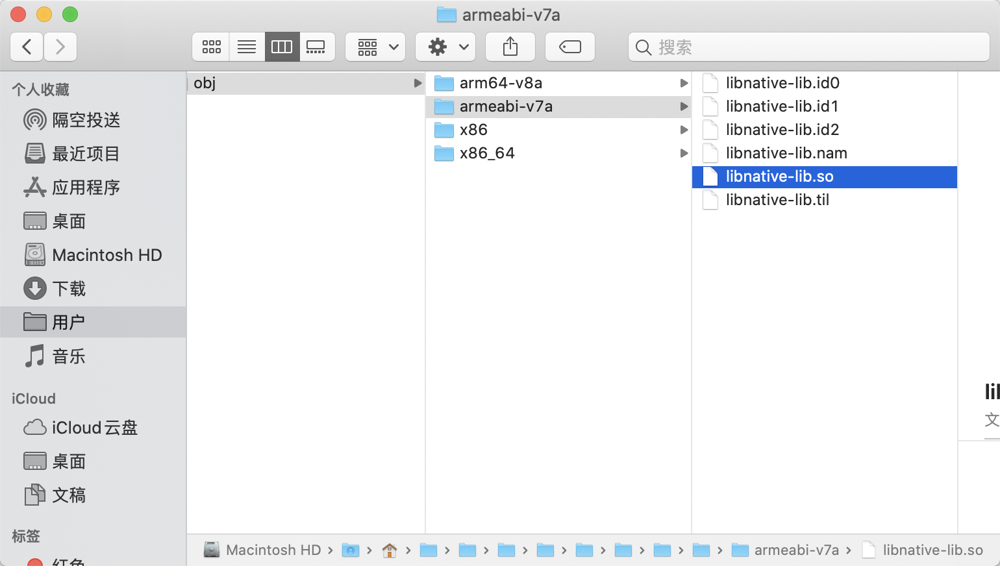
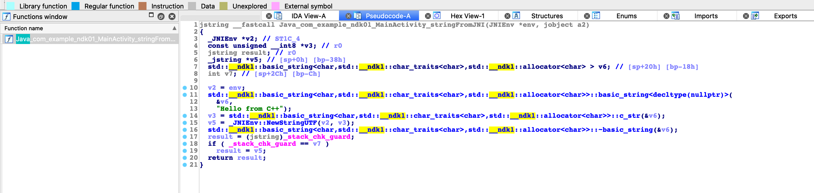
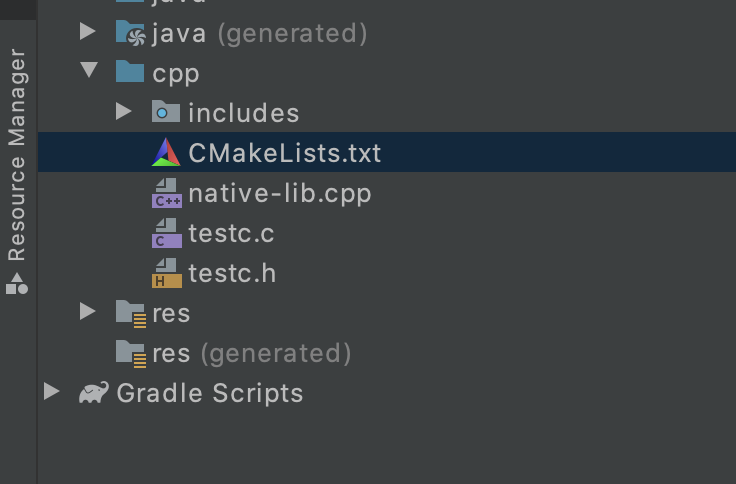
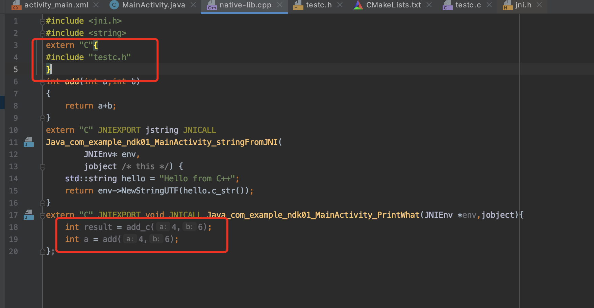
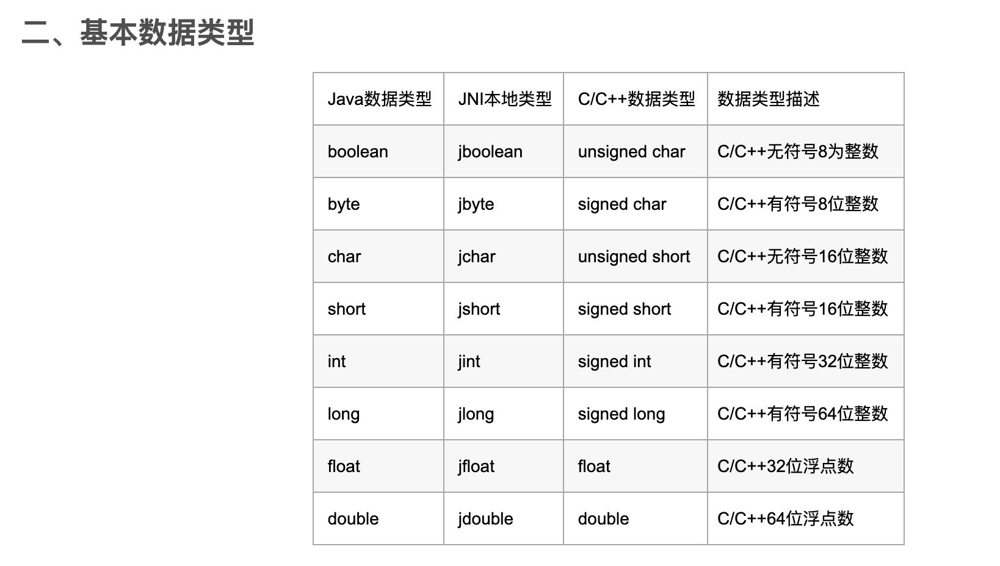

# AndroidSecurity-NKD

## JNI概述

jni是java本地接口，从java1.1开始，它允许java代码和其他语言写的代码进行交互。jni一开始是为本地编译语言，尤其是为C和C++设计。

但是jni不是android特有的，Android的Dalvik/ART虚拟机同样支持jni标准。凡是有JVM的地方都支持jni,通过jni我们可以连接java世界和native世界。

注意：jni是桥梁，android的虚拟机才是最后操作者。

## NDK(Native Development Kit)

* 提供一系列工具链，帮助开发C/C++
* 提供API库，Android采用Google Bionic Libc,大部分API一致。
* 可以帮助使用C/C++开发，甚至内嵌汇编

使用NDK开发使得java不再具备夸平台特性,你需要提供相关的ABI,比如类似的.so文件件。

> https://developer.android.com/ndk/guides

下载：

> https://developer.android.com/ndk/downloads?hl=zh-cn

## NDK反编译

我们创建了一个native c++的工程，直接进行编译生成apk，然后把生成的so文件拉入到ida里面进行观察

看其源代码：

~~~java
public class MainActivity extends AppCompatActivity {

    // Used to load the 'native-lib' library on application startup.
    static {
        System.loadLibrary("native-lib"); //加载了相关库文件
    }

    @Override
    protected void onCreate(Bundle savedInstanceState) {
        super.onCreate(savedInstanceState);
        setContentView(R.layout.activity_main);

        // Example of a call to a native method
        TextView tv = findViewById(R.id.sample_text);
        tv.setText(stringFromJNI());
    }

    /**
     * A native method that is implemented by the 'native-lib' native library,
     * which is packaged with this application.
     */
    public native String stringFromJNI();//jni函数
}
~~~

因为native我们知道 stringFromJNI是一个jni函数，其实际定义在so文件内部。

同时看android stdio自己生成的jni函数，在native-lib.cpp内部：

这个函数和之前的native那个stringFromJNI函数是对应的，前面是声明，这里是定义。

~~~c++
extern "C" JNIEXPORT jstring JNICALL
Java_com_example_ndk01_MainActivity_stringFromJNI(
        JNIEnv* env,
        jobject /* this */) {
    std::string hello = "Hello from C++";
    return env->NewStringUTF(hello.c_str());
}
~~~

相关定义：

~~~c
#define JNIIMPORT
#define JNIEXPORT  __attribute__ ((visibility ("default"))) //告诉编译器保留函数名称
#define JNICALL
~~~

> https://www.jianshu.com/p/29eb7b5c8b2d   __attribute__相关
>
> https://blog.csdn.net/fengbingchun/article/details/78898623

libc里面可以看到默认的jni函数，还有我们自己定义的add函数。

## name mangling 符号修饰

C++支持函数重载，编译器在编译C++代码的时候，会对其函数进行name mangling操作，生成一些特定的字符串来帮助辨别函数，如果我们在函数的前面加上extern "C" 那么编译器就会按照C语言的方式对函数进行编译，那么函数名就和自己当初定义的完全相同了，ps:c语言不支持函数重载。

## 函数的定义和声明

在MainActivity.java里面，我们看到了声明：

~~~java
    public native void PrintWhat();
~~~

在native-lib.cpp里面我们看到了定义：

~~~cpp
extern "C" JNIEXPORT void JNICALL Java_com_example_ndk01_MainActivity_PrintWhat(JNIEnv *env,jobject){

};
~~~

> 写定义的时候，我们可以根据android studio里面进行仿写

参数：

我们看android studio里面生成的那个：

~~~java
extern "C" JNIEXPORT jstring JNICALL
Java_com_example_ndk01_MainActivity_stringFromJNI(
        JNIEnv* env,
        jobject /* this */) {
    std::string hello = "Hello from C++";
    return env->NewStringUTF(hello.c_str());
}
~~~

可以看到第一个是一个jni指针（等后续），第二个参数，和当前函数在java类里面的声明的类型有关，非静态函数的话，第二个参数是一个object类型的，当前的activity的实例。

如果是静态的话第二个参数就是一个jclass.

## 导入.c文件

我们实现的.c文件，一定要写入到CMakeLists.txt里面：

~~~c
add_library( # Sets the name of the library.
             native-lib
             # Sets the library as a shared library.
             SHARED
            testc.c
             # Provides a relative path to your source file(s).
             native-lib.cpp )
~~~

同时，.c文件为了避免遭受name mangling操作的影响，我们必须用extern "C" 进行包裹

## jni数据类型

https://blog.csdn.net/afei__/article/details/80899758

