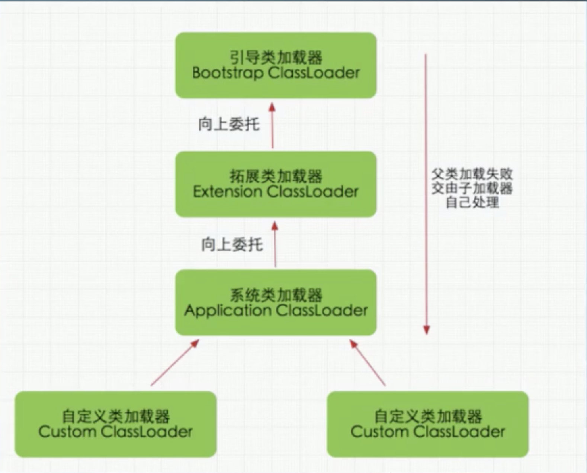
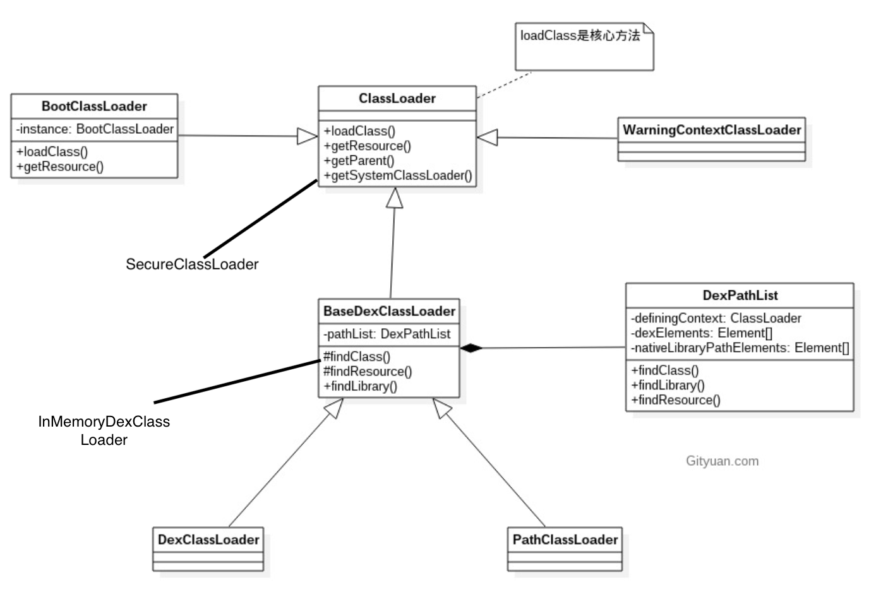

# AndroidSecurity-脱壳1

JVM的类加载器：

* Bootstrap ClassLoader (引导类加载器，C/C++实现)
  * 用于加载指定的JDK的核心类库，如:`java.lang`,`java.uti`等这些系统类。Java虚拟机启动通过Bootstrap,该Classloader在`java`里面无法获取，负责加载/lib下的类。
* Extensions ClassLoader(拓展类加载器)
  * Java里面的实现类是ExtClassLoader,提供了除了系统类之外的额外功能，可以再`java`里面获取，负责加载/lib/ext下的类。
* Application ClassLoader (应用程序加载类加载器)
  * Java中的实现类为AppClassLoader，开发人员的代码默认由其进行加载，ClassLoader.getSystemClassLoader返回的就是它。
* 自定义加载器：我们可以自己通过继承java.lang.ClassLoader类的方式来实现自己的加载器。

加载器的加载顺序：

1. Bootstrap Classloader
2. Extention Classloader
3. AppClassLoader

## 双亲委托

工作原理：如果一个类加载器收到一个加载请求，它并不是自己先加载，它会把这个请求委托给父类的加载器去执行，如果父类还存在其他父类加载器，那么就进一步向上委托，递归请求，最后达到顶层父类进行加载，如果加载成功就返回成功，如果记载失败子加载器才会尝试进行加载。

双亲委派的有点：

* 避免重复加载，如果加载过一次的Class,可以直接读取已经记载的Class
* 安全，无法自定义类来替代系统的类，防止核心API库被随意更改。

## JVM类加载

什么时候才会触发类加载器加载类？

1. 隐式加载：不是开发人员自己加载的。
   1. 创建类的实例
   2. 访问类的静态变量，或者为静态变量赋值
   3. 调用类的静态方法
   4. 使用反射方式来强制创建某个类或者接口对应的java.lang.Class对象。
   5. 初始化某个类的子类。
2. 显示加载（利用API）：
   1. 使用LoadClass() 加载
   2. 使用forName() 加载

JVM类的加载步骤：

1. 装载：查找和导入 Class文件。
2. 链接：
   1. 检查：检查载入的class文件数据的正确性
   2. 准备：给类的静态变量分配存储空间
   3. 解析：将符号引用转成直接引用。
3. 初始化：调用<clinit>函数（编译器自动生成），对静态变量，静态代码块执行初始化工作。

# Android类加载器

Android系统中的ClassLoader是一个抽象类

其中，InMemoryDexClassLoader为Android8.0新引入的ClassLoader

* BootClassLoader 预加载常用了类，单例模式（只加载一次），java实现
* BaseDexClassLoader , 是很多类的父类（看上图），类记载的主要逻辑都在这里。
* SecureClassLoader  权限扩展。
* PathClassLoader 是Android默认使用的加载器，Activity等类就是它加载的。
* InMemoryDexClassLoader的作用就是从内存里面直接加载Dex

写个代码来测试：

~~~java
 public void testClassLoader(){
        ClassLoader classLoader = MainActivity.class.getClassLoader();
        Log.i("classloadertest","this class loader = " + classLoader.toString());
        ClassLoader tmpClassloader = null;
        ClassLoader parentClassloader = classLoader.getParent();
        while (parentClassloader!=null){
            Log.i("newParent","this " + classLoader.toString() + " ----- parent :" + parentClassloader.toString());
            tmpClassloader = parentClassloader.getParent();
            classLoader = parentClassloader;
            parentClassloader = tmpClassloader;
        }
        Log.i("Lastclassloader :",classLoader.toString());
    }
~~~

结果：

~~~bash
2020-10-28 12:53:34.403 4010-4010/com.example.storage I/classloadertest: this class loader = dalvik.system.PathClassLoader[DexPathList[[zip file "/data/app/~~HTyFRN3dMJXp6MfMb0nHgg==/com.example.storage-kuAsNZEFwJHKkLA5kYD9pQ==/base.apk"],nativeLibraryDirectories=[/data/app/~~HTyFRN3dMJXp6MfMb0nHgg==/com.example.storage-kuAsNZEFwJHKkLA5kYD9pQ==/lib/x86, /system/lib, /system_ext/lib]]]
2020-10-28 12:53:34.403 4010-4010/com.example.storage I/newParent: this dalvik.system.PathClassLoader[DexPathList[[zip file "/data/app/~~HTyFRN3dMJXp6MfMb0nHgg==/com.example.storage-kuAsNZEFwJHKkLA5kYD9pQ==/base.apk"],nativeLibraryDirectories=[/data/app/~~HTyFRN3dMJXp6MfMb0nHgg==/com.example.storage-kuAsNZEFwJHKkLA5kYD9pQ==/lib/x86, /system/lib, /system_ext/lib]]] ----- parent :java.lang.BootClassLoader@6de3406
2020-10-28 12:53:34.404 4010-4010/com.example.storage I/Lastclassloader :: java.lang.BootClassLoader@6de3406
~~~

我们如何自己实现一个Dex的loader?

Dex文件在哪里？创建一个类，生成apk，对apk进行解包，我们在里面就可以看到相应类的Dex文件。

~~~java
  public void testDexclassloader(Context context,String path){
        File opt_file = context.getDir("opt_dex",0); //创建临时文件的目录
        File lib_file1 = context.getDir("lib_path",0); //创建lib的目录（这些都是api要求的参数）
        DexClassLoader dexClassLoader = new DexClassLoader(path,opt_file.getAbsolutePath(),lib_file1.getAbsolutePath(),MainActivity.class.getClassLoader());
        Class<?> claee = null;
        try {
            claee = dexClassLoader.loadClass("com.example.storage.Testclass"); //load相应的dex文件里面定义的类
        }
        catch (ClassNotFoundException e){
            e.printStackTrace();
        }
        if(claee!=null){
         try {
             Method testFuncMethod = claee.getDeclaredMethod("testfunc"); //获取loader的dex文件里面声明的方法
            Object object = claee.newInstance();
            testFuncMethod.invoke(object); // 方法调用，因为Dex里面的不是静态方法，所以我们要常见一个object的实例，下面都是错误处理
         }catch (NoSuchMethodException e){
             e.printStackTrace();
         }
         catch (IllegalAccessException e){
             e.printStackTrace();
         }
         catch (InstantiationException e){
             e.printStackTrace();
         }
         catch (InvocationTargetException e){
             e.printStackTrace();
         }
        }
~~~

这些对于我们将来编写插件是很有用的。

