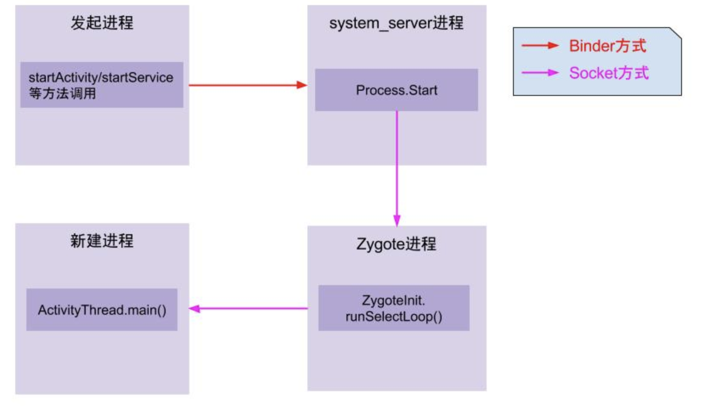
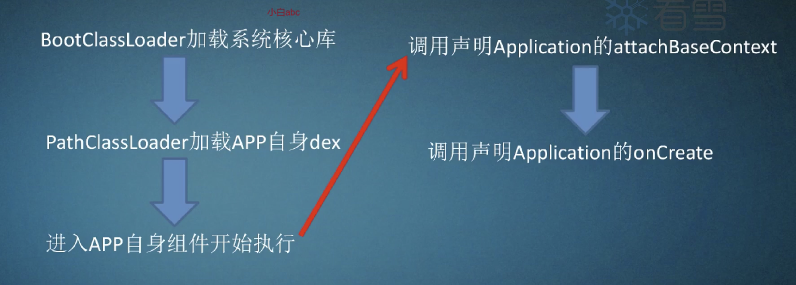

#AndroidSecutity-加壳APP运行流程和ClassLoader修正

## APP启动流程

* Binder方式：这是一种进程间通信方式。
* Socket方式：另一种进程间通信方式。

通过`Zygote`进程进入了APP进程，从这里开始APP代码才真正的得到执行。

我们可以查看该函数代码[ActivityThread.java](http://androidxref.com/8.0.0_r4/xref/frameworks/base/core/java/android/app/ActivityThread.java)，得到如下结论：

1. BootClassLoader加载系统核心库
2. PathClassLoader加载APP自身的dex
   1. 没有加壳：dex包含自身所声明的application,同时会包含app里面所有的类信息。
   2. 加壳：PathClassLoader加载的只有壳自身的代码，还没有加载APP真正的代码，真正的代码会在壳解密释放后出现。
3. APP自身组件开始执行。
4. 调用声明的Application 的attachBaseContext
5. 调用声明Application的onCreate

在上述`ActivityThread.java`里面，我们找到其main函数：

~~~java
public static void main(String[] args) {
6506        Trace.traceBegin(Trace.TRACE_TAG_ACTIVITY_MANAGER, "ActivityThreadMain");
6507        SamplingProfilerIntegration.start();
6508
6509        // CloseGuard defaults to true and can be quite spammy.  We
6510        // disable it here, but selectively enable it later (via
6511        // StrictMode) on debug builds, but using DropBox, not logs.
6512        CloseGuard.setEnabled(false);
6513
6514        Environment.initForCurrentUser();
6515
6516        // Set the reporter for event logging in libcore
6517        EventLogger.setReporter(new EventLoggingReporter());
6518
6519        // Make sure TrustedCertificateStore looks in the right place for CA certificates
6520        final File configDir = Environment.getUserConfigDirectory(UserHandle.myUserId());
6521        TrustedCertificateStore.setDefaultUserDirectory(configDir);
6522
6523        Process.setArgV0("<pre-initialized>");
6524
6525        Looper.prepareMainLooper();
6526
6527        ActivityThread thread = new ActivityThread();
6528        thread.attach(false);
6529
6530        if (sMainThreadHandler == null) {
6531            sMainThreadHandler = thread.getHandler();
6532        }
6533
6534        if (false) {
6535            Looper.myLooper().setMessageLogging(new
6536                    LogPrinter(Log.DEBUG, "ActivityThread"));
6537        }
6538
6539        // End of event ActivityThreadMain.
6540        Trace.traceEnd(Trace.TRACE_TAG_ACTIVITY_MANAGER);
6541        Looper.loop();
6542
6543        throw new RuntimeException("Main thread loop unexpectedly exited");
6544    }
~~~

其实我刚开始学，也没太看懂这个函数，抄录一段大佬的解释：

> 对于ActivityThread这个类，其中的sCurrentActivityThread静态变量用于全局保存创建的ActivityThread实例，同时还提供了public static ActivityThread currentActivityThread()静态函数用于获取当前虚拟机创建的ActivityThread实例。ActivityThread.main()函数是java中的入口main函数,这里会启动主消息循环，并创建ActivityThread实例，之后调用thread.attach(false)完成一系列初始化准备工作，并完成全局静态变量sCurrentActivityThread的初始化。之后主线程进入消息循环，等待接收来自系统的消息。当收到系统发送来的bindapplication的进程间调用时，调用函数handlebindapplication来处理该请求

handleBindApplication函数：

~~~java
private void handleBindApplication(AppBindData data) {
    //step 1: 创建LoadedApk对象
    data.info = getPackageInfoNoCheck(data.appInfo, data.compatInfo);
    ...
    //step 2: 创建ContextImpl对象;
    final ContextImpl appContext = ContextImpl.createAppContext(this, data.info);
 
    //step 3: 创建Instrumentation
    mInstrumentation = new Instrumentation();
 
    //step 4: 创建Application对象;在makeApplication函数中调用了newApplication，在该函数中又调用了app.attach(context)，在attach函数中调用了Application.attachBaseContext函数
    Application app = data.info.makeApplication(data.restrictedBackupMode, null);
    mInitialApplication = app;
 
    //step 5: 安装providers
    List<ProviderInfo> providers = data.providers;
    installContentProviders(app, providers);
 
    //step 6: 执行Application.Create回调
    mInstrumentation.callApplicationOnCreate(app);
~~~

