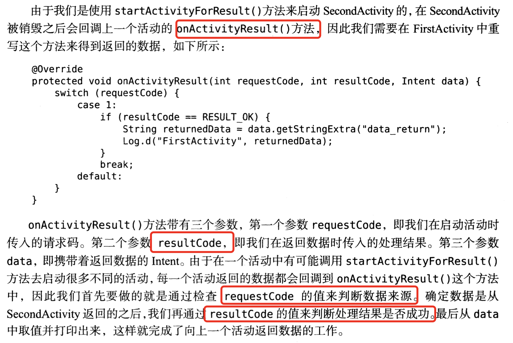

# Android基础-一

## AndroidManifest文件注册

~~~xml
<?xml version="1.0" encoding="utf-8"?>   <!-- 所有的活动都要在AndroidManifest.xml进行注册才可以生效-->
<manifest xmlns:android="http://schemas.android.com/apk/res/android"
    package="com.example.androidtest">

    <!--活动注册的声明放在application标签，activity标签进行活动注册-->
    <application
        android:allowBackup="true"
        android:icon="@mipmap/ic_launcher"
        android:label="@string/app_name"
        android:roundIcon="@mipmap/ic_launcher_round"
        android:supportsRtl="true"
        android:theme="@style/Theme.AndroidTest">
        <activity android:name=".MainActivity" android:label="This is a test">  <!--这里的label为后来添加的，指定了活动的标题栏，还会成为launcher中应用程序显示的名称-->
            <intent-filter>  <!--改标签为程序配置主活动-->
                <action android:name="android.intent.action.MAIN" />

                <category android:name="android.intent.category.LAUNCHER" />
            </intent-filter>
        </activity>
    </application>

</manifest>
~~~

## 使用Toast

这个其实重要的就是了解它的参数：

1. makeTest()方法创建出一个Toast对象
2. 调用show()方法把它显示出来。

makeTest需要3个参数，Context:Toast要求的上下文，活动本身就是一个Context对象，因此可以直接传入MainActivity.this , 第二个参数是Toast显示的文本的内容，第三个参数是Toast显示的时长，有两个内置的常量可以选择Toast.LENGTH_SHORT和Toast.LENGTH_LONG.

## 使用Menu

在一个res/menu文件夹里面创建Menu resource file

~~~xml
<?xml version="1.0" encoding="utf-8"?>
<menu xmlns:android="http://schemas.android.com/apk/res/android">
    <!--id表示标识符，title给菜单指定名称-->
    <item
        android:id="@+id/add_item"
        android:title="Add"/>
    <item
        android:id="@+id/remove_item"
        android:title="Remove"/>
</menu>
~~~

然后在MainActivity里面重写OnCreateOptionsMenu()方法

~~~java
public boolean onCreateOptionsMenu(Menu menu) {
        getMenuInflater().inflate(R.menu.main,menu);
        return true;
    }
~~~

menu的事件响应（重点）：

在MainActivity里面创建响应事件，重写onOptionsItemSelected()方法

~~~java
    public boolean onOptionsItemSelected(@NonNull MenuItem item) {
        switch (item.getItemId())
        {
            case R.id.add_item:
                Toast.makeText(MainActivity.this,"giid",Toast.LENGTH_LONG).show();
                break;
            case R.id.remove_item:
                Toast.makeText(MainActivity.this,"close",Toast.LENGTH_SHORT).show();
                break;
            default:
                break;
        }
        return true;
    }
~~~

## 活动销毁：

Activity类里面提供了一个finish()方法。

## Intent

创建一个新的活动但是不要勾选Launcher Activity

切记每一个活动都需要在AndroidManifest.xml里面进行注册，finish之后正常情况下会自动注册。

Intent是android里面进行组件交互的一种方式，可以执行动作和传递数据，其分为隐式Intent和显式Intent.

显示Intent:

~~~java
Intent(Context packageContext, Class<?>cls)
~~~

~~~java
            public void onClick(View v) {
                Intent intent = new Intent(MainActivity.this,SecondActivity.class);
                startActivity(intent);
            }
~~~

隐式Intent:

这个比较抽象，不明确指定是哪个活动，而是通过action和category等信息进行匹配，所以我们需要丰富注册信息。

~~~xml
        <activity android:name=".SecondActivity">
            <intent-filter>
                <action android:name="com.example.androidtest.ACTION_START"/>
                <category android:name="android.intent.category.DEFAULT"/>
            </intent-filter>
        </activity>
~~~

action和category同时匹配Intent中指定的action和category的时候，这个活动才能响应。

~~~java
        public void onClick(View v) {
                Intent intent = new Intent("com.example.androidtest.ACTION_START");
                intent.addCategory("com.example.androidtest.MY_CATEGORY");

                startActivity(intent);
            }
~~~

## 更多Intent用法

~~~
        public void onClick(View v) {
                Intent intent = new Intent(Intent.ACTION_VIEW);
                intent.setData(Uri.parse("http://www.baidu.com"));
                intent.setData(Uri.parse("http://www.baidu.com"))
                intent.addCategory("com.example.androidtest.MY_CATEGORY");

                startActivity(intent);
            }
~~~

这个的结果就是我们经常看到的那个选择，使用某个app，是单次还是一直使用？

可以响应的协议有很多，没见过的记得百度一下

~~~java
     public void onClick(View v) {
                Toast.makeText(MainActivity.this,"you",Toast.LENGTH_LONG).show();
                Intent intent = new Intent(Intent.ACTION_DIAL);
                intent.setData(Uri.parse("tel:10086"));

                startActivity(intent);
            }
~~~

**归根结底，最重要的是关注intent的action属性和他的时间信息匹配**

## intent方法记录

~~~
intent.putExtra("extra_data",data) //两个参数，前面是变量名，后面是变量内容
intent.getStringExtra("extra_data"); //接受数据，中间的String是数据类型，可以换成Int Boolean等
startActivityForResult();//该方法期望在活动销毁的时候能够返回一个结果给上一个活动。
setResult(); // 该方法用于向上一个活动返回处理结果。
~~~

但是如果是按得back，而不是通过click事件导致的Activity销毁，那么就会无法实现数据传输，那么我们需要在SecondActivity里面重写onBackPressed()方法，具体写法就是利用代码块里面的那些方法实现。

# 活动的生命周期

## 返回栈

android使用Task来管理活动，一个任务就是一组放在栈里面的活动的集合，这个栈被称为返回栈。

栈采用后入先出的结构，当我们启动一个新的活动时它会入栈，并处于栈顶。同样back键返回或调用finish方法的时候都会出栈。系统总是显示处于栈顶的活动给用户。

## 活动生存期

## 活动被回收怎么办

onSaveInstanceState()回调方法，这个方法可以保证在活动被回收前一定会被调用，因此我们可以通过这个方法来解决活动被临时回收时数据得不到保存的问题。

其携带一个Bundle类型的参数，它提供一系列方法用于保存数据，数据一般采用键值对的方式传入，同时onCreate方法也有这个参数，可以取出销毁前保存的数据。

# 活动的启动模式

## standard

默认的启动方式，该模式下系统不会在乎这个活动是否在返回栈里面存在，每次启动都会创建该活动的一个新的实例。

原理示意图：

## singleTop

这个与standard模式的区别在于他不会重复创建新的activity,前提是这个activity在栈顶，如果不在栈顶的话，还是会创建一个新的。

## singleTask

当活动的模式是singleTask的时候，每次启动该活动的时候首先会在返回栈中检查是否存在该活动的实例，如果已经发现则直接使用该实例，并把这个活动之上的所有活动全部出栈（销毁了不少，哈哈），如果没有发现就会创建一个新的活动实例。

## singleInstance

这个比较复杂，这个模式的活动会创建一个新的返回栈来管理这个活动，这其实是解决了其他进程和当前进程之间共享活动实例的问题。	

解决的方法：

​	因为其他模式在不同的返回栈里面 入栈肯定是要重新创建实例的，但是这种模式下会有一个单独的返回栈来管理这个activity,所以无论任何的程序来访问这个返回栈都共用一个。

> 返回当前栈的id:
>
> getTaskId()   //这个方法返回当前栈的id

> 当一个栈的activity销毁完之后会销毁下一个有activity的返回栈

## 活动的退出

~~~java
package com.example.androidtest;

import android.app.Activity;

import java.util.ArrayList;
import java.util.List;

public class ActivityCollector {
    public static List<Activity> activities = new ArrayList<>();
    public static void addActivity(Activity activity){
        activities.add(activity);
    }
    public static void finishAll()
    {
        for (Activity activity:activities)
        {
            if(!activity.isFinishing())
            {
                activity.finish();
            }
        }
    }
}
~~~

