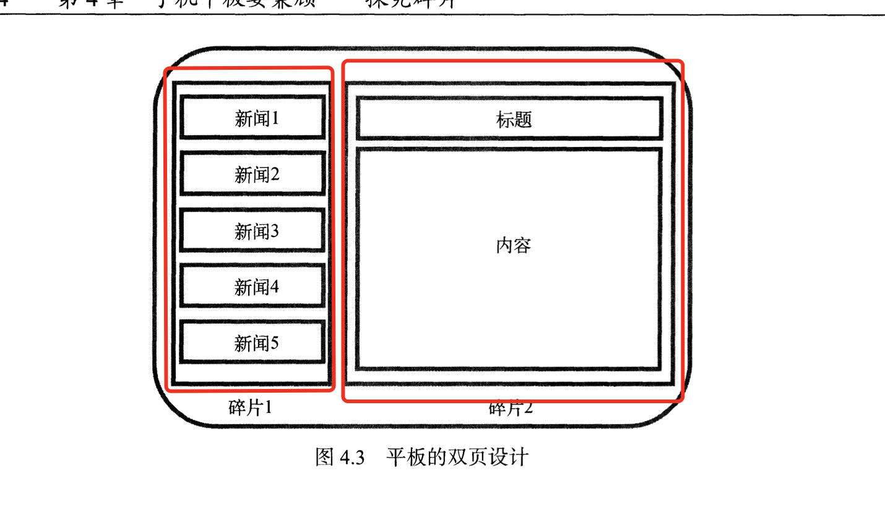
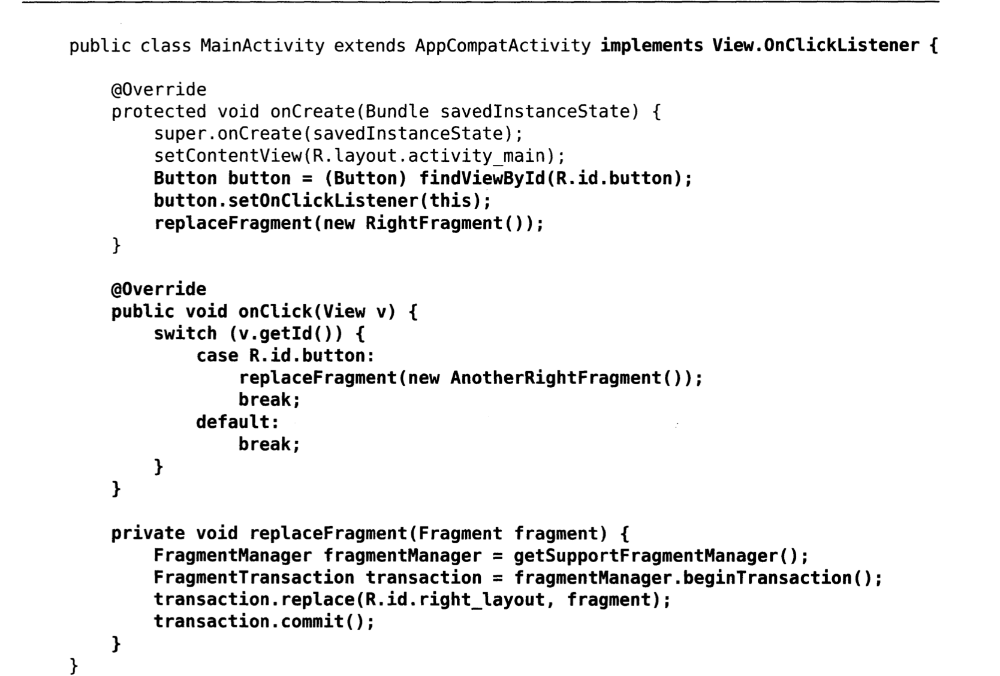
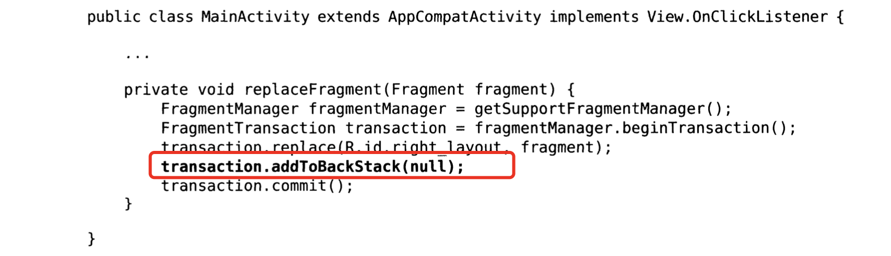
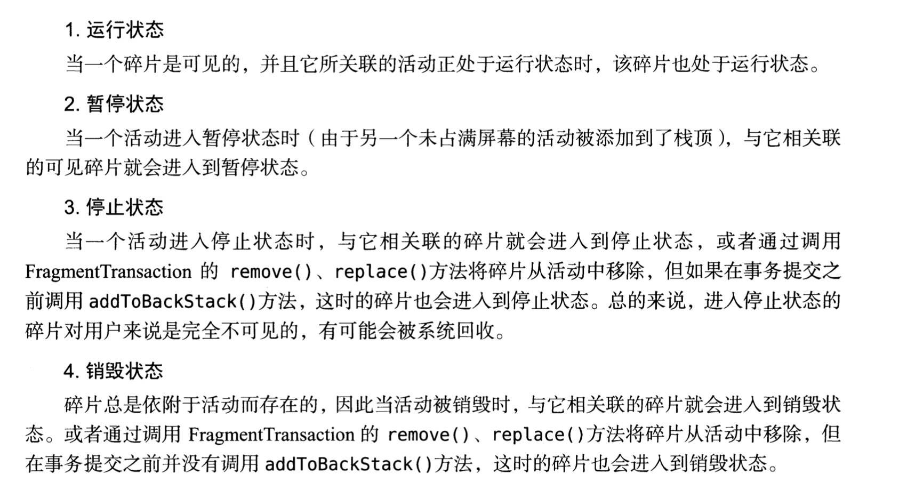
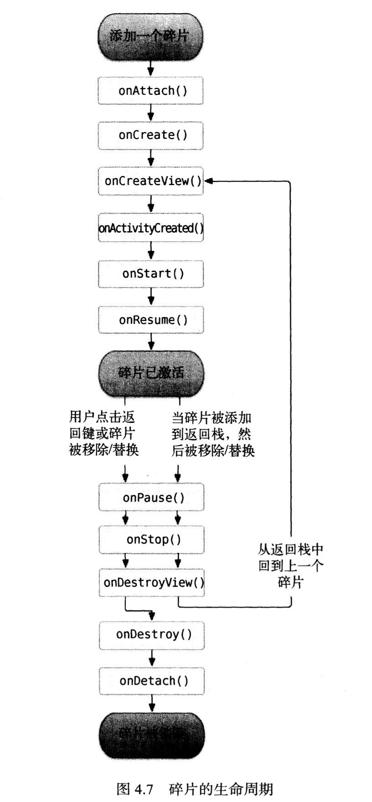

# Android基础-手机和平板

> android自3.0版本开始就引入了碎片的概念,其和活动非常相像，同样都可以包含布局，同样都拥有自己的生命周期。

在平板里面，用一个活动包含两个碎片，来实现屏幕很好的利用。

## 碎片的使用方式

> 因为我这次使用模拟器不是apid

~~~xml
<?xml version="1.0" encoding="utf-8"?>
<androidx.constraintlayout.widget.ConstraintLayout xmlns:android="http://schemas.android.com/apk/res/android"
    xmlns:app="http://schemas.android.com/apk/res-auto"
    xmlns:tools="http://schemas.android.com/tools"
    android:layout_width="match_parent"
    android:layout_height="match_parent"
    tools:context=".MainActivity">

    <LinearLayout
        android:layout_width="match_parent"
        android:layout_height="match_parent"
        android:orientation="horizontal"
        tools:layout_editor_absoluteX="67dp"
        tools:layout_editor_absoluteY="173dp">
    <fragment
        android:layout_width="0dp"
        android:layout_height="match_parent"
        android:name="com.example.androidfragment.LeftFragment"
        android:id="@+id/leftFragment"
        android:layout_weight="1"
        />
        
        <fragment
            android:layout_width="0dp"
            android:layout_height="match_parent"
            android:name="com.example.androidfragment.RightFragment"
            android:layout_weight="1"
            />
    </LinearLayout>
</androidx.constraintlayout.widget.ConstraintLayout>
~~~

可以看到碎片的使用方式和之前的那种组件的使用方式是十分类似的，值得注意的是它的name属性：

* android:name 用来显示的指明要添加的碎片的类名。

## 动态的添加碎片

~~~java
public class LeftFragment extends Fragment {
    @Nullable
    @Override
    public View onCreateView(@NonNull LayoutInflater inflater, @Nullable ViewGroup container, @Nullable Bundle savedInstanceState) {

        View view = inflater.inflate(R.layout.left_fragment,container,false);
        return view;
    }
}
~~~

步骤：

* 创建一个xml文件，添加自己想要的布局
* 可以看到，代码里面的oncreateview方法中加载了another_right_fragment布局。
* 添加FrameLayout布局（这个其实就是简单的把所有的东西默认摆放在布局的左上角）
* 添加事件使得我们可以动态的载入我们的布局，比如我们可以添加一个按钮，注册一个点击事件，然后调用`replaceFragment()`方法将右侧的碎片替换成AnotherRightFragment  这个我自己敲了一遍，但是因为模拟器不是ipad的原因好像会加载冲突导致闪退。

动态加载代码分析：

* 创建待加载的碎片的实例。 FragmentManager fragmentManager 使用的是getSupportFragmentManager()方法，改方法可以在活动里面直接调用。
* 开启一个事务，通过beginTransaction()方法开启。
* 向容器内添加或者替换碎片，一般使用replace()方法实现，需要传入容器的id和待添加的碎片实例。
* 提交事务，调用commit()方法来完成。

> 事务就是一连串操作的集合。

## 在碎片里面模拟返回栈

> 之前添加的碎片，在我们按下back返回的时候，整个活动会直接退出。

如果要实现碎片的一个个的返回退出，那么需要理由FragmentTransaction提供的addToBackStack()方法，可以用于将一个事务添加到返回栈里面 去。

只是添加一个方法就可以了，其参数是用于描绘返回栈的状态的名字。

## 碎片和活动之间的通信

碎片和活动都是处于自己独立的类里面的，所以为了方便通信FragmentManager提供了一个类似于findViewById()的方法，专门用于从布局文件里面获取碎片的实例。

* getActivity() 方法用于得到和当前碎片想关联的活动的实例。

# 碎片的生命周期

碎片的状态：

感觉和活动很类似，不是特别难理解，重要的还是那些回调的方法。

* onAttach()  当碎片和活动建立关联的时候调用。
* onCreateView()  为碎片创建视图时调用
* onActivityCreated()   确保与碎片相关联的活动一定已经创建完毕的时候调用。
* onDestoryView()   当与碎片关联的视图被移出的时候调用。
* onDetach() 当碎片和活动解除关联的时候调用。

图解生命周期

> 可以跟着基础1里面的活动的生命周期对比着看。

