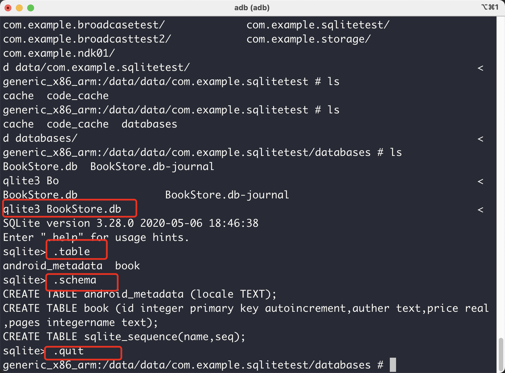
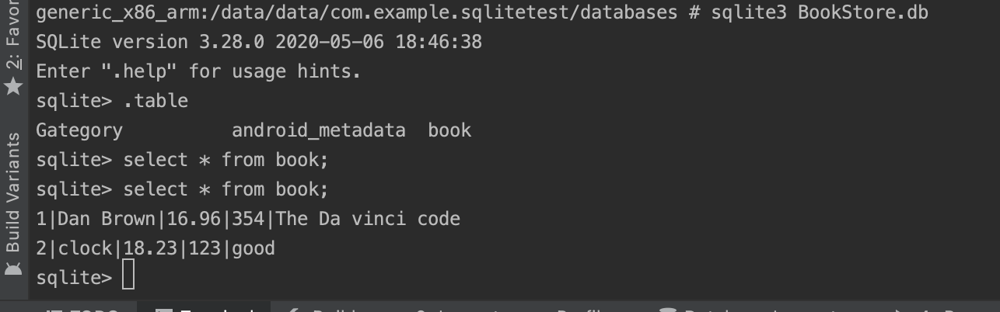
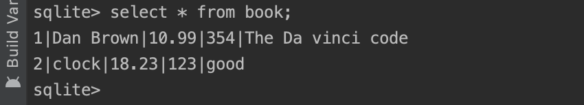
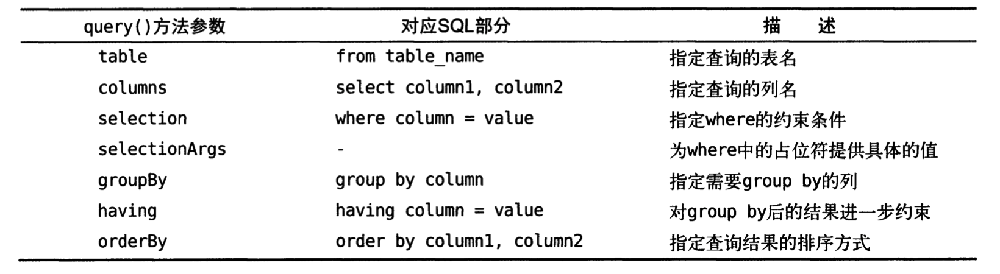
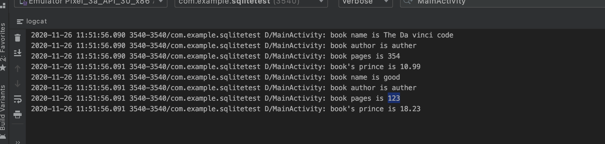
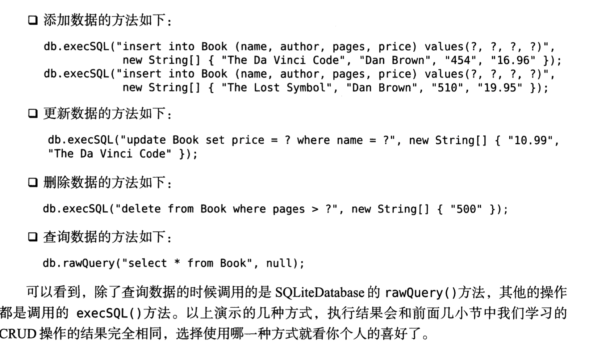

# Android基础-数据存储

Android系统中主要提供了三种方式用于实现数据持久化存储

* 文件存储
* SharedPreference
* 数据库存储

# 文件存储

> 不对数据进行格式化处理，数据原封不动保存在文件里面，默认的存储文件/data/data/com.example.storage/files/data

* Context类里面的openFileOutput()方法

~~~java
    public void Save()
    {
        String data = "Data to save";
        FileOutputStream out = null;
        BufferedWriter writer = null;
        try {
            out = openFileOutput("data", Context.MODE_PRIVATE); //默认的操作模式，表示该文件存在的话就进行覆盖写。
            writer = new BufferedWriter(new OutputStreamWriter(out));
            writer.write(data);

        } catch (IOException e)
        {
            e.printStackTrace();
        }finally {
            try {
                if(writer!=null)
                {
                    writer.close();
                }
            }catch (IOException e)
            {
                e.printStackTrace();
            }
        }
    }
~~~

读取文件内容：

java和android还是有区别的，我用平常IO读文件的方法可能是需要全部的路径的（我没试验哈），但是用以下的方法，我们可以有一个默认的文件夹位置，就是这个app在系统里面存储文件数据的默认位置。

~~~java
 public String load() throws IOException{
        StringBuilder stringBuilder = new StringBuilder();
        FileInputStream inputStream = null;
        BufferedReader bufferedReader = null;
        try {
            inputStream = openFileInput("data");
            bufferedReader = new BufferedReader(new InputStreamReader(inputStream));
            String line = "";
            while ((line=bufferedReader.readLine())!=null){
                stringBuilder.append(line);
            }
        }catch (IOException e){
            e.printStackTrace();
        }
        finally {
            if(bufferedReader!=null)
            {
                try {
                    bufferedReader.close();
                }catch (IOException e){
                    e.printStackTrace();
                }
            }
        }
        return stringBuilder.toString();
    }
~~~

学到一个方法：

* EditText的setSelection()方法，移动光标到指定的位置。

# SharedPreferences

文件存储位置：

目录下的。

获取SharedPreferences对象：

* Context 类getSharedPreferences()方法

~~~java
 public void onClick(View v) {
                SharedPreferences.Editor editor = getSharedPreferences("data",MODE_PRIVATE).edit();
                editor.putString("name","tom");
                editor.putInt("age",28);
                editor.putBoolean("married",false);
                editor.apply();
            }
~~~

我们以一个onclick事件来测试，这会生成一个xml文件，可以看到里面存储的有我们的数据。	

* Activity类里面的getPreferences()方法

它只接受一个操作模式参数，因为使用这个方法时会自动将当前活动的类名作为SharedPreferences的文件名。

* PreferenceManager 类里面的getDefaultSharedPreferences()方法。

这个是一个静态方法，它接受一个Context参数，并自动使用当前应用的包名作为前缀来命名文件。

`从SharedPreferences`里面读取数据：

`SharedPreferences对象`里面提供了一系列的get方法帮助读取数据，每种方法对应着一个SharedPreferences.Editor里面的一种put方法（参见上述代码），这些get方法都接受两个参数，一个是put传入的键值对里面的键，第二个参数是默认值，表示当传入的键找不到对应的值得时候会以怎么样的默认值进行返回。

~~~java
 public void onClick(View v) {
                SharedPreferences sharedPreferences = getSharedPreferences("data",MODE_PRIVATE);
                String name = sharedPreferences.getString("name","");
                int age = sharedPreferences.getInt("age",0);
                Log.d("MainActivity","name is "+name);
                Log.d("MainActivity","name is "+age);
            }
~~~

### 记住密码

这里实现一个记住密码的功能来帮助理解这一个存储的方式：

~~~java
 protected void onCreate(Bundle savedInstanceState) {
        super.onCreate(savedInstanceState);
        setContentView(R.layout.activity_main);
        sharedPreferences = PreferenceManager.getDefaultSharedPreferences(this);
        editText = (EditText)findViewById(R.id.username);
        passwordText = (EditText)findViewById(R.id.password);
        checkBox = (CheckBox) findViewById(R.id.checkBox);
        boolean isRemeber = sharedPreferences.getBoolean("remember_password",false);
        if(isRemeber){
            String username = sharedPreferences.getString("username","");
            String passwd = sharedPreferences.getString("passwd","");
            editText.setText(username);
            passwordText.setText(passwd);
            checkBox.setChecked(true);
        }
        Button button = (Button)findViewById(R.id.button);
        Button button1 = (Button)findViewById(R.id.button2);
        button.setOnClickListener(new View.OnClickListener() {
            @Override
            public void onClick(View v) {
                String username = editText.getText().toString();
                String passwd = passwordText.getText().toString();
                if(username.equals("admin") && passwd.equals("123456")){
                    editor = sharedPreferences.edit();
                    if(checkBox.isChecked()){
                        editor.putBoolean("remember_password",true);
                        editor.putString("username",username);
                        editor.putString("passwd",passwd);
                        Toast.makeText(MainActivity.this,"存储成功",Toast.LENGTH_LONG);
                    }
                    else {
                        editor.clear();
                    }
                }
                else {
                    Toast.makeText(MainActivity.this,"登陆错误",Toast.LENGTH_LONG);
                }
                editor.apply();
            }
        });
        button1.setOnClickListener(new View.OnClickListener() {
            @Override
            public void onClick(View v) {
                SharedPreferences sharedPreferences = getSharedPreferences("com.example.sharedpreferencestest_preferences",MODE_PRIVATE);
                String name = sharedPreferences.getString("username","");
                int age = sharedPreferences.getInt("age",0);
                Log.d("MainActivity","name is"+name);
                Log.d("MainActivity","name is"+age);
            }
        });
    }
~~~

# SQLite数据库存储

> android系统内置数据库SQLite,

android提供了`SQLiteOpenHelper`帮助类，这是一个抽象类。其中包含两个抽象方法`onCreate()`和`onUpgrade()`,我们必须重写这两个方法，然后分别在这两个方法中去实现创建，升级数据库逻辑。

`SQLiteOpenHelper`包含的实例方法：

* `getReadableDatabase()`
* `getWritableDatabase()`
  * 两个都可以打开或者创建一个数据库，但是磁盘空间已满的时候只能返回只读的数据库，而且`getWritableDatabase()`会出现异常。

创建的数据库存放路径`/data/data/<package name>/databases`目录下面。 

自己定义一个类，完成数据库创建

~~~java
package com.example.sqlitetest;

import android.content.Context;
import android.database.sqlite.SQLiteDatabase;
import android.database.sqlite.SQLiteOpenHelper;
import android.widget.Toast;

public class MydatabaseHelper extends SQLiteOpenHelper {
    public static final String CREATE_BOOK = "create table book ("
            + "id integer primary key autoincrement,"
            + "auther text,"
            + "price real,"
            + "pages integer"
            + "name text)";
    private Context mContext;
    public MydatabaseHelper(Context context, String name, SQLiteDatabase.CursorFactory factory, int version)
    {
        super(context,name,factory,version);
        mContext = context;
    }

    @Override
    public void onCreate(SQLiteDatabase db) {
        db.execSQL(CREATE_BOOK);
        Toast.makeText(mContext,"create succeeded",Toast.LENGTH_LONG).show();
    }
nd
    @Override
    public void onUpgrade(SQLiteDatabase db, int oldVersion, int newVersion) {
        
    }
}
~~~

* `autoincrement`关键字：表示相关列是自增长的。
* `real`：表示浮点型

Sqlite操作：

现在我们在类里面加入

~~~java
    public static final String CREATE_GATEGROUP = "create table Gategory("
            + "id integer primary key autoincrement,"
            + "category_name text,"
            + "category_code integer)";
    @Override
    public void onCreate(SQLiteDatabase db) {
        db.execSQL(CREATE_BOOK1);
        db.execSQL(CREATE_GATEGROUP);
        Toast.makeText(mContext,"create succeeded",Toast.LENGTH_LONG).show();
    }
~~~

我们可以发现，新的表没有被创建，因为数据库已经存在，我们点击的onCreate方法不会被执行。

正确的做法是在`onUpgrade()`方法里面进行操作：

~~~java
    @Override
    public void onCreate(SQLiteDatabase db) {
        db.execSQL(CREATE_BOOK1);
        db.execSQL(CREATE_GATEGROUP);
        Toast.makeText(mContext,"create succeeded",Toast.LENGTH_LONG).show();
    }

    @Override
    public void onUpgrade(SQLiteDatabase db, int oldVersion, int newVersion) {
        db.execSQL("drop table if exists book");
        db.execSQL("drop table if exists Gategory");
        onCreate(db);
    }
~~~

触发`onUpgrade()`方法，注意构造函数里面的第四个参数，版本号，只要我们传入一个大于1的版本号，`onUpgrade()`方法就会得到执行。

`添加数据`

`getReadableDatabase()`方法和`getWritableDatabase()`方法都会返回一个`SQLiteDatabase`对象，其中包含各种方法。

* `insert()`方法，添加数据。	
  * 参数1，表的名字
  * 参数2，用于在未指定添加数据的情况下给某些可为空的列自动赋值 null，一般这个参数直接传null.
  * 参数三：`ContentValues`对象，提供了`put()`方法重载，可用于向`ContentValues`中添加数据。

~~~java
        button1.setOnClickListener(new View.OnClickListener() {
            @Override
            public void onClick(View v) {
                SQLiteDatabase database = mydatabaseHelper.getWritableDatabase();
                ContentValues contentValues = new ContentValues();
                contentValues.put("name","The Da vinci code");
                contentValues.put("auther","Dan Brown");
                contentValues.put("pages",354);
                contentValues.put("price",16.96);
                database.insert("book",null,contentValues);
                contentValues.clear();
                contentValues.put("name","good");
                contentValues.put("auther","clock");
                contentValues.put("pages",123);
                contentValues.put("price",18.23);
                database.insert("book",null,contentValues);
            }
        });
~~~

`更新数据：`

~~~java
        button2.setOnClickListener(new View.OnClickListener() {
            @Override
            public void onClick(View v) {
                SQLiteDatabase sqLiteDatabase = mydatabaseHelper.getWritableDatabase();
                ContentValues contentValues = new ContentValues();
                contentValues.put("price",10.99);
                sqLiteDatabase.update("book",contentValues,"name = ?",new String[] {"The Da vinci Code"})
            }
        });
~~~

这其实就和`SQL`操作很像了，`update`方法中第三个第四个参数用来指定更新的是那几行。

* `name = ?`这对应的是`where`部分，表示更新所有`name等于?`的行，但是'?'是一个占位符，可以通过第四个参数提供和一个字符串数组为第三个参数中的每一个占位符，指定相应的内容，那么上述就是把书名为`The Da vinci Code`的书的价格改为`10.99`;

`删除数据`

* `SQLiteDatabase`对象里面的`delete`方法

~~~java
        button3.setOnClickListener(new View.OnClickListener() {
            @Override
            public void onClick(View v) {
                SQLiteDatabase sqLiteDatabase = mydatabaseHelper.getWritableDatabase();
                sqLiteDatabase.delete("book","pages > ?",new String[]{"500"});
            }
        });
~~~

第一个参数指定，删除的表，第二三个参数指明删除pages > 500的选项。

`数据查询`

`SQLiteDatabase`对象

* `query`方法用于对数据进行查询。
  * 第一个参数：表名
  * 2，指定查询列，默认查询所有列
  * 3，4用于约束查询某一行或者某几行的数据
  * 5，用于指定`group by`的列，不指定表明结果不需要用`group by`操作
  * 6，`group by`过滤之后的进一步过滤，不指定则不需要
  * 7，指定查询结果的排序方式，不指定则默认

其返回值是一个`Cursor`对象，查到的数据都是从对象里面取出的。

~~~java
        button4.setOnClickListener(new View.OnClickListener() {
            @Override
            public void onClick(View v) {
                SQLiteDatabase sqLiteDatabase = mydatabaseHelper.getWritableDatabase();
                Cursor cursor = sqLiteDatabase.query("book",null,null,null,null,null,null);
                if(cursor.moveToFirst())
                {
                    do {
                        String name = cursor.getString(cursor.getColumnIndex("name"));
                        String author = cursor.getColumnName(cursor.getColumnIndex("auther"));
                        int pages = cursor.getInt(cursor.getColumnIndex("pages"));
                        double prince = cursor.getDouble(cursor.getColumnIndex("price"));
                        Log.d("MainActivity","book name is " + name);
                        Log.d("MainActivity","book author is "+ author);
                        Log.d("MainActivity","book pages is "+pages);
                        Log.d("MainActivity","book's prince is " + prince);
                    }while (cursor.moveToNext());
                }
                cursor.close();
            }
        });
~~~

`使用SQL`操作数据库

### 使用LitePal操作数据库

> LitePal是开源的`Android`数据库框架，采用对象映射模式。

