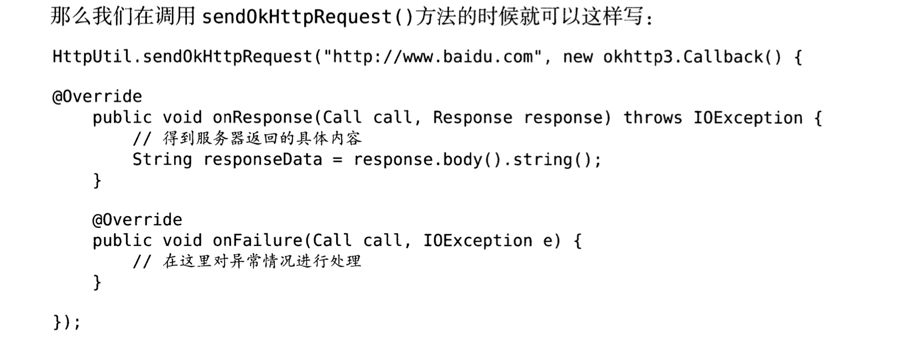

# Android基础-网络技术

~~~java
package com.example.webviewtest;

import androidx.appcompat.app.AppCompatActivity;

import android.os.Bundle;
import android.webkit.WebView;
import android.webkit.WebViewClient;

public class MainActivity extends AppCompatActivity {

    @Override
    protected void onCreate(Bundle savedInstanceState) {
        super.onCreate(savedInstanceState);
        setContentView(R.layout.activity_main);
        WebView webView = (WebView)findViewById(R.id.web_viwe);
        webView.getSettings().setJavaScriptEnabled(true); //设置支持JavaScript脚本
        webView.setWebViewClient(new WebViewClient());//当一个网页要打开另一个网页的时候，我们需要目标网页仍然在该webView里面显示，而不是打开浏览器。
        webView.loadUrl("http://www.baidu.com");
    }
}
~~~

在老版本里面，这里应该是可以直接运行的，但是新版本就不可以，因为网络连接权限问题，网页不能够启动起来，会显示网络连接失败。

~~~xml
    <uses-permission android:name="android.permission.INTERNET"/>
~~~

权限如上。

## HTTP协议访问网络

Android发送Http请求的方式一般有两种：

* HttpURLConnection 
* HttpClient（Android6.0之后被移除了）

`ScrollView`控件，手机屏幕比较小，我们使用这个控件可以使得我们以滚动的方式查看屏幕以外的内容。

~~~java
package com.example.networdtest;

import androidx.appcompat.app.AppCompatActivity;

import android.os.Bundle;
import android.view.View;
import android.widget.Button;
import android.widget.TextView;

import java.io.BufferedReader;
import java.io.IOException;
import java.io.InputStream;
import java.io.InputStreamReader;
import java.net.HttpURLConnection;
import java.net.URL;

public class MainActivity extends AppCompatActivity implements View.OnClickListener {
    TextView responseText;
    @Override
    protected void onCreate(Bundle savedInstanceState) {
        super.onCreate(savedInstanceState);
        setContentView(R.layout.activity_main);
        Button sendRequest = (Button)findViewById(R.id.button);
        responseText = (TextView)findViewById(R.id.textView);
        sendRequest.setOnClickListener(this);
    }
    private void sendRequestWithHttpURLConnection(){
        new Thread(new Runnable() {
            @Override
            public void run() {
                HttpURLConnection connection = null;
                BufferedReader reader = null;
                try {
                    URL url = new URL("https://www.baidu.com"); //百度的http好似不行了，只能用https
                    connection = (HttpURLConnection)url.openConnection();
                    connection.setRequestMethod("GET");
                    connection.setConnectTimeout(8000);
                    connection.setReadTimeout(8000);
                    InputStream in = connection.getInputStream();
                    reader = new BufferedReader(new InputStreamReader(in));
                    StringBuilder response = new StringBuilder();
                    String line;
                    while ((line=reader.readLine())!=null){
                        response.append(line);
                    }
                    showRequest(response.toString());
                }catch (Exception e){
                    e.printStackTrace();
                }finally {
                    if(reader==null){
                        try {
                            reader.close();
                        }catch (IOException e){
                            e.printStackTrace();
                        }
                    }
                    if(connection!=null){
                        connection.disconnect();
                    }
                }
            }
        }).start();
    }

    @Override
    public void onClick(View v) {
        if(v.getId()==R.id.button){
            sendRequestWithHttpURLConnection();
        }
    }

    private void showRequest(final String response){
        runOnUiThread(new Runnable() { //Android不允许子现在中进行UI操作，所以我们需要通过这个方法将线程切换到主线程，然后就可以更新UI元素。
            @Override
            public void run() {
                responseText.setText(response);
            }
        });
    }
}
~~~

权限依然是需要INTERNET权限。

~~~xml
    <uses-permission android:name="android.permission.INTERNET"/>
~~~

如何提交数据给服务器：

首先，要把方法改成`POST`方法，然后，我们必须在获得输入流之前把要提交的数据写出就可以了,数据与数据之前 用`&`隔开。

~~~java
                    DataOutputStream outputStream = new DataOutputStream(connection.getOutputStream());
                    outputStream.writeBytes("username=admin&password=123456");
~~~

`使用OkHttp`

这是一个开源项目：`https://github.com/square/okhttp`

MAC上新版Android stduio 的加载方式还不太一样呢。。。

> file -> project Structure

 使用该库的话，我们可以把关键函数修改为如下：

~~~java
    private void sendRequestWithHttpURLConnection(){
        new Thread(new Runnable() {
            @Override
            public void run() {
                try {
                    OkHttpClient client = new OkHttpClient();
                    Request request = new Request.Builder().url("https://www.baidu.com").build();
                    Response response = client.newCall(request).execute();
                    String responseData = response.body().string();
                    showRequest(responseData);
                }catch (Exception e){
                    e.printStackTrace();
                }
            }
        }).start();
    }
~~~

不得不说，简单很多。

那么它如何实现`POST`请求：

~~~java
    private void sendRequestWithHttpURLConnection(){
        new Thread(new Runnable() {
            @Override
            public void run() {
                try {
                    OkHttpClient client = new OkHttpClient();
                    RequestBody requestBody = new FormBody.Builder()
                            .add("username","admin")
                            .add("password","word")
                            .build();
                    Request request = new Request.Builder().url("https://www.baidu.com").post(requestBody).build();
                    Response response = client.newCall(request).execute();
                    String responseData = response.body().string();
                    showRequest(responseData);
                }catch (Exception e){
                    e.printStackTrace();
                }
            }
        }).start();
    }
~~~

最大的区别就是加上了一个`RequestBody`来帮助我们实现数据传送。

## 解析XML格式数据

~~~java
    private void paresXMLWithPull(String xmlData){
        try {
            XmlPullParserFactory factory = XmlPullParserFactory.newInstance();
            XmlPullParser xmlPullParser = factory.newPullParser();
            xmlPullParser.setInput(new StringReader(xmlData));
            int eventType = xmlPullParser.getEventType();
            String id = "";
            String name = "";
            String version = "";
            while (eventType != xmlPullParser.END_DOCUMENT){
                String nodeName = xmlPullParser.getName();
                switch (eventType){
                    case XmlPullParser.START_TAG:
                        if("id".equals(nodeName)){
                            id = xmlPullParser.nextText();
                        }else if ("name".equals(nodeName)){
                            name = xmlPullParser.nextText();
                        }else if ("versiong".equals(nodeName)){
                            version = xmlPullParser.nextText();
                        }
                        break;
                    case XmlPullParser.END_TAG:
                        if("app".equals(nodeName)){
                            Log.d("MainActivity","id is " + id);
                            Log.d("MainActivity","name is " + name);
                            Log.d("MainActivity","version is " + version);
                        }
                        break;
                    default:
                        break;
                }
                eventType = xmlPullParser.next();
            }
        }catch (Exception e){
            e.printStackTrace();
        }
    }
~~~

解析过程：

1. 创建`XmlPullParserFactory`实例
2. 从实例中获取`XmlPullParser`对象
3. 利用对象的`setInput`方法将服务器返回的XML数据设置进去开始解析。

我们发现此时好似并没有解析成功，调试发现是在发送http请求的时候出现失败，搜索之后发现因为Andrroid 9之后不再支持http协议，因而必须使用https协议。

`SAX解析方式`

~~~java
package com.example.networdtest;

import org.xml.sax.Attributes;
import org.xml.sax.SAXException;
import org.xml.sax.helpers.DefaultHandler;

public class Myhandle extends DefaultHandler {
    @Override
    public void startDocument() throws SAXException {

    }

    @Override
    public void startElement(String uri, String localName, String qName, Attributes attributes) throws SAXException {

    }

    @Override
    public void characters(char[] ch, int start, int length) throws SAXException {

    }

    @Override
    public void endElement(String uri, String localName, String qName) throws SAXException {

    }

    @Override
    public void endDocument() throws SAXException {
        
    }
}
~~~

新建一个`Myhandle`类继承于`DefaultHandler`类，实现其中5个方法：

* `startDocument()`方法会在开始XML解析的时候调用。
* `startElement`方法会在解析某个节点的时候调用。
* `characters`方法会在获取节点中的内容的时候调用。
* `endElement`方法会在完成解析某个节点的时候调用。
* `endDocument()`方法会在完成整个`XML`解析的时候调用。

完善功能后如下：

~~~java
package com.example.networdtest;

import android.util.Log;

import org.xml.sax.Attributes;
import org.xml.sax.SAXException;
import org.xml.sax.helpers.DefaultHandler;

public class Myhandle extends DefaultHandler {
    private String nodeName;
    private StringBuilder id;
    private StringBuilder name;
    private StringBuilder version;

    @Override
    public void startDocument() throws SAXException {
        id = new StringBuilder();
        name = new StringBuilder();
        version = new StringBuilder();
    }

    @Override
    public void startElement(String uri, String localName, String qName, Attributes attributes) throws SAXException {
        nodeName = localName;
    }

    @Override
    public void characters(char[] ch, int start, int length) throws SAXException {
        if("id".equals(nodeName)){
            id.append(ch,start,length);
        }
        else if ("name".equals(nodeName)){
            name.append(ch,start,length);
        }
        else if("version".equals(nodeName)){
            version.append(ch,start,length);
        }
    }

    @Override
    public void endElement(String uri, String localName, String qName) throws SAXException {
        if("app".equals(localName)){
            Log.d("Myhandle","id is " + id.toString().trim());
            Log.d("Myhandle","name is " + name.toString().trim());
            Log.d("Myhandle","version is" + version.toString().trim());
            id.setLength(0);
            name.setLength(0);
            version.setLength(0);
        }
    }

    @Override
    public void endDocument() throws SAXException {
        super.endDocument();
    }
}
~~~

创建好了类，那么我们该如何进行使用呢？在`MainActivity`里面实现如下方法

~~~java
    private void paresXMLWithSAX(String xmlData){
        try {
            SAXParserFactory factory = SAXParserFactory.newInstance();
            XMLReader xmlReader = factory.newSAXParser().getXMLReader();
            Myhandle handler = new Myhandle();
            xmlReader.setContentHandler(handler);
            xmlReader.parse(new InputSource(new StringReader(xmlData)));
        }catch (Exception e){
            e.printStackTrace();
        }
    }
~~~

那么我们就可以把第一个`pull`处理数据的方法替换成该方法。

## 解析JSON格式的数据

JSON格式和XML格式相比，其优点在于在网络传输的过程中可以节省流量，但是缺点在于其语义性较差，在直观性上差于XML.

解析方式：

* 官方提供的`JSONObject`

  * ~~~java
        private void paresJSONWithJSONObject(String jsonData){
            try {
                JSONArray jsonArray = new JSONArray(jsonData);
                for (int i=0;i<jsonArray.length();i++){
                    JSONObject jsonObject = jsonArray.getJSONObject(i);
                    String id = jsonObject.getString("id");
                    String name = jsonObject.getString("name");
                    String version = jsonObject.getString("version");
                    Log.d("MainActivity","id is " + id.toString());
                    Log.d("MainActivity","name is " + name);
                    Log.d("MainActivity","version is " + version);
                }
            }catch (Exception e){
                e.printStackTrace();
            }
        }
    ~~~

* 谷歌开源GSON库。

  * `com.google.code.gson:gson:2.7`(有新版的，但是我为了测试等原因用的老版本库)

  * 如果只是解析单个数据的话

  * ~~~java
    Gson gson = new Gson();
    Person person = gson.fromJson(jsonData,Person.class)
    ~~~

  `{"name":"Tom","age":20}`,我们可以定义一个`Person`类，简单的调用上述代码就可以完成解析，但是如果是一个`json`格式的数组的话，就要用下面的这个特殊方式。

  * ~~~java
        private void paresJSONWithGSON(String jsonData){
            Gson gson = new Gson();
            List<app> appList = gson.fromJson(jsonData,new TypeToken<List<app>>(){}.getType());
            for (app app1 : appList){
                Log.d("MainActivity","id is " + app1.getId());
                Log.d("MainActivity","name is " + app1.getName());
                Log.d("MainActivity","version is " + app1.getVersion());
            }
        }
    ~~~

  * ~~~java
    package com.example.networdtest;
    
    public class app {
        private String id;
        private String name;
        private String version;
        public String getId(){
            return id;
        }
        public String getName(){
            return name;
        }
        public String getVersion(){
            return version;
        }
        public void setId(String id){
            this.id = id;
        }
        public void setName(String name){
            this.name = name;
        }
        public void setVersion(String version){
            this.version = version;
        }
    }
    ~~~

* 其他第三方开源库

## 网络编程实践

~~~java
package com.example.networdtest;

import java.io.BufferedReader;
import java.io.InputStream;
import java.io.InputStreamReader;
import java.net.HttpURLConnection;
import java.net.URL;

public class Httputil {
    public static String sendHttpRequest(String address){
        HttpURLConnection connection = null ;
        try{
            URL url = new URL(address);
            connection = (HttpURLConnection)url.openConnection();
            connection.setRequestMethod("GET");
            connection.setConnectTimeout(8000);
            connection.setReadTimeout(8000);
            connection.setDoInput(true);
            connection.setDoOutput(true);
            InputStream in = connection.getInputStream();
            BufferedReader reader = new BufferedReader(new InputStreamReader(in));
            StringBuilder stringBuilder = new StringBuilder();
            String line;
            while ((line = reader.readLine())!=null){
                    stringBuilder.append(line);
            }
            return stringBuilder.toString();
        }catch (Exception e){
            e.printStackTrace();
            return e.getMessage();
        }
        finally {
            if(connection!=null){
                connection.disconnect();
            }
        }
    }
}
~~~

网络请求通常都是耗时操作，所以`sendHttpRequest`方法可能阻塞主线程，同时我们不可以简单把发起请求放在线程里面，因为服务器响应的数据是没有办法进行返回的，所有的耗时逻辑都在线程里面进行吗，`sendHttpRequest()`方法会在服务器没来得及响应的时候就执行结束，当然就没办法返回响应的数据。

`利用JAVA的回调机制`

~~~java
    public static void sendOkHttpRequest(String address, okhttp3.Callback callback){
        OkHttpClient client = new OkHttpClient();
        Request request = new Request.Builder()
                .url(address)
                .build();
        client.newCall(request).enqueue(callback);
    }
~~~

* `okhttp3.Callback`是`OkHttp`库里面自带的一个回调接口。
* `newCall`之后没有调用`execute()`方法，而是调用了一个`enqueue()`方法，并且把`okhttp3.Callback`参数传入。

