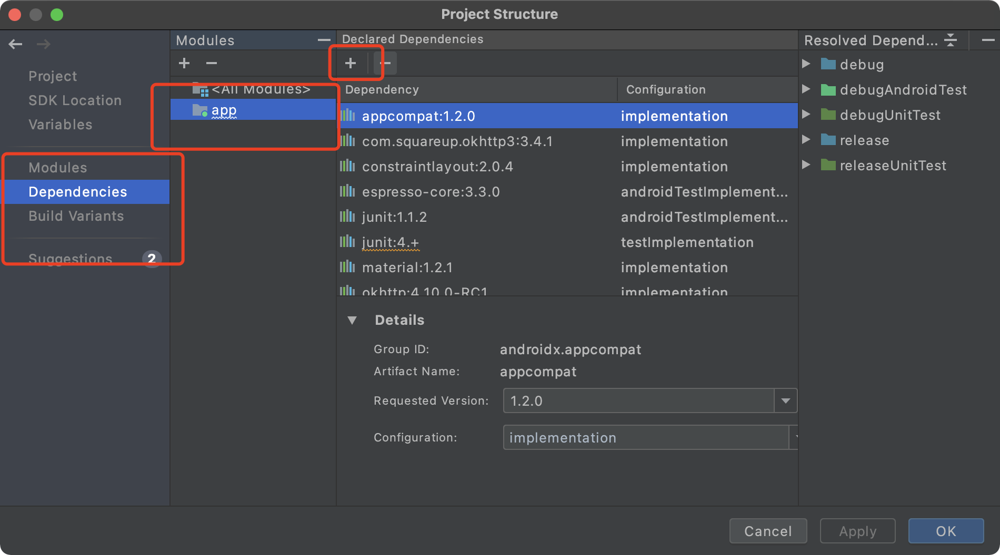

# Android基础-网络技术

~~~java
package com.example.webviewtest;

import androidx.appcompat.app.AppCompatActivity;

import android.os.Bundle;
import android.webkit.WebView;
import android.webkit.WebViewClient;

public class MainActivity extends AppCompatActivity {

    @Override
    protected void onCreate(Bundle savedInstanceState) {
        super.onCreate(savedInstanceState);
        setContentView(R.layout.activity_main);
        WebView webView = (WebView)findViewById(R.id.web_viwe);
        webView.getSettings().setJavaScriptEnabled(true); //设置支持JavaScript脚本
        webView.setWebViewClient(new WebViewClient());//当一个网页要打开另一个网页的时候，我们需要目标网页仍然在该webView里面显示，而不是打开浏览器。
        webView.loadUrl("http://www.baidu.com");
    }
}
~~~

在老版本里面，这里应该是可以直接运行的，但是新版本就不可以，因为网络连接权限问题，网页不能够启动起来，会显示网络连接失败。

~~~xml
    <uses-permission android:name="android.permission.INTERNET"/>
~~~

权限如上。

## HTTP协议访问网络

Android发送Http请求的方式一般有两种：

* HttpURLConnection 
* HttpClient（Android6.0之后被移除了）

`ScrollView`控件，手机屏幕比较小，我们使用这个控件可以使得我们以滚动的方式查看屏幕以外的内容。

~~~java
package com.example.networdtest;

import androidx.appcompat.app.AppCompatActivity;

import android.os.Bundle;
import android.view.View;
import android.widget.Button;
import android.widget.TextView;

import java.io.BufferedReader;
import java.io.IOException;
import java.io.InputStream;
import java.io.InputStreamReader;
import java.net.HttpURLConnection;
import java.net.URL;

public class MainActivity extends AppCompatActivity implements View.OnClickListener {
    TextView responseText;
    @Override
    protected void onCreate(Bundle savedInstanceState) {
        super.onCreate(savedInstanceState);
        setContentView(R.layout.activity_main);
        Button sendRequest = (Button)findViewById(R.id.button);
        responseText = (TextView)findViewById(R.id.textView);
        sendRequest.setOnClickListener(this);
    }
    private void sendRequestWithHttpURLConnection(){
        new Thread(new Runnable() {
            @Override
            public void run() {
                HttpURLConnection connection = null;
                BufferedReader reader = null;
                try {
                    URL url = new URL("https://www.baidu.com"); //百度的http好似不行了，只能用https
                    connection = (HttpURLConnection)url.openConnection();
                    connection.setRequestMethod("GET");
                    connection.setConnectTimeout(8000);
                    connection.setReadTimeout(8000);
                    InputStream in = connection.getInputStream();
                    reader = new BufferedReader(new InputStreamReader(in));
                    StringBuilder response = new StringBuilder();
                    String line;
                    while ((line=reader.readLine())!=null){
                        response.append(line);
                    }
                    showRequest(response.toString());
                }catch (Exception e){
                    e.printStackTrace();
                }finally {
                    if(reader==null){
                        try {
                            reader.close();
                        }catch (IOException e){
                            e.printStackTrace();
                        }
                    }
                    if(connection!=null){
                        connection.disconnect();
                    }
                }
            }
        }).start();
    }

    @Override
    public void onClick(View v) {
        if(v.getId()==R.id.button){
            sendRequestWithHttpURLConnection();
        }
    }

    private void showRequest(final String response){
        runOnUiThread(new Runnable() { //Android不允许子现在中进行UI操作，所以我们需要通过这个方法将线程切换到主线程，然后就可以更新UI元素。
            @Override
            public void run() {
                responseText.setText(response);
            }
        });
    }
}
~~~

权限依然是需要INTERNET权限。

~~~xml
    <uses-permission android:name="android.permission.INTERNET"/>
~~~

如何提交数据给服务器：

首先，要把方法改成`POST`方法，然后，我们必须在获得输入流之前把要提交的数据写出就可以了,数据与数据之前 用`&`隔开。

~~~java
                    DataOutputStream outputStream = new DataOutputStream(connection.getOutputStream());
                    outputStream.writeBytes("username=admin&password=123456");
~~~

`使用OkHttp`

这是一个开源项目：`https://github.com/square/okhttp`

MAC上新版Android stduio 的加载方式还不太一样呢。。。

> file -> project Structure

 使用该库的话，我们可以把关键函数修改为如下：

~~~java
    private void sendRequestWithHttpURLConnection(){
        new Thread(new Runnable() {
            @Override
            public void run() {
                try {
                    OkHttpClient client = new OkHttpClient();
                    Request request = new Request.Builder().url("https://www.baidu.com").build();
                    Response response = client.newCall(request).execute();
                    String responseData = response.body().string();
                    showRequest(responseData);
                }catch (Exception e){
                    e.printStackTrace();
                }
            }
        }).start();
    }
~~~

不得不说，简单很多。

