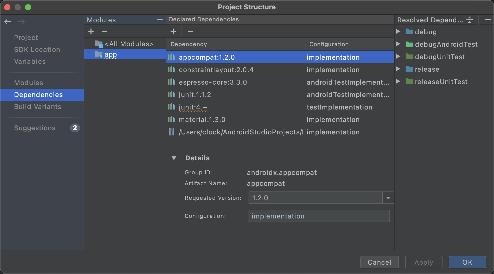
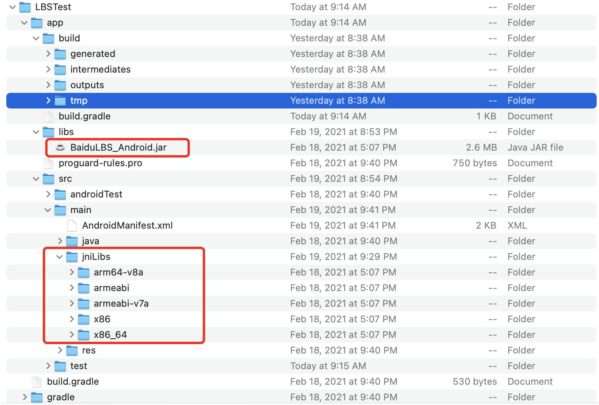

# Android特色开发-基于位置的服务

## 简介

GPS定位的工作原理是基于手机内置的GPS硬件直接合卫星交互来获得当前 经纬度的信息，其优点在于精度高，但是只能在室外使用。

网络定位的工作原理是根据手机当前网络附近的三个基站进行测速，以此计算出手机和每个基站之间的位置，然后通过三角定位来得到一个大概的位置。缺点在于精度差，优点在于室内室外都可使用。

还有一种是wi-fi定位。

第三方SDK可以帮我们解决上面的问题，国内百度和高德做的不错。

## 申请API Key

申请成功百度开发者

http://developer.baidu.com/user/reg

GQXWu30G0qTRH4wL1ENhYSf9

## 使用百度定位（Android 导入 第三方SDK）

这一点偏为麻烦的还是jar包的导入，首先在

这里点+，然后选择导入jar包，然后写入路径，然后还需要把依赖的so文件放到合适的位置。

jniLibs文件夹是自己建立在main文件夹下面的。

~~~java
package com.example.lbstest;

import androidx.annotation.NonNull;
import androidx.appcompat.app.AppCompatActivity;
import androidx.core.app.ActivityCompat;
import androidx.core.content.ContextCompat;

import android.Manifest;
import android.content.pm.PackageManager;
import android.os.Bundle;
import android.widget.TextView;
import android.widget.Toast;

import com.baidu.location.BDLocation;
import com.baidu.location.BDLocationListener;
import com.baidu.location.LocationClient;

import java.util.ArrayList;
import java.util.List;

public class MainActivity extends AppCompatActivity {
    public LocationClient locationClient;
    private TextView textView;

    @Override
    protected void onCreate(Bundle savedInstanceState) {
        super.onCreate(savedInstanceState);
        setContentView(R.layout.activity_main);
        //getApplicationContext()可以获得一个全局的Context
        locationClient = new LocationClient(getApplicationContext());//创建一个百度jar包里面的LocationClient实例，参数为一个Context参数
        locationClient.registerLocationListener(new MyLocationListener());//注册一个定位监听器，当获取到位置信息的时候就会回调这个定位监听器
        textView = (TextView)findViewById(R.id.position_text_view);
        /*
        利用List集合收集没有被授予的权限，注意因为ACCESS_FINE_LOCATION和ACCESS_COARSE_LOCATION同属于一个权限组，所以只用申请他们中的一个就可以了
        最后转换为一个数组，然后进行权限请求
        * */
        List<String> permissionList = new ArrayList<>();
        if(ContextCompat.checkSelfPermission(MainActivity.this, Manifest.permission.ACCESS_FINE_LOCATION)!= PackageManager.PERMISSION_GRANTED)
        {
            permissionList.add(Manifest.permission.ACCESS_FINE_LOCATION);
        }
        if(ContextCompat.checkSelfPermission(MainActivity.this,Manifest.permission.READ_PHONE_STATE)!=PackageManager.PERMISSION_GRANTED)
        {
            permissionList.add(Manifest.permission.READ_PHONE_STATE);
        }
        if(ContextCompat.checkSelfPermission(MainActivity.this,Manifest.permission.WRITE_EXTERNAL_STORAGE)!=PackageManager.PERMISSION_GRANTED)
        {
            permissionList.add(Manifest.permission.WRITE_EXTERNAL_STORAGE);
        }
        if(!permissionList.isEmpty()){
            String []permissions = permissionList.toArray(new String[permissionList.size()]); //转化为数组
            ActivityCompat.requestPermissions(MainActivity.this,permissions,1);//权限请求
        }else {
            requestLocation();
        }
    }
    private void requestLocation(){
        locationClient.start();
    } //定位开始

    @Override
    public void onRequestPermissionsResult(int requestCode, @NonNull String[] permissions, @NonNull int[] grantResults) {
        switch (requestCode){
            case 1:
                if(grantResults.length>0){ //grantResults代表请求结果
                    for (int result : grantResults){
                        if(result != PackageManager.PERMISSION_GRANTED){ //如果程序没有被赋予权限就关闭该程序，这里就表明，用户必须全部同意我们申请的权限才可以。
                            Toast.makeText(this,"必须同意权限才可使用本程序",Toast.LENGTH_LONG).show();
                            finish();
                        }
                    }
                }
                break;
            default:
                break;
        }
    }
    public class MyLocationListener implements BDLocationListener{
        @Override
        public void onReceiveLocation(BDLocation bdLocation) {
            StringBuilder currentPosition = new StringBuilder();
            currentPosition.append("纬度：").append(bdLocation.getLatitude()).append("\n");//这里就可以直接利用jar包获得定位信息了
            currentPosition.append("经线：").append(bdLocation.getLongitude()).append("\n");
            currentPosition.append("定位方式：");
            if(bdLocation.getLocType()== BDLocation.TypeGpsLocation){//判断定位类型GPS，还是网络定位
                currentPosition.append("GPS");
            }else if (bdLocation.getLocType()== BDLocation.TypeNetWorkLocation){
                currentPosition.append("网络");
            }else if(bdLocation.getLocType()== BDLocation.TypeServerError) //模拟器一般都返回这个,tmd百度SDK api文档也没查到什么有用的信息，服务关了还能获得定位信息
            {
                currentPosition.append("服务未开启");
            }
            textView.setText(currentPosition);
        }
    }
}
~~~

到此为止，就完成了最基础的定位服务。

