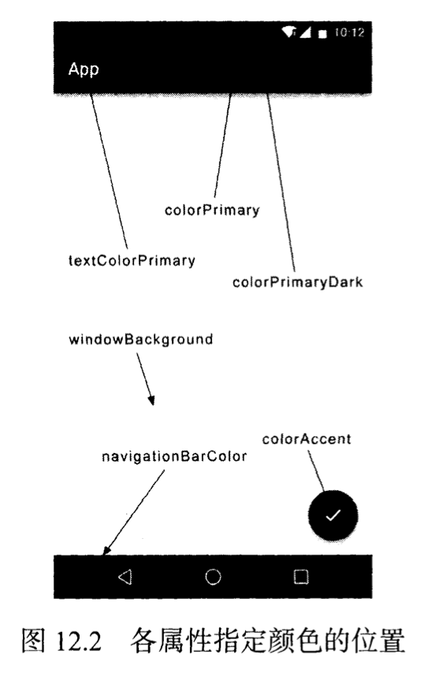

# Material Design实战

当一个项目新建之初的UI界面其实来自于AndroidManifest.xml文件中`theme`关键字的指定，这个`theme`的来源在于`res/values/styles.xml`文件

~~~xml
<resources xmlns:tools="http://schemas.android.com/tools">
    <!-- Base application theme. -->
    <style name="Theme.Material" parent="Theme.MaterialComponents.DayNight.DarkActionBar">
        <!-- Primary brand color. -->
        <item name="colorPrimary">@color/purple_500</item>
        <item name="colorPrimaryVariant">@color/purple_700</item>
        <item name="colorOnPrimary">@color/white</item>
        <!-- Secondary brand color. -->
        <item name="colorSecondary">@color/teal_200</item>
        <item name="colorSecondaryVariant">@color/teal_700</item>
        <item name="colorOnSecondary">@color/black</item>
        <!-- Status bar color. -->
        <item name="android:statusBarColor" tools:targetApi="l">?attr/colorPrimaryVariant</item>
        <!-- Customize your theme here. -->
    </style>
</resources>
~~~

可以看到style标签里面指定的parent="Theme.MaterialComponents.DayNight.DarkActionBar"，这是一个深色的`ActionBar`主题，主题可该，还是比较多的，xml文件里面也重写了很多属性。



## Toolbar

Toolbar不仅继承了`ActionBar`的所有功能，而且灵活性更高。

首先在xml里面指定一个不带ActionBar的主题，通常为：

* ```xml
  Theme.MaterialComponents.NoActionBar
  ```

* ```xml
  Theme.MaterialComponents.Light.NoActionBar
  ```

  这两种选择

  