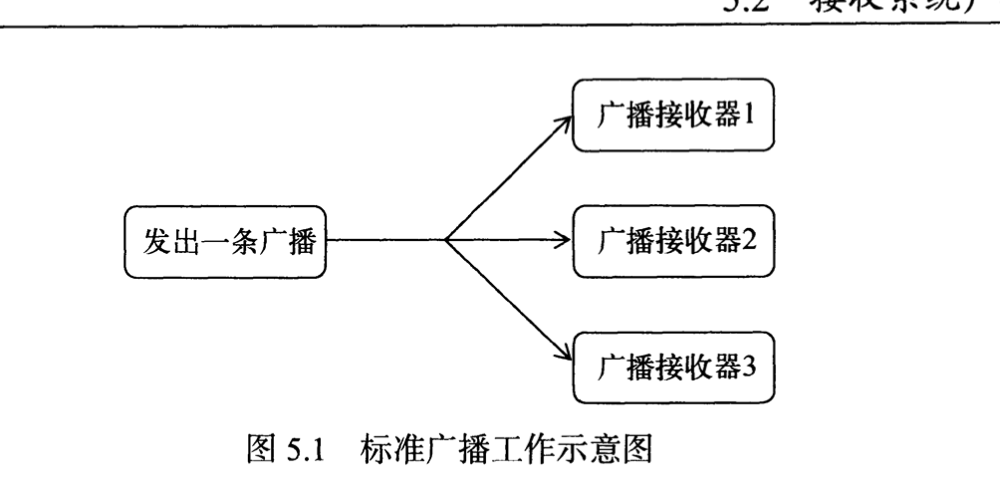
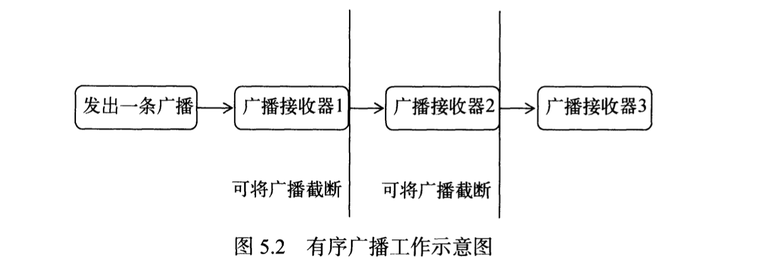
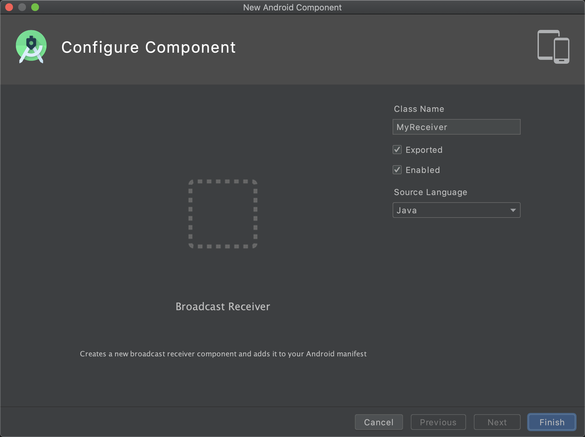

# android基础-广播机制

> ip网络里面，最大的IP地址是保留作为广播地址来使用的。比如192.168.0.XXX , 子网掩码255.255.255.0，那么这个网络的广播地址就是192.168.0.255.

Android里面的广播类型：

* 标准广播：完全异步的方式执行广播，所有的广播接收器都可以接收这条广播，因此他们之间没有任何先后顺序可言，同时无法截断。

* 有序广播：同步执行广播，广播发出之后只有一个广播接收器能够接收这条广播信息，当前广播里面的执行逻辑全部结束之后才会执行下一个，优先级高的广播器还可以进行广播的截断，让其他广播接收器无法接收拿到广播信息。

## 动态注册监听网络变化

> 注册广播的方式一般有两种：在代码里面注册和在androidManifest.xml里面进行注册，其中前者被称为动态注册，后者被称为静态注册。

~~~java
public class MainActivity extends AppCompatActivity {
    private IntentFilter intentFilter;
    private NetworkChangeReceicer networkChangeReceicer;

    @Override
    protected void onCreate(Bundle savedInstanceState) {
        super.onCreate(savedInstanceState);
        setContentView(R.layout.activity_main);
        intentFilter = new IntentFilter();
        intentFilter.addAction("android.net.conn.CONNECTIVITY_CHANGE");
        networkChangeReceicer = new NetworkChangeReceicer();
        registerReceiver(networkChangeReceicer,intentFilter);
    }

    @Override
    protected void onDestroy() {
        super.onDestroy();
        unregisterReceiver(networkChangeReceicer);
    }

    class NetworkChangeReceicer extends BroadcastReceiver{
        @Override
        public void onReceive(Context context, Intent intent) {
            Toast.makeText(context,"network changes",Toast.LENGTH_SHORT).show();
        }
    }
}
~~~

讲解：

* NetworkChangeReceicer类继承自BroadcastReceiver类，在类的内部，我们重写了父类的onReceive方法，这样，每次网络状态变化的时候，都会执行悬浮框代码。
* onCreate()方法，我们创建了一个IntentFilter实例，添加了一个"android.net.conn.CONNECTIVITY_CHANGE"的action（当网络状态发生变化的时候，系统发出的就是一个android.net.conn.CONNECTIVITY的广播，所以我们想监听什么信息就从这里添加相应的action）
* 创建一个NetworkChangeReceicer实例，然后调用registerReceiver()方法进行注册，注意它的参数，这样NetwordChangeReceiver就会收到所有值为android.net.conn.CONNECTIVITY_CHANGE的广播，这样就实现了监听网络变化的功能。
* 动态注册的广播接收器一定要取消注册，我们在onDestory()方法里面通过调用unregisterReceiver()方法取消注册。

~~~java
  class NetworkChangeReceicer extends BroadcastReceiver{
        @Override
        public void onReceive(Context context, Intent intent) {
            ConnectivityManager connectivityManager = (ConnectivityManager)getSystemService(context.CONNECTIVITY_SERVICE);
            NetworkInfo networkInfo = connectivityManager.getActiveNetworkInfo();
            if(networkInfo != null && networkInfo.isAvailable())
            {
                Toast.makeText(context,"network is available",Toast.LENGTH_SHORT).show();
            }
            else
            {
                Toast.makeText(context,"network is unavailable",Toast.LENGTH_SHORT).show();
            }
        }
    }
~~~

> 以上的操作android访问了用户的设备和隐私，这些敏感操作都必须在AndroidManifest.xml里面加入权限，比如上面的，我们就需要加上对网络系统的访问权限：

~~~xml
    <uses-permission android:name="android.permission.ACCESS_NETWORK_STATE" />
~~~

## 静态注册实现开机启动

这里面提供的是一个快捷的方式用来创建广播接收器。

Export : 是否允许这个广播接收器接受本程序以外的广播。

Enabled : 表示是否启用这个广播接收器。

同时android 会自动在androidmanifest.xml里面进行注册，采用recriver标签。

~~~xml
        <receiver
            android:name=".BootCompleteReceiver"
            android:enabled="true"
            android:exported="true"></receiver>
~~~

所有的静态广播接收器都在这里进行注册。

开机启动注册：

~~~xml
<?xml version="1.0" encoding="utf-8"?>
<manifest xmlns:android="http://schemas.android.com/apk/res/android"
    package="com.example.broadcasetest">

    <uses-permission android:name="android.permission.ACCESS_NETWORK_STATE" />
    <uses-permission android:name="android.permission.RECEIVE_BOOT_COMPLETED"/>

    <application
        android:allowBackup="true"
        android:icon="@mipmap/ic_launcher"
        android:label="@string/app_name"
        android:roundIcon="@mipmap/ic_launcher_round"
        android:supportsRtl="true"
        android:theme="@style/Theme.BroadcaseTest">
        <receiver
            android:name=".BootCompleteReceiver"
            android:enabled="true"
            android:exported="true">
            <intent-filter>
                <action android:name="android.intent.action.BOOT_COMPLETED"/>
            </intent-filter>
        </receiver>

        <activity android:name=".MainActivity">
            <intent-filter>
                <action android:name="android.intent.action.MAIN" />

                <category android:name="android.intent.category.LAUNCHER" />
            </intent-filter>
        </activity>
    </application>
</manifest>
~~~

起作用的在于：

~~~xml
    <uses-permission android:name="android.permission.RECEIVE_BOOT_COMPLETED"/>
               <intent-filter>
                <action android:name="android.intent.action.BOOT_COMPLETED"/>
            </intent-filter>
~~~

Android系统启动完成的时候发送一条值为android.intent.action.BOOT_COMPLETED的广播，同时因为监听开机需要权限，所以我们加入了相关权限标签。

## 自定义广播

1. 首先先建立一个广播的类，用上面other那个，方便快捷

   1. 

   ~~~java
   package com.example.broadcasetest;
   
   import android.content.BroadcastReceiver;
   import android.content.Context;
   import android.content.Intent;
   import android.widget.Toast;
   
   public class MyReceiver extends BroadcastReceiver {
   
       @Override
       public void onReceive(Context context, Intent intent) {
           Toast.makeText(context,"receiver in my broad",Toast.LENGTH_SHORT).show();
       }
   }
   ~~~

2. 注册广播行为：注意action标签，这个就是我们自定义接受的广播类型

   1. ~~~xml
              <receiver
                  android:name=".MyReceiver"
                  android:enabled="true"
                  android:exported="true">
                  <intent-filter>
                      <action android:name="com.example.broadcasetest.MY_BROADCAST"/>
                  </intent-filter>
              </receiver>
      ~~~

3. 发送广播，这里以一个onclick事件为例子，切记intent里面的内容，因为书上的不全，会导致广播无法接受。

   1. ~~~java
       button.setOnClickListener(new View.OnClickListener() {
                  @Override
                  public void onClick(View v) {
                      Intent intent = new Intent("com.example.broadcasetest.MY_BROADCAST");
                      intent.setComponent(new ComponentName(getPackageName(),"com.example.broadcasetest.MyReceiver"));
                      sendBroadcast(intent);
                  }
              });
      ~~~

其实就是其他app也可以收到。

1. 建立一个项目，新建一个广播器，然后对反应事件在AndroidManifest.xml里面进行注册。

2. 修改发出广播的广播器的setComponent方法的参数

   1. ~~~java
      public void onClick(View v) {
                      Intent intent = new Intent("com.example.broadcasetest.MY_BROADCAST");
                      //intent.setComponent(new ComponentName(getPackageName(),"com.example.broadcasetest.MyReceiver"));
                      intent.addFlags(0x01000000);
                      sendBroadcast(intent);
                  }
      ~~~

> https://www.cnblogs.com/panqiaoyan/p/12882487.html

## 有序广播

上面的那些都是标准广播，我们现在尝试一下有序广播：

~~~java
  public void onClick(View v) {
                Intent intent = new Intent("com.example.broadcasetest.MY_BROADCAST");
                intent.setComponent(new ComponentName(getPackageName(),"com.example.broadcasetest.MyReceiver"));
                sendOrderedBroadcast(intent,null);
            }
~~~

可以看到，我们只修改了一处代码，sendOrderedBroadcast的第二个参数是与权限相关的字符串。

如何设定顺序？

可以在AndroidManifest.xml里面设定广播的优先级，进而，我们可以再相对应的广播器里面进行广播的截断。

~~~xml
            <intent-filter android:priority="100">
                <action android:name="com.example.broadcasetest.MY_BROADCAST"/>
                <category android:name="android.intent.category.DEFAULT"/>
            </intent-filter>
~~~

其实就是简单的在广播里面添加了一个属性。

* abortBroadcast()  该方法可以对广播进行断言。

## 使用本地广播

~~~java
package com.example.broadcasttest2;

import androidx.appcompat.app.AppCompatActivity;
import androidx.localbroadcastmanager.content.LocalBroadcastManager;//注意这个包，有可能不会自动出现

import android.content.BroadcastReceiver;
import android.content.Context;
import android.content.Intent;
import android.content.IntentFilter;
import android.os.Bundle;
import android.view.View;
import android.widget.Button;
import android.widget.Toast;

public class MainActivity extends AppCompatActivity {
    private IntentFilter intentFilter;
    private LocalReceiver localReceiver;
   // private LocalBroadcastManager localBroadcastManager;
    private LocalBroadcastManager localBroadcastManager;
    @Override
    protected void onCreate(Bundle savedInstanceState) {
        super.onCreate(savedInstanceState);
        setContentView(R.layout.activity_main);
        localBroadcastManager = LocalBroadcastManager.getInstance(this); //获得当前实例
        Button button = (Button)findViewById(R.id.button);
        button.setOnClickListener(new View.OnClickListener() {
            @Override
            public void onClick(View v) {
                Intent intent = new Intent("com.example.broadcasttest2.MY_BROADCAST");
                localBroadcastManager.sendBroadcast(intent); //本地广播管理器发送信息
            }
        });
        intentFilter = new IntentFilter();
        intentFilter.addAction("com.example.broadcasttest2.MY_BROADCAST"); //这里要和发送的信息想对应
        localReceiver = new LocalReceiver();
        localBroadcastManager.registerReceiver(localReceiver,intentFilter);//注册该广播器
    }

    @Override
    protected void onDestroy() {
        super.onDestroy();
        localBroadcastManager.unregisterReceiver(localReceiver);//销毁的时候记得取消注册。
    }

    class LocalReceiver extends BroadcastReceiver{
        @Override
        public void onReceive(Context context, Intent intent) {
            Toast.makeText(context,"received local broadcast",Toast.LENGTH_LONG).show();
        }
    }
}
~~~

可以看到这类似于动态注册监听那个环节，不过这是本地的，同时可以看到其不依赖于AndroidManifest.xml文件。

## 广播最佳实践

利用广播实现销毁，强制下线功能，输入账号密码，然后成功就跳转到MainActivity,否则提示用户密码错误，但是关键在于MainActivity里面有一个功能，就是强制下线的功能。

但是MainActivity的按钮功能是发送广播

问题：

解决：

~~~java
  class ForceOfflineReceiver extends BroadcastReceiver{
        @Override
        public void onReceive(Context context, Intent intent) {
            AlertDialog.Builder builder = new AlertDialog.Builder(context);
            builder.setTitle("warning");
            builder.setMessage("you , please try again");
            builder.setCancelable(false);
            builder.setPositiveButton("ok", new DialogInterface.OnClickListener() {
                @Override
                public void onClick(DialogInterface dialog, int which) {
                    ActivityCollector.finishall();
                    Intent intent1 = new Intent(context, LoginActivity.class);
                    context.startActivity(intent1);
                }
            });
        }
    }
~~~

* AlertDialog.Builder 构建了一个对话框
* setCancelable方法将对话框设置为不可取消。
* setPositiveButton() 方法来给对话框注册确定按钮,在按钮里面实现全部的销毁操作。

