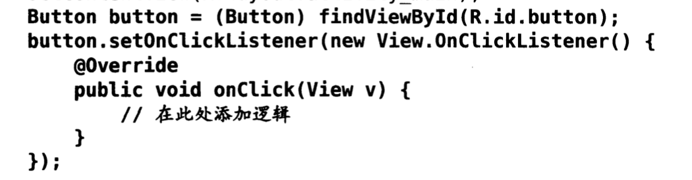

# android基础二-UI

## 基本控件

* TextView

* Button

  * android:textAllCaps="false" 关闭系统中对于button的文本自动大小写转换。
  * Button.setOnClickListener事件
  * 
  * 
  * 两种不同的定义方式，第二种是接口的方式

* EditText

  * maxLines : 属性，规定输入框里面的最大行数

* ImageView

  * setImageResource()方法可以更换图片资源

* ProgressBar

  * Android控件的可见属性，android:visibility限定，选值有visible（默认）,invisible（透明）,gone（无了）
  * setVisibility()方法，参数为View.VISIBLE , View.INVISIBLE,View.GONE

* AlertDialog , 当前界面弹出对话框，其在所有元素之上，可以屏蔽其他控件的交互能力。

  * ~~~java
                        AlertDialog.Builder dialog = new AlertDialog.Builder(MainActivity.this);
                        dialog.setTitle("this is a dialog");
                        dialog.setMessage("something import");
                        dialog.setCancelable(false);
                        dialog.setPositiveButton("ok", new DialogInterface.OnClickListener() {//按钮点击事件
                            @Override
                            public void onClick(DialogInterface dialog, int which) {
      
                            }
                        });
                        dialog.setNegativeButton("cancle", new DialogInterface.OnClickListener() {//按钮点击取消事件
                            @Override
                            public void onClick(DialogInterface dialog, int which) {
      
                            }
                        });
                        dialog.show();
    ~~~

* ProgressDialog , 这个和AlertDialog有点类似，去吧就是会有一个进度条子，具体怎么写也一样。

## 四种布局 

> 这个感觉不很重要，除非开发，就简单的了解了一下，主要是页面控制相关的。

* LinearLayout  
* 相对布局，很常用
* 帧布局，所有控件都默认摆放在布局的左上角。
* 百分比布局 ，

## 自定义控件

> 我们所有的控件都是直接或者间接继承自View的。
>
> ViewGroup是一种特殊的View,他可以包含很多子View和子ViewGroup,是一个用于放置控件和布局的容器。

## 引入布局

这个其实就是新建一个布局xml文件，然后通过一句代码包含进来。

~~~
  <include layout="@layout/title"/>
~~~

隐藏系统自带标签：

## 创建自定义控件

~~~java
    public class TitleLayout extends LinearLayout{
        public TitleLayout(Context context, AttributeSet attrs) //构造函数
        {
            super(context,attrs);
            LayoutInflater.from(context).inflate(R.layout.title,this);
        }
    }
~~~

新建TitleLayout继承自LinearLayout , 在构造函数里面对标题栏布局进行动态加载，借助LayoutInflater的form构建出一个LayoutInflater对象，然后调用inflate()方法就可以动态的加载一个布局文件。

## ListView

~~~java
public class MainActivity extends AppCompatActivity {
    public String[] data = {
            "apple","Banana"
    };

    @Override
    protected void onCreate(Bundle savedInstanceState) {
        super.onCreate(savedInstanceState);
        setContentView(R.layout.activity_main);
        ArrayAdapter<String> adapter = new ArrayAdapter<String>(
                MainActivity.this,R.layout.support_simple_spinner_dropdown_item,data
        );
        ListView listView = (ListView)findViewById(R.id.listview);
        listView.setAdapter(adapter);
    }
}
~~~

可以看出在传输数据的时候，listview控件是没有办法进行数组中 的数据传递的，我们可以通过ArrayAdapter这个适配器实现，通过其大量的重载构造函数，我们可以适配到我们的数据，最后通过setAdapter来实现数据的传递。

## ListView点击事件

~~~java
        ListView listView = (ListView)findViewById(R.id.listview);
        listView.setAdapter(adapter);
        listView.setOnItemClickListener(new AdapterView.OnItemClickListener() {
            @Override
            public void onItemClick(AdapterView<?> parent, View view, int position, long id) {
                String fruit = fruitList.get(position);
                Toast.makeText(MainActivity.this,fruit,Toast.LENGTH_SHORT).show();
            }
        });
~~~

这些其实你知道有这些事件，在逆向的时候可以猜到他们会用这个就行了。

缺点：ListView 不可以实现横向的滚动，而且如果没有进行专门的优化的话，其性能很差。

## RecycleView

官方推荐使用，其使用方法和事件跟ListView相似，但是却十分的种类繁多，建议就是在逆向过程中如果遇见可以百度谷歌+积累。