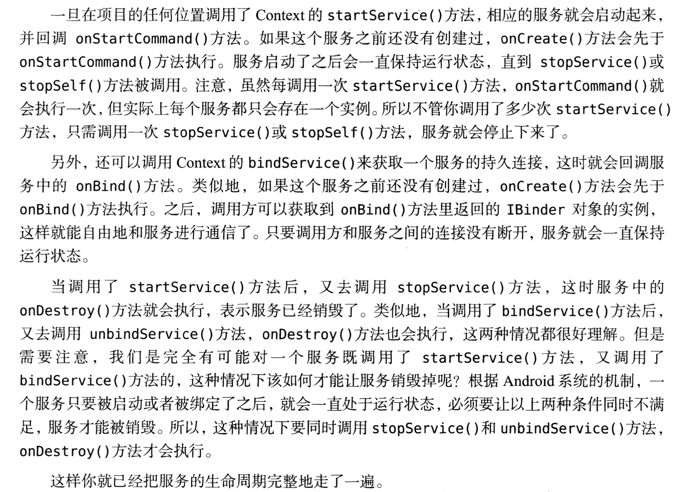

# 服务

> 服务并不是运行在一个独立的进程里面，而是依赖于创建服务时所在的应用程序进程。当某个进程被杀掉的时候，所有依赖于该进程的服务也会停止运行。

## 线程

~~~java
class Mythread extends Thread{
	@Override
	public void run(){
		// 具体逻辑
	}
}
~~~

第一种方法就是继承`Thread`类，然后重写`run()`方法

~~~java
new Mythread().start();//start方法用来启动线程
~~~

缺点：耦合性高。

第二中方法就是通过实现`Runnable`接口：

~~~java
class Mythread implements Runnable{
	@Override
	public void run(){
		// 具体逻辑
	}
}
~~~

启动方式：

~~~java
Mythread mythread = new MyThread();
new Thread(myThread).start();
~~~

new出的`MyThread`是一个实现了`Runnable`接口的对象，直接将其闯入到`Thread`的构造函数里面，然后调用`start()`方法。

第三种方法就是使用`匿名类`的方式：

~~~java
new Thread(new Runnable(){
	@Override
	public void run(){
		//具体处理逻辑
	}
}).start();
~~~

其实跟java类似。

`在子线程中更新UI`

日过想要更新应用程序里面的UI元素，则必须在主线程中进行，否则就会出现异常。

~~~java
package com.example.multithreadingtest;

import androidx.appcompat.app.AppCompatActivity;

import android.os.Bundle;
import android.view.View;
import android.widget.Button;
import android.widget.TextView;

public class MainActivity extends AppCompatActivity implements View.OnClickListener {
    private TextView text;

    @Override
    protected void onCreate(Bundle savedInstanceState) {
        super.onCreate(savedInstanceState);
        setContentView(R.layout.activity_main);
        text = (TextView)findViewById(R.id.textView);
        Button button = (Button)findViewById(R.id.button);

    }

    @Override
    public void onClick(View v) {
        switch (v.getId())
        {
            case R.id.button:
                new Thread(new Runnable() {
                    @Override
                    public void run() {
                        text.setText("Nice to meet you");
                    }
                }).start();
                break;
            default:
                break;
        }
    }
}
~~~

按照书上面说的，应该会崩溃，但是我这个成功了，因为其实线程里面也是可以更新UI的，但是为了线程安全，我们必须在UI线程，即是主线程里面更新UI，所以最好还是使用下面的异步消息机制。

异步消息处理机制用来解决子线程中进行UI操作的问题。

~~~java
package com.example.multithreadingtest;

import androidx.appcompat.app.AppCompatActivity;

import android.os.Bundle;
import android.os.Handler;
import android.os.Message;
import android.view.View;
import android.widget.Button;
import android.widget.TextView;

public class MainActivity extends AppCompatActivity implements View.OnClickListener {
    public static final int UPDATE_TEXT = 1;
    private TextView text;
    private Handler handler = new Handler(){
        public void handleMessage(Message msg){
            switch (msg.what){
                case UPDATE_TEXT:
                    text.setText("Nice to meet you");
                    break;
                default:
                    break;
            }
        }
    };
    @Override
    protected void onCreate(Bundle savedInstanceState) {
        super.onCreate(savedInstanceState);
        setContentView(R.layout.activity_main);
        text = (TextView)findViewById(R.id.textView);
        Button button = (Button)findViewById(R.id.button);
        button.setOnClickListener(this);
    }

    @Override
    public void onClick(View v) {
        switch (v.getId())
        {
            case R.id.button:
                new Thread(new Runnable() {
                    @Override
                    public void run() {
                        Message message = new Message();
                        message.what = UPDATE_TEXT;
                        handler.sendMessage(message); //将message对象发送出去
                    }
                }).start();
                break;
            default:
                break;
        }
    }
}
~~~

* 我们定义了一个`UPDATE_TEXT`用于表示更新`TextView`这个动作。
* 新建一个`Handler`对象，并且重写父类的`HandleMessage()`方法，在这里对具体的`Message`进行处理。
* 可以看到，处理UI的代码在主线程里面。

`解析异步消息处理机制`

* Message
  * Message在线程之间传递信息，可以在内部携带少量的信息，用于在不同线程之间交换信息。
    * what字段
    * arg1和arg2字段可以携带一点整形数据
    * obj字段可以携带一个`Object`对象
* Handler
  * 用于处理和发送消息
    * `sendMessage()`方法用来发送消息
    * 发送的消息最终传递到`handleMessage()`方法中
* MessageQueue
  * 消息队列，用于存放所有通过`Handler`发送的消息，这部分消息会一直在队列里面，等待被处理，每个线程里面都只会有一个`MessageQueue`对象。
* `Looper`
  * 每个线程中`MessageQueue`的关键，调用`Looper`的`loop()`方法后，就会进入一个无限循环里面，每当发现`MessageQueue`中存在一条消息，就会将它取出并传递到`Handler`的`handleMessage()`方法里面，每个线程里面也只有一个`Looper`对象。

`使用AsyncTask`

AsyncTask是一个抽象类，所以我们使用的时候必须创建一个子类去继承它。

继承的时候我们可以为其指定三个泛型参数：

* `Params` 执行AsyncTask时需要传入的参数，可用于后台任务中使用。
* `Progress` 后台执行任务的时候，如果要在界面上显示当前的进度，则使用这里指定的泛型为进度单位。
* `Result` 任务执行完毕之后，如要需要对结果进行返回，则使用这里的泛型作为返回值类型。

demo如下：

~~~java
class DownloadTask extends AsyncTask<Void ,Integer, Boolean>{
 ...
}
~~~

* 第一个参数为`Void`表示在执行AsyncTask的时候不需要传入参数给后台程序。
* `Integer`参数表示用整形数据来作为进度显示单位。
* `Boolean` 表示使用布尔类型 来反馈执行结果。

重写AsyncTask中的方法来完成对任务的制定：

* `onPreExecute()`   后台任务开始执行时被调用，用于界面上的一些初始化操作。
* `doInBackground(Params...)` 这个方法中的代码都会在子线程里面进行执行，在这里处理所有的耗时任务，任务一旦完成就return语句来将任务的执行结果返回，但是第三个参数是void的时候可以不返回结果，但是**该方法不能进行UI操作。**
* `publishProgress(Progress...)` 方法可以完成UI更新操作。
* `onProgressUpdate(Progress...)`  任务在后台调用了`publishProgree(Progress...)` 的时候该方法很快被调用，该方法携带的参数是后台任务中传递过来的，该方法中可以进行UI更新操作。
* `onPostExecute(Result)` 后台任务执行完毕的时候并通过Return 语句进行返回的时候，该方法会被调用。返回的数据会作为参数被传递到此方法中，可以利用返回的数据来进行UI操作。

~~~java
package com.example.multithreadingtest;

import android.app.ProgressDialog;
import android.content.Context;
import android.os.AsyncTask;
import android.widget.Toast;

public class DownloadTask extends AsyncTask<Void,Integer,Boolean> {
    @Override
    protected void onPreExecute() {
        ProgressDialog.show(); //显示进度对话框
    }

    @Override
    protected Boolean doInBackground(Void... voids) {
        try{
            while(true){
                int downloadPercent = doDownload(); //doDownlaod是虚构的方法 ， 这里用来执行下载任务、
                publishProgress(downloadPercent); //这里用来作为`onProgressUpdate`方法被调用的起因
                if(downloadPercent>=100){
                    break;
                }
            }
        }catch (Exception e){
            return false;
        }
        return true;
    }

    @Override
    protected void onProgressUpdate(Integer... values) {
        ProgressDialog.setMessage("Download" + values[0] + "%"); //更新下载速度
    }

    @Override
    protected void onPostExecute(Boolean aBoolean) {
        ProgressDialog.dismiss(); // 关闭对话框
        if(aBoolean){
            Toast.makeText(context,"Download Succeeded",Toast.LENGTH_LONG).show();
        }
        else {
            Toast.makeText(context,"Download Failed",Toast.LENGTH_LONG).show();
        }
    }
}
~~~

这是一个代码，只是用来清楚的告诉大家函数的功能和用途，编译肯定通过不了，因为好多方法没有实现。

如何启动上述任务？

~~~java
new DownloadTask.execute(); //一行代码搞定
~~~

## 服务的基本用法

* Exported属性表示是否允许除了当前应用程序之外的其他程序访问这个服务。
* Enable属性表示是否启用这个服务。

创建成功之后，重写了一些方法有如下代码：

~~~java
public class MyService extends Service {
    public MyService() {
    }

    @Override
    public IBinder onBind(Intent intent) {
        // TODO: Return the communication channel to the service.
        throw new UnsupportedOperationException("Not yet implemented");
    }

    @Override
    public void onCreate() {
        super.onCreate();
        Log.d("MyService","Oncreate excuted");
    }

    @Override
    public int onStartCommand(Intent intent, int flags, int startId) {
        Log.d("MyService","onStartCommand executed");
        return super.onStartCommand(intent, flags, startId);
    }

    @Override
    public void onDestroy() {
        super.onDestroy();
        Log.d("MyService","onDestroy executed");
    }
}
~~~

* `onBind`方法是Service里面唯一一个抽象方法，必须在子类里面实现。
* `onStartCommand`方法会在每次服务启动的时候调用。其他的都很明显了。

每一个服务都必须在`AndroidMainfest.xml`文件里面进行注册才可以生效，但是`Android Studio`可以帮助自动添加。

`启动和停止服务`

启动和停止的方法都是借助`Intent`来实现的。

~~~java
public class MainActivity extends AppCompatActivity implements View.OnClickListener{

    @Override
    protected void onCreate(Bundle savedInstanceState) {
        super.onCreate(savedInstanceState);
        setContentView(R.layout.activity_main);
        Button startService = (Button)findViewById(R.id.start_service);
        Button stopService = (Button)findViewById(R.id.stop_service);
        startService.setOnClickListener(this);
        stopService.setOnClickListener(this);
    }

    @Override
    public void onClick(View v) {
        switch (v.getId()){
            case R.id.start_service:
                Intent startIntent = new Intent(this,MyService.class);
                startService(startIntent);   //启动服务
                break;
            case R.id.stop_service:
                Intent stopIntent = new Intent(this,MyService.class);
                stopService(stopIntent); //停止服务
                break;
            default:
                break;
        }
    }
}
~~~

服务如何自动停止下来？

* 只需要在`MyService`的任何一个位置调用`stopSelf`方法就能让这个服务停止。

`活动和服务进行通信`

`onBind`方法可以让服务和活动之间的关系变得紧密。

当一个服务和一个活动绑定 后，就可以调用该服务里面的`Binder`提供的方法。

MyService.java:

~~~java
package com.example.servicetest;

import android.app.Service;
import android.content.Intent;
import android.os.Binder;
import android.os.IBinder;
import android.util.Log;

public class MyService extends Service {
    private DownloadBinder binder = new DownloadBinder();

    public MyService() {
    }
    class DownloadBinder extends Binder{ //下载类，提供了下载和获得进程的方法
        public void startDownload(){
            Log.d("MyService","startDownload executed");
        }
        public int getProgress(){
            Log.d("MyService","getProgress executed");
            return 0;
        }
    }
    @Override
    public IBinder onBind(Intent intent) {
        // TODO: Return the communication channel to the service.
        return binder;
    }

    @Override
    public void onCreate() {
        super.onCreate();
        Log.d("MyService","Oncreate excuted");
    }

    @Override
    public int onStartCommand(Intent intent, int flags, int startId) {
        Log.d("MyService","onStartCommand executed");
        return super.onStartCommand(intent, flags, startId);
    }

    @Override
    public void onDestroy() {
        super.onDestroy();
        Log.d("MyService","onDestroy executed");
    }
}
~~~

MainActivity.java

~~~java
package com.example.servicetest;

import androidx.appcompat.app.AppCompatActivity;

import android.content.ComponentName;
import android.content.Intent;
import android.content.ServiceConnection;
import android.os.Bundle;
import android.os.IBinder;
import android.view.View;
import android.widget.Button;

public class MainActivity extends AppCompatActivity implements View.OnClickListener{
    private MyService.DownloadBinder downloadBinder;
    private ServiceConnection connection = new ServiceConnection() {
        @Override
        public void onServiceConnected(ComponentName name, IBinder service) {
            downloadBinder = (MyService.DownloadBinder) service; //在这里服务和活动被链接
            downloadBinder.startDownload();
            downloadBinder.getProgress();
        }

        @Override
        public void onServiceDisconnected(ComponentName name) {
        }
    };

    @Override
    protected void onCreate(Bundle savedInstanceState) {
        super.onCreate(savedInstanceState);
        setContentView(R.layout.activity_main);
        Button startService = (Button)findViewById(R.id.start_service);
        Button stopService = (Button)findViewById(R.id.stop_service);
        startService.setOnClickListener(this);
        stopService.setOnClickListener(this);
        Button bindService = (Button)findViewById(R.id.bind_service);
        Button unbindService = (Button)findViewById(R.id.unbind_service);
        bindService.setOnClickListener(this);
        unbindService.setOnClickListener(this);
    }

    @Override
    public void onClick(View v) {
        switch (v.getId()){
            case R.id.bind_service:
                Intent bindIntent = new Intent(this,MyService.class);
                bindService(bindIntent,connection,BIND_AUTO_CREATE); //绑定服务
                break;
            case R.id.unbind_service:
                Intent unbindIntent = new Intent(this,MyService.class);
                unbindService(connection); //解绑服务
                break;
            case R.id.start_service:
                Intent startIntent = new Intent(this,MyService.class);
                startService(startIntent);   //启动服务
                break;
            case R.id.stop_service:
                Intent stopIntent = new Intent(this,MyService.class);
                stopService(stopIntent); //停止服务
                break;
            default:
                break;
        }
    }
}
~~~

* `BIND_AUTO_CREATE`表示活动和服务进行绑定后自动创建服务，这会使得`MyService`里面的`onCreate`方法得到执行。

## 服务的生命周期

## 服务的更多技巧

`使用前台服务`

服务大多在后台运行，但是服务的优先级比较低，所以当系统内存出现不足的情况的时候，有可能回收掉正在后台进行的服务，为了避免被回收，我们可以使用前台服务。

前台服务在运行的时候有一个正在运行的图标在系统的状态栏显示，类似`ssr`哈哈。

为了实现前台服务，我们只需要更改`MyService`里面的`onCreate`方法

~~~java
    @Override
    public void onCreate() {
        super.onCreate();
        Log.d("MyService","Oncreate excuted");
        NotificationChannel notificationChannel = null;
        if(Build.VERSION.SDK_INT >= Build.VERSION_CODES.O){
            notificationChannel = new NotificationChannel(CHANNEL_ID,"asda",NotificationManager.IMPORTANCE_HIGH);
            notificationChannel.enableLights(true);
            notificationChannel.setLightColor(Color.RED);
            notificationChannel.setShowBadge(true);
            notificationChannel.setLockscreenVisibility(Notification.VISIBILITY_PUBLIC);
            NotificationManager manager = (NotificationManager)getSystemService(NOTIFICATION_SERVICE);
            manager.createNotificationChannel(notificationChannel);
        }
        Intent intent = new Intent(this,MainActivity.class);
        PendingIntent pi = PendingIntent.getActivity(this,0,intent,0);
        Notification notification = new NotificationCompat.Builder(this)
                .setChannelId(CHANNEL_ID)
                .setContentTitle("This is a Content title")
                .setContentText("This is a content text")
                .setWhen(System.currentTimeMillis())
                .setSmallIcon(R.mipmap.ic_launcher)
                .setLargeIcon(BitmapFactory.decodeResource(getResources(),R.mipmap.ic_launcher))
                .setContentIntent(pi)
                .setPriority(Notification.PRIORITY_DEFAULT)
                .build();
        startForeground(1,notification);
    }
~~~

这十分类似创建通知的方法，但是没有通过`NotificationManager`来将通知显示出来，而是调用了`startForeground`方法让`MyService`变成一个前台服务。

同时，由于Android 8.0开始必须使用channal，所以跟书上会有所不同。

`使用IntentService`

服务里面的代码 一般默认在主线程里面运行，但是如果在服务里面处理一些耗时的逻辑，可能会引发`ANR(Application Not Responding)`

Android的多线程编程可以解决这个问题，我们在服务的每一个具体的方法里面开启一个子线程，在这里处理比较耗时的逻辑。

~~~java
    @Override
    public int onStartCommand(Intent intent, int flags, int startId) {
        Log.d("MyService","onStartCommand executed");
        new Thread(new Runnable() {
            @Override
            public void run() {
                //处理具体的逻辑
              stopSelf(); //实现服务执行完毕之后自动停止，如果没有的话服务会一直处于运行状态，使用 stopService()也可以。
            }
        }).start();
        return super.onStartCommand(intent, flags, startId);
    }
~~~

为了简单的创建一个异步的，会自动停止的服务，Android提供了一个`IntentService`类。

~~~java
package com.example.servicetest;

import android.app.IntentService;
import android.content.Intent;
import android.util.Log;

import androidx.annotation.Nullable;

public class MyIntentService extends IntentService {
    public MyIntentService(){
        super("MyIntentService"); //调用父类的有参构造函数
    }

    @Override
    protected void onHandleIntent(@Nullable Intent intent) { //子类里面必须实现这个抽象方法
        Log.d("MyIntentService","Thread is " + Thread.currentThread().getId()); //打印当前线程的ID。
    }

    @Override
    public void onDestroy() { //根据IntentService的性质，服务运行后会自动停止
        super.onDestroy();
        Log.d("MyIntentService","onDestroy executed");
    }
}
~~~

但是要记得在AndroidManifest.xml里面进行服务注册：

~~~xml
        <service android:name=".MyIntentService"></service>
~~~

然后再onClick里面添加一个case启动就可以了：

~~~java
            case R.id.start_intent_service:
                Log.d("MainActivity","Thread id is " + Thread.currentThread().getId());
                Intent intentService = new Intent(this,MyIntentService.class);
                startService(intentService);
                break;
~~~

## 服务的最佳实践，完整版的下载示例

 MainActivity.java

~~~java
package com.example.servicebestpractice;

import androidx.appcompat.app.AppCompatActivity;

import android.os.Bundle;

public class MainActivity extends AppCompatActivity {

    @Override
    protected void onCreate(Bundle savedInstanceState) {
        super.onCreate(savedInstanceState);
        setContentView(R.layout.activity_main);
    }
    public interface DownloadListener{ //定义回调接口 ， 里面声明五个回调方法
        void onProgress(int progress);
        void onSuccess();
        void onFailed();
        void onPaused();
        void onCanceled();
    }
}
~~~

DownloadTask.java

~~~java
package com.example.servicebestpractice;
import android.os.AsyncTask;
import android.os.Environment;
import java.io.File;
import java.io.IOException;
import java.io.InputStream;
import java.io.RandomAccessFile;
import okhttp3.OkHttpClient;
import okhttp3.Request;
import okhttp3.Response;

public class DownloadTask extends AsyncTask<String,Integer,Integer> {
    public static final int TYPE_SUCCESS = 0;
    public static final int TYPE_FAILED = 1;
    public static final int TYPE_PAUSED = 2;
    public static final int TYPE_CANCELED = 3;
    public MainActivity.DownloadListener listener;
    private boolean isCanceled = false;
    private boolean isPaused = false;
    private int lastProgress;

    public DownloadTask(MainActivity.DownloadListener listener1){
        this.listener = listener1; //传入MainActivity定义的参数
    }

    @Override
    protected Integer doInBackground(String... strings) {
        InputStream is = null;
        RandomAccessFile saveFile = null;
        File file = null;
        try {
            long downloadedLength = 0;
            String downloadUrl = strings[0];
            String fileName = downloadUrl.substring(downloadUrl.lastIndexOf("/"));
            String directory = Environment.getExternalStoragePublicDirectory(Environment.DIRECTORY_DOWNLOADS).getPath(); //SD卡的download目录
            file = new File(directory + fileName);
            if(file.exists()){
                downloadedLength = file.length();
            }
            long contentLength = getContentLength(downloadUrl);
            if(contentLength==0){
                return TYPE_FAILED;
            }else if (contentLength == downloadedLength){
                return TYPE_SUCCESS; //如果待下载大小和文件大小相等那么就直接返回正确
            }
            OkHttpClient client = new OkHttpClient();
            Request request = new Request.Builder()
                    .addHeader("RANGE","bytes = " + downloadedLength + ".") //告诉服务器我们从第几个字节开始下载
                    .url(downloadUrl)
                    .build();
            Response response = client.newCall(request).execute();
            if(response == null){
                is = response.body().byteStream();
                saveFile = new RandomAccessFile(file,"rw");
                saveFile.seek(downloadedLength);
                byte[] b = new byte[1024];
                int total = 0;
                int len;
                while ((len = is.read(b)) != -1){
                    if(isCanceled){
                        return TYPE_CANCELED;
                    }else if (isPaused){
                        return TYPE_PAUSED;
                    }else {
                        total += len;
                        saveFile.write(b,0,len);
                        int progress = (int)((total + downloadedLength)*100 / contentLength);
                        publishProgress(progress); //下载进度通知
                    }
                }
                response.body().close();
                return TYPE_SUCCESS;
            }
        }catch (Exception e){
            e.printStackTrace();
        }finally {
            try {
                if(is != null){
                    is.close();
                }
                if(saveFile != null){
                    saveFile.close();
                }
                if(isCanceled && file != null){
                    file.delete();
                }
            }catch (Exception e){
                e.printStackTrace();
            }
        }
        return TYPE_FAILED;
    }

    @Override
    protected void onProgressUpdate(Integer... values) {
        int progress  = values[0];
        if(progress > lastProgress){
            listener.onProgress(progress);
            lastProgress = progress;
        }
    }

    @Override
    protected void onPostExecute(Integer integer) {
        switch (integer){ //根据参数调用回调方法
            case TYPE_SUCCESS:
                listener.onSuccess();
                break;
            case TYPE_FAILED:
                listener.onFailed();
                break;
            case TYPE_PAUSED:
                listener.onPaused();
                break;
            case TYPE_CANCELED:
                listener.onCanceled();
                break;
            default:
                break;
        }
    }
    public void pauseDownload(){
        isPaused = true;
    }
    public void cancelDownload(){
        isCanceled = true;
    }
    private long getContentLength(String downloadUrl) throws IOException{ //用来获取待下载文件的总长度
        OkHttpClient client = new OkHttpClient();
        Request request = new Request.Builder()
                .url(downloadUrl)
                .build();
        Response response = client.newCall(request).execute();
        if(response != null && response.isSuccessful()){
            long contentLength = response.body().contentLength();
            response.close();
            return contentLength;
        }
        return 0;
    }
}
~~~

到这里我们其实只是声明了一些回调方法，但是还没对他们进行实现，所以我们还需要一个服务：

DownService.java

~~~java
package com.example.servicebestpractice;

import android.app.Notification;
import android.app.NotificationManager;
import android.app.PendingIntent;
import android.app.Service;
import android.content.Intent;
import android.graphics.BitmapFactory;
import android.os.Binder;
import android.os.Environment;
import android.os.IBinder;
import android.widget.Toast;

import androidx.core.app.NotificationCompat;

import java.io.File;

public class DownService extends Service {
    private DownloadTask downloadTask;
    private String downloadUrl;

    private MainActivity.DownloadListener listener = new MainActivity.DownloadListener() {
        @Override
        public void onProgress(int progress) {
            getNotificationManager().notify(1,getNotification("Download.....",progress));
        }

        @Override
        public void onSuccess() {
            getNotificationManager().notify(1,getNotification("Download Success",-1));
            Toast.makeText(DownService.this,"Download Success",Toast.LENGTH_LONG).show();
        }

        @Override
        public void onFailed() {
            downloadTask = null;
            stopForeground(true);
            getNotificationManager().notify(1,getNotification("Downlaod Failed",-1));
            Toast.makeText(DownService.this,"Download Failed",Toast.LENGTH_LONG).show();
        }

        @Override
        public void onPaused() {
            downloadTask = null;
            Toast.makeText(DownService.this,"paused",Toast.LENGTH_LONG).show();
        }

        @Override
        public void onCanceled() {
            downloadTask = null;
            stopForeground(true);
            Toast.makeText(DownService.this,"Canceled",Toast.LENGTH_LONG).show();
        }
    };
    private DownloadBinder mBinder = new DownloadBinder();

    public DownService() {
    }
    class DownloadBinder extends Binder{
        public void startDownload(String url){
            if(downloadTask == null){
                downloadUrl = url;
                downloadTask = new DownloadTask(listener);
                downloadTask.execute(downloadUrl);
                startForeground(1,getNotification("Download....",0));
                Toast.makeText(DownService.this,"downloading...",Toast.LENGTH_LONG).show();
            }
        }
        public void pauseDownload(){
            if(downloadTask != null){
                downloadTask.pauseDownload();
            }
        }
        public void cancelDownload(){
            if(downloadTask != null){
                downloadTask.cancelDownload();
            }else {
                if(downloadUrl != null){
                    String filename = downloadUrl.substring(downloadUrl.lastIndexOf("/"));
                    String directory = Environment.getExternalStoragePublicDirectory(Environment.DIRECTORY_DOWNLOADS).getPath();
                    File file = new File(directory + filename);
                    if(file.exists()){
                        file.delete();
                    }
                    getNotificationManager().cancel(1);
                    stopForeground(true);
                    Toast.makeText(DownService.this,"Canceled",Toast.LENGTH_LONG).show();
                }
            }
        }
    }
    private NotificationManager getNotificationManager(){
        return (NotificationManager)getSystemService(NOTIFICATION_SERVICE);
    }
    private Notification getNotification(String title,int progress){
        Intent intent = new Intent(this,MainActivity.class);
        PendingIntent pi = PendingIntent.getActivity(this,0,intent,0);
        NotificationCompat.Builder builder = new NotificationCompat.Builder(this);
        builder.setSmallIcon(R.mipmap.ic_launcher);
        builder.setLargeIcon(BitmapFactory.decodeResource(getResources(),R.mipmap.ic_launcher));
        builder.setContentIntent(pi);
        builder.setContentTitle(title);
        if(progress>0){
            builder.setContentText(progress + "%");
            builder.setProgress(100,progress,false);
        }
        return builder.build();
    }

    @Override
    public IBinder onBind(Intent intent) {
        // TODO: Return the communication channel to the service.
        return mBinder;
    }
}
~~~

