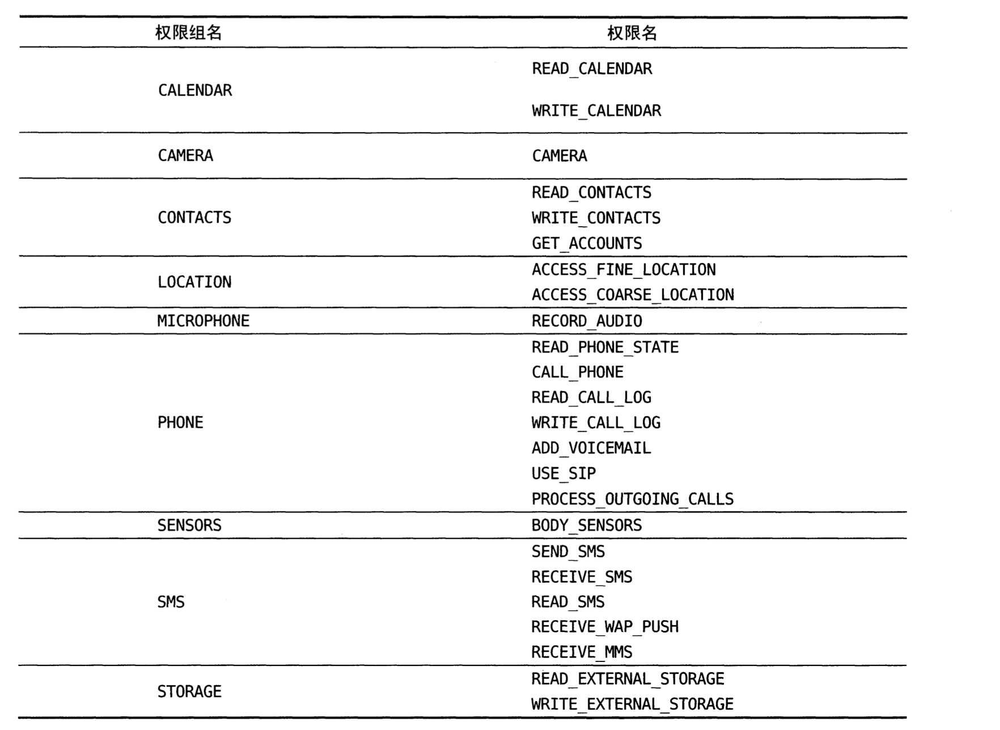
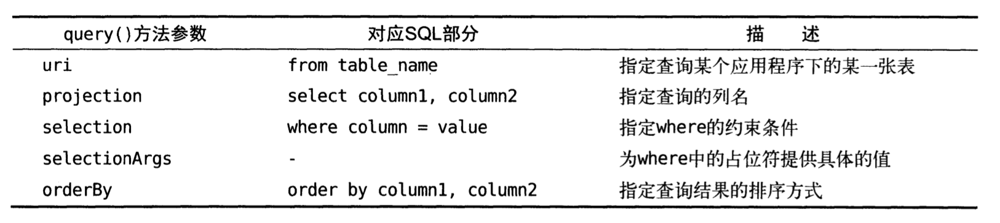

# 第七章-跨程序共享数据-内容提供器

Android中所有的危险权限

一共九组24个权限。

值得注意的是，如果一旦用户授权某个权限，那么该权限对应的权限组中所有的其他权限也会被同时授予。

> http://developer.android.com/reference/android/Mainfest.permission.html

上面网上上有Android系统中完整的权限列表。

`电话拨打权限`

~~~java
        make_call.setOnClickListener(new View.OnClickListener() {
            @Override
            public void onClick(View v) {
                try {
                    Intent intent = new Intent(Intent.ACTION_CALL);
                    intent.setData(Uri.parse("tel:10086"));
                    startActivity(intent);

                }catch (SecurityException e)
                {
                    e.printStackTrace();
                }
            }
        });
~~~

其中：

* `ACTION_CALL`是系统内置的打电话的动作，data部分指定的是`tel`协议，号码是`10086`.
* `ACTION_DIAL`表示打开拨号界面，这个倒是不需要声明权限。

权限：

~~~xml
    <uses-permission android:name="android.permission.CALL_PHONE"/>
~~~

代码：

~~~java
        make_call.setOnClickListener(new View.OnClickListener() {
            @Override
            public void onClick(View v) {
                try {
                    Intent intent = new Intent(Intent.ACTION_CALL);
                    intent.setData(Uri.parse("tel:10086"));
                    startActivity(intent);

                }catch (SecurityException e)
                {
                    e.printStackTrace();
                }
            }
        });
~~~

上述代码在`低于Android6.0`里面还是比较好用的，但是在以上版本，由于权限必须又用户授予的原则，这种方法就被抛弃了。

~~~java
public class MainActivity extends AppCompatActivity {

    @Override
    protected void onCreate(Bundle savedInstanceState) {
        super.onCreate(savedInstanceState);
        setContentView(R.layout.activity_main);
        Button make_call = (Button)findViewById(R.id.make_call);
        make_call.setOnClickListener(new View.OnClickListener() {
            @Override
            public void onClick(View v) {
                if(ContextCompat.checkSelfPermission(MainActivity.this, Manifest.permission.CALL_PHONE)!= PackageManager.PERMISSION_GRANTED)
                {
                    ActivityCompat.requestPermissions(MainActivity.this,new String[]{Manifest.permission.CALL_PHONE},1);
                }
                else
                {
                    try {
                        Intent intent = new Intent(Intent.ACTION_CALL);
                        intent.setData(Uri.parse("tel:10086"));
                        startActivity(intent);

                    }catch (SecurityException e)
                    {
                        e.printStackTrace();
                    }
                }
            }
        });
    }

    @Override
    public void onRequestPermissionsResult(int requestCode, @NonNull String[] permissions, @NonNull int[] grantResults) {
        switch (requestCode)
        {
            case 1:
                if(grantResults.length>0 && grantResults[0] == PackageManager.PERMISSION_GRANTED)
                {
                    try {
                        Intent intent = new Intent(Intent.ACTION_CALL);
                        intent.setData(Uri.parse("tel:10086"));
                        startActivity(intent);

                    }catch (SecurityException e)
                    {
                        e.printStackTrace();
                    }
                }
                else {
                    Toast.makeText(this,"You denied the perssion",Toast.LENGTH_LONG).show();
                }
                break;
            default:
                break;
        }
    }
}
~~~

* `ContextCompat.checkSelfPermission()`方法
  * 参数1：context
  * 参数2：权限名
  * 方法的返回值和`PackageManager.PERMISSION_GRANTED`做比较，相等说明用户已经授权。
* `ActivityCompat.requestPermissions()`方法向用户申请使用权限。
  * 参数1，`Activity`实例
  * 参数2：`String`数组，要申请 的权限名字放入数组里
  * 参数3：请求码，只要是唯一值就可以了，这里传入的是1
  * 返回值：最终都会回调到`onRequest-PermissionsResult()`方法里面，授权的结果则保存在`grantResults`参数里面。

`访问其他程序里面的数据`

想访问内容提供器里面的数据，那么必须要借助`Content-Resolver`类，可以通过`Context`里面的`getContentResolver()`方法获得该类的实例。

`Uri`包括`authority`和`path`.

* `authority`：用于对不同的程序进行区分。
* `path`：对不同程序的表进行区分，通常都会加到`authority`后面。

> 例子:content://com.example.app.provider/table2

最开始的部分是协议声明。

~~~java
Uri uri = Uri.parse("content://com.example.ru");
~~~

`Uri.parse()`方法可以将URI字符串解析成Uri对象。

~~~java
Cursor cursor = getContentResolver().query(
	uri,
	projection,
	selection,
	selectionArgs,
	sortOrder
);
~~~

数据提取就跟sql的一样了。其他 的也很类似。

`读取系统联系人`：

cet

