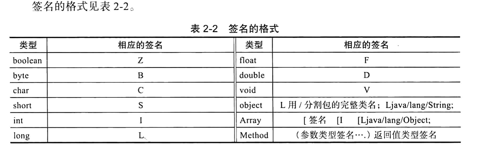

# Android NDK开发

> 大致一看目录，书的版本有点老，写的又老又菜，直接android开发官网手册整起来。
>
> https://developer.android.com/ndk/guides?hl=zh-cn

原生开发套件 (NDK) 是一套工具，使您能够在 Android 应用中使用 C 和 C++ 代码，并提供众多[平台库](https://developer.android.com/ndk/guides/stable_apis?hl=zh-cn)，您可使用这些平台库管理原生 Activity 和访问实体设备组件，例如传感器和触摸输入。

NDK的一大用途就是把C/C++代码编译到原生库里面去，然后使用Andorid studio的集成系统Gradle将原生库打包到APK里面去，然后java代码就可以通过jni进行调用。

NDK集成了交叉编译器，并提供了相应的mk文件隔离CPU、平台、ABI等差异，开发人员只需要简单修改mk文件（指出“哪些文件需要编译”、“编译特性要求”等），就可以创建出so。

> mk文件，是android DNK构建系统使用的一个可选构建文件，它的目的在于描述应用程序需要哪些模块，也定义了所有模块的一些通用变量。
>
> Android.mk位于项目jni/子目录里面,用于向构建系统描述源文件和共享库。它实际上是一个微小的 GNU makefile 片段，构建系统会将其解析一次或多次。`Android.mk` 文件用于定义 [`Application.mk`](https://developer.android.com/ndk/guides/application_mk?hl=zh-cn)、构建系统和环境变量所未定义的项目级设置。它还可替换特定模块的项目级设置。

## 原生API和应用

Android SDK 提供了辅助类 `NativeActivity`，可用于编写完全原生的 Activity。`NativeActivity` 可处理 Android 框架与原生代码之间的通信，因此您不必子类化该类或调用其方法，只需在 `AndroidManifest.xml` 文件中将您的应用声明为原生应用，然后开始创建该原生应用。

## JavaVM 和 JNIEnv

这两个都是jni定义的两个关键数据结构。两者本质上都是指向函数表的二级指针。（在 C++ 版本中，它们是一些类，这些类具有指向函数表的指针，并具有每个通过该函数表间接调用的 JNI 函数的成员函数。）

* JavaVM提供调用接口函数，理论上，每个进程可以有多个 JavaVM，但 Android 只允许有一个。
* JNIEnv 提供了大部分jni函数。您的原生函数都会收到JNIEnv作为第一个参数（逆向的时候知道这一点还是比较重要的。）
  * 但是改JNIEnv用于线程本地存储，因此线程之间没有办法共享JNIEnv。如果一段代码无法通过其他方法获取自己的 JNIEnv，您应该共享相应 JavaVM，然后使用 `GetEnv` 发现线程的 JNIEnv。

JNIEnv类型

~~~java
extern "C" JNIEXPORT void JNICALL Java_com_example_ndk01_MainActivity_PrintWhat(JNIEnv *env,jobject){
    int result = add_c(4,6);
    int a = add(4,6);
};
~~~

JNIEnv实际上代表了java环境，通过对JNIEnv* 指针就可以对java端的代码进行操作。

JNIEnv类中有很多函数可以用：

NewObject:创建Java类中的对象

NewString:创建Java类中的String对象

New<Type>Array:创建类型为Type的数组对象

Get<Type>Field:获取类型为Type的字段

Set<Type>Field:设置类型为Type的字段的值

GetStatic<Type>Field:获取类型为Type的static的字段

SetStatic<Type>Field:设置类型为Type的static的字段的值

Call<Type>Method:调用返回类型为Type的方法

CallStatic<Type>Method:调用返回值类型为Type的static方法

等许多的函数，具体的可以查看jni.h文件中的函数名称。

jobject参数 ojb

* 如果native方法不是static,obj就代表native方法。
* 如果native方法是static，obj就是代表native方法的类的class对象实例（static方法不需要类实例的，所以就代表这个类的class对象）

jclass类型

为了能够在C/C++里面使用Java类，jni.h头文件中专门定义了jclass类型来表示Java中的Class类。

JNIEnv类里面有如下几个简单函数可以取得jclass:

* jclass FindClass (const char* clsName) : 通过类的名称（类的全名，这时候包名不是用.而是用/来区分的）获取jclass.   

  * ~~~java
    jclass str = env->FindClass("java/lang/String"); //获取java中的String对象的class对象
    ~~~

* jclass GetObjectClass(jobject obj) ： 通过对象实例来获取jclass，相当于Java中的getClass方法。

* jclass GetSuperClass(jclass obj) : 通过jclass可以获取其父类的jclass对象。

在native中访问java层代码

为了在C/C++中表示端的属性和方法，JNI在jni.h头文件中定义了jfieldId , jmethodID类型来分别代表Java端的属性和方法。在访问或者设置Java属性的时候，首先要在本地代码取得代表该Java属性的jfiledID，然后才能在本地代码中进行Java属性的操作，同样需要调用Java端的方法的时候，也是需要取得代表该方法的jmethodID才能进行Java方法 调用。

> javap可以查看类中的字段和方法的签名。同时JNIEnv中的GetMethodID方法也可以获取构造函数的jmethodID，创建一个Java对象的时候可以调用指定的构造方法。

常见的调用java层的方法:

一般是使用JNIEnv来进行操作

- GetFieldID/GetMethodID：获取某个属性/某个方法
- GetStaticFieldID/GetStaticMethodID：获取某个静态属性/静态方法

下面是方法的具体实现：

~~~java
jfieldID GetFieldID(JNIEnv *env, jclass clazz, const char *name, const char *sig);
jmethodID GetMethodID(JNIEnv *env, jclass clazz, const char *name, const char *sig);
jfieldID GetStaticFieldID(JNIEnv *env, jclass clazz, const char *name, const char *sig);
jmethodID GetStaticMethodID(JNIEnv *env, jclass clazz,const char *name, const char *sig);
~~~

可以发现他们都是四个入参，而且参数一致。

* jclass代表的就是java层的类。
* name代表的是方法名或者属性名
* char *sig 代表的JNI中的一个特殊字段--签名（每个变量，方法都是有签名的）。

JNIEnv中有一个特殊的方法CallNonvirtual<Type>Method，

### C++和JAVA在继承的上的区别

java中假设父类和子类都有一个function方法：

~~~java
Father p = new Child();
p->function();
~~~

此时的java执行的是子类里面的方法。

在C++中，如果类似上面的情况则会执行父类的方法，那么此时如何执行子类的function呢?则必须把父类的function函数设置为虚函数。

因此在Java中，所有的方法都是虚拟的，所以总是调用子类的方法，此时`CallNonvirtual<Type>Method`就可以实现子类对象调用父类方法的功能。

## C/C++中如何创建JAVA对象

大致流程就死：

* 通过jclass 参数先获得class对象
* 然后通过env提供的方法获得构造函数
* env提供的方法用来构建对象实例
* 获得实例中相应的函数id
* 调用实例中的函数

第二种方法：

用`AllObject`函数创建一个对象，可以根据传入的jclass创建一个java对象，但是状态是非初始化的，为了延迟构造函数的调用，在这个对象前绝对要调用`CallNonvirtualVoidMethod`函数来调用该jclass的构造函数。

> 这种方法用的很少

`native中操作Java字符串`

Java和C/C++中字符串的区别：

Java中使用的String对象是Unicode编码的。

