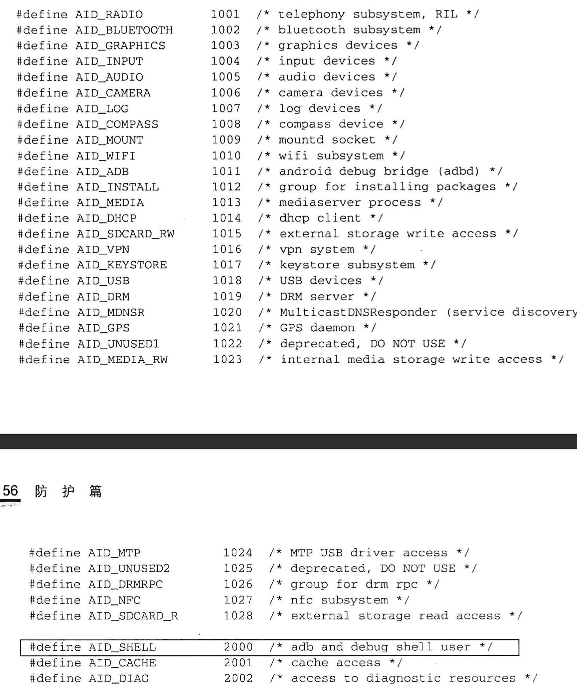

# Android 中的run-as命令

android中有一个runs-as命令，作用是以root身份运行命令，但是必须携带指定应用包名参数，而且这个应用是debug模式的，其被开发者用来查看自己应用中的沙盒数据，在设备没有root的情况下可以用这个命令查看。

> 应用沙盒相关：https://source.android.google.cn/security/app-sandbox?hl=zh-cn

run-as [packagename]。其中packagename就是想查看的应用的包名，运行命令之后，就直接进入指定应用的目录：`/data/data/packagename`

Android中的命令一般放在/system/bin和/system/xbin目录下，这些命令的源码都是放在Android源码目录/system/core下

> Android中的安装应用的uid都是大于1000的，如果小于这个值，那么就认为不是一个应用了。

run-as命令运行限制：

* 必须是shell和root用（这个命令不是提供给非root用户的么，看到最后才知道是因为有些手机是没有root权限的，此时该命令的执行权限为）

* 应用安装必须合法

  * `/data/system/package.list` 这个文件记录了所有安装应用的信息。
  * `/data/system/package.xml` 这里记录了安装应用的详细信息，还有一个重要信息就是应用的安装来源，有些app可以做到这点就是通过这个信息来获取的，还有签名，权限等。

* uid必须合法

  ~~~c
  if (info.uid < AID_APP) {
  	panic("Package '%s' is not an application\n", packname);
  	return 1;
  }
  ~~~

  上面来自于run-as的源码，存在对uid的检查，其中的`AID_APP`的定义在Android源码目录\system\core\private\android_filesystem_config.h下，但是我的模拟器不带源码。。。

  * AID_ROOT 对应的 uid = 0的root用户
  * AID_SYSTEM 对应的是system用户，uid=1000
  * AID_SHELL 对应的是shell用户，uid=2000.

  权限划分：root>system>shell用户>第三方应用权限，**但是android中的api会做uid限制，即使用反射机制也是访问失败的，比如一个API限制只能是uid=1000的用户使用，那么root用户也无法调用，但是root用户可以通过su降级进行调用。**

安装的应用的uid都是从10000开始的，一般查看应用的uid的时候，得到的整数+10000就是真正的应用uid.

* 应用是否为debug模式
  * 这就告诉我们在开发程序的时候一定要保证debug包不可以外泄，不然数据就外泄了。

