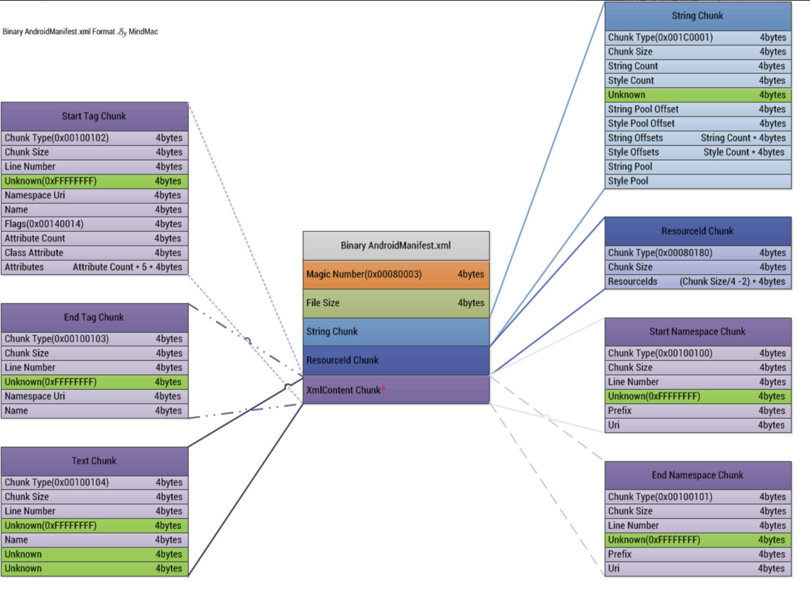
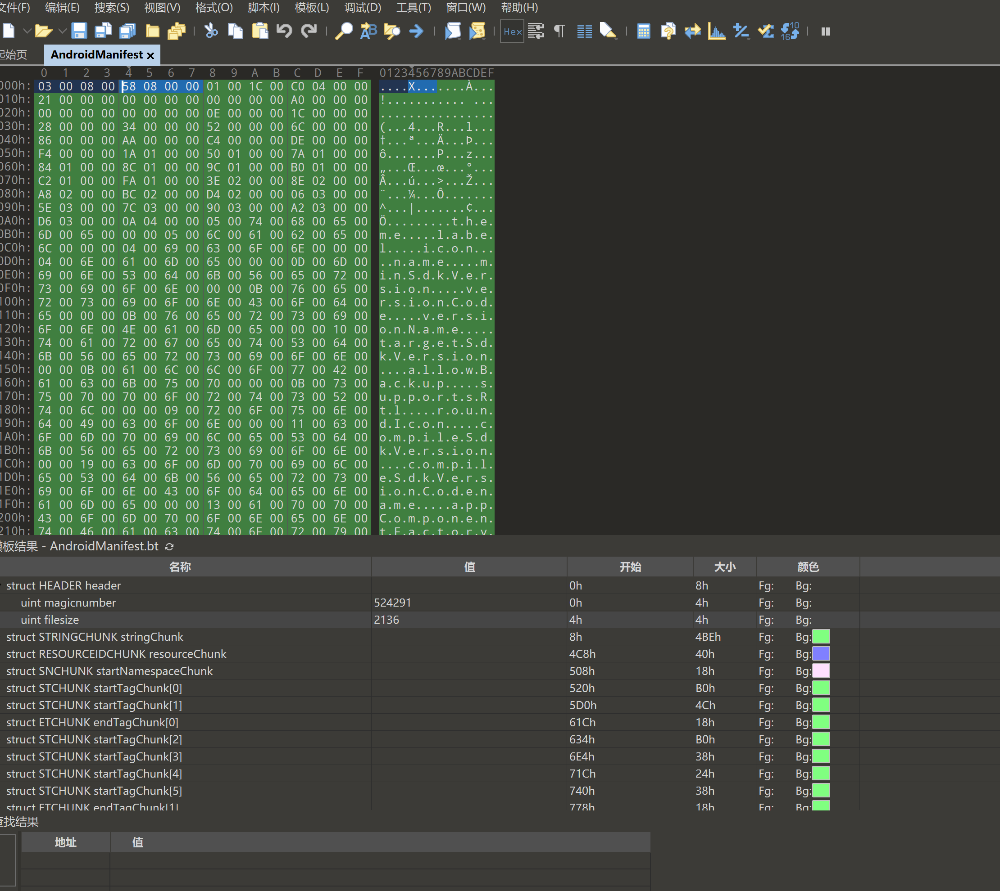
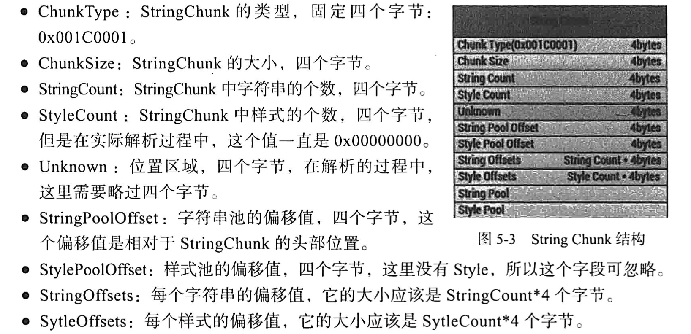

# AndroidManifest.xml文件格式解析

> apktool 工具的工作原理就是解析三个主要文件:
>
> AndroidManifest.xml classes.dex  resources.arsc
>
> https://juejin.cn/post/6844903747169026061

AndroidManifest.xml文件被称为清单文件，它包含了应用的包名，版本号，权限信息，所有的四大组件等信息。

apk中的这个文件已经不是在开发时候的那个xml文件了，他有自己的文件格式

上面是看雪大神的文件格式神图（[原图链接](https://bbs.pediy.com/thread-194206.htm)）

用010打开，然后使用模块可以很快进行解析

