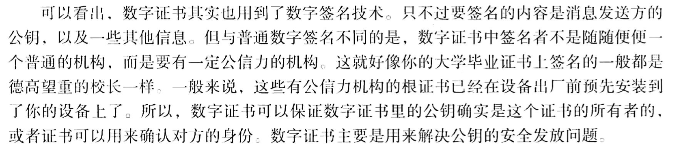
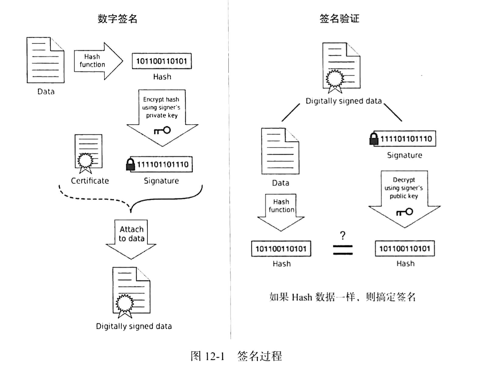

# android中的签名机制

## 基本概念

### 数据摘要

数据摘要是一种算法，对一个数据源进行一种算法操作之后得到的摘要，也叫做数据指纹，比较著名的就是md5和sha-1算法及其大量变体。

### 签名文件和证书文件

这两者是成对出现的，不可分离。

数字签名：

* 对要发送的原始信息提取数据摘要
* 用自己的私钥对数据摘要进行加密

但是数字签名在传输中害怕接收方没拿到真正的公钥，使得接受消息无法进行，这个时候就需要数字证书了。

数字证书一般保护以下内容：

* 证书的发布机构
* 证书的有效期
* 消息发送方的公钥
* 证书所有者
* 数字签名所使用的算法
* 数字签名

### jarsign和signapk工具

jarsign是jdk本身自带的一个工具，它可以对jar进行签名，但是`signapk`是后面专门为了android应用程序apk进行签名的工具，它们的签名算法没什么区别，主要就是签名时使用的文件不一样。

