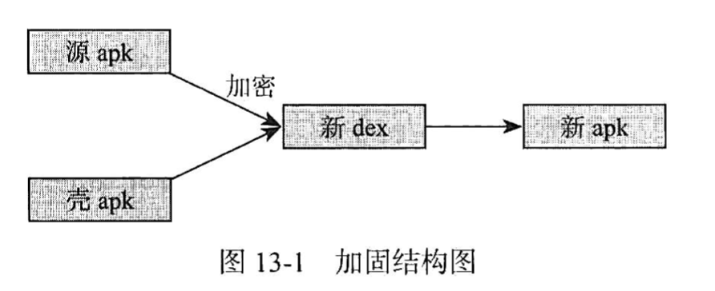

# android应用加固原理

> https://www.jianshu.com/p/4ff48b761ff6
>
> https://juejin.cn/post/6844904176070164488

## 加固原理

加固过程需要三个对象：

* 需要加密的apk （源apk）
* 自己的壳程序 (负责解密apk工作)
* 加密工具 （将源apk进行加密和壳dex合并成新的dex）

### APK文件结构

| 文件或目录          | 说明                                                         |
| ------------------- | ------------------------------------------------------------ |
| assets文件夹        | 存放资源文件的目录                                           |
| lib文件夹           | 存放ndk编译出来的so文件                                      |
| META-INF文件夹      | 1.该目录下存放的是签名信息，用来保证apk包的完整性和系统的安全性 2.CERT.RS   保存着该应用程序的证书和授权信息 3.CERT.SF  保存着SHA-1信息资源列表  4.MANIFEST.MF  清单信息 |
| res文件夹           | 存放资源文件的目录                                           |
| AndroidManifest.xml | 一个清单文件，它描述了应用的名字、版本、权限、注册的服务等信息。 |
| classes.dex         | java源码编译经过编译后生成的dalvik字节码文件，主要在Dalvik虚拟机上运行的主要代码部分 |
| resources.arsc      | 编译后的二进制资源文件。                                     |

dex文件结构：

| 数据名称     |                             解释                             |
| ------------ | :----------------------------------------------------------: |
| dex_header   |             dex文件头部记录整个dex文件的相关属性             |
| string_table |       字符串数据索引，记录了每个字符串在数据区的偏移量       |
| type_table   |           类似数据索引，记录了每个类型的字符串索引           |
| proto_table  | 原型数据索引，记录了方法声明的字符串，返回类型字符串，参数列表 |
| field_table  |          字段数据索引，记录了所属类，类型以及方法名          |
| method_table |    类方法索引，记录方法所属类名，方法声明以及方法名等信息    |
| class_def    | 类定义数据索引，记录指定类各类信息，包括接口，超类，类数据偏移量 |
| data_section |                数据区，保存了各个类的真是数据                |

头部信息如下：

在进行apk加固的时候，我们需要关注上面的三个成员，它们分别是checksum、signature和fileSize。

*  checksum 字段
  * 校验码字段，4byyes，主要用来检察从该字段（不包括checksum字段，也就是从12bytes开始算起）开始到文件末尾，这段数据是否完整，也是完整性校验。它使用alder32算法检验。
* Signature 字段：使用SHA-1签名字段，20bytes，也是做完整性校验。之所以有两个完整性校验字段，是由于使用Checksum字段可以先快速检查出错Dex文件，然后才使用第二个计算量更大的校验码进行计算检查。
* filesize字段
  *   4bytes  保存classes.dex文件总长度。

这三个字段当我们修改Dex文件的时候，这三个字段的值需要更新的，否则在加载到Dalvik虚拟机的时候报错。

### 第一代加密技术

> 感觉书里面写的都落后太多了，先不看了，去论坛什么的看看有无好文。

