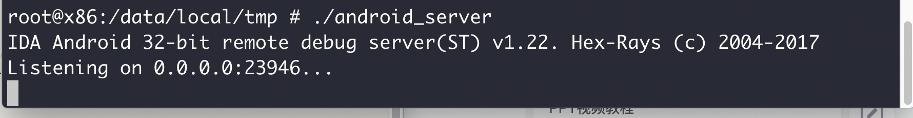
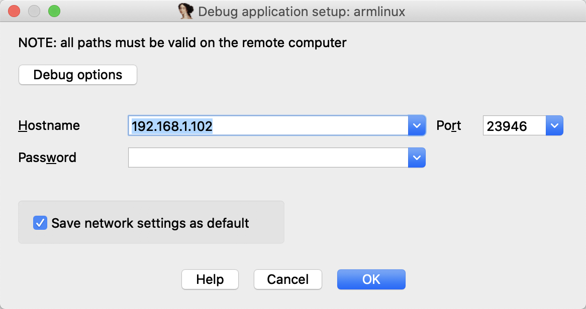
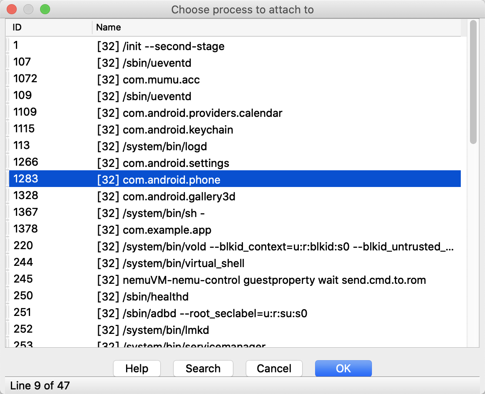

# mac网易mumu调试安卓

## abd如何连接上网易mumu

adb kill-server && adb server && adb shell

这个命令可以帮我们进入模拟器的shell。

> http://mumu.163.com/2017/12/19/25241_730476.html

## adb文件操作：

打开PC机的终端管理器，用adb命令在计算机和设备之间上传/下载文件，将电脑中的apk软件安装至android设备速度非常快。各种命令如下：

1、下载文件
语法：adb pull [文件名] /源路径/
例如：
adb pull blade_keypad.kl /system/usr/keylayout/
adb pull /sdcard/mp3/1.mp3

2、上传文件
语法：adb push [文件名] /目标路径/
例如：
adb push qwerty.kl /system/usr/keylayout/
adb push 1.mp3 /sdcard/mp3/

3、安装程序
语法：adb install -r [/路径/软件名.apk]
例如：adb install -r /App/OpenCV-2.4.9-android-sdk/apk/OpenCV_2.4.9_Manager_2.18_armeabi.apk

## adb语法

Adb devices

这个可以显示电脑上已经连接的安卓设备。

## ida动态调试

将ida中的dbgsrv/目录下的android_server 上传到安卓机的/data/local/tmp/目录下，因为安卓机的这个目录是有读写权限的方便一点。

adb push android_server /data/local/tmp

给androidserver加上可执行权限，然后运行。

这是正常情况，可能有些会出现killed 直接退出的情况，那样的话我们就知道重启安卓设备。

ida连接：

左下角的那个是把当前设置改为默认设置，点不点都可。

然后再模拟器上运行你要调试的app，然后点ok就可。

但是假如你的ida 下面的信息框，显示拒绝连接，那么：

方案一：

关闭ida ， 关闭模拟器，在活动监视器（windows那个进行管理器）中关闭adb进程，重新启动走一遍之前的过程。

方案二：

adb forward tcp:23946 tcp:23946  

进行端口转发

把192.168.1.102（你的ip）改为localhost

方案三：

> https://www.jianshu.com/p/4307cdb4b147

连接成功后：

进程很多，mac可用control + f搜索包名，双击进行调试。