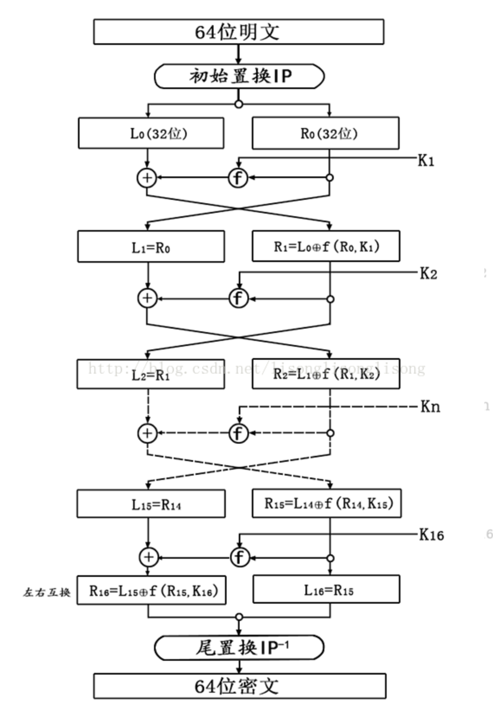

# 常见加密算法剖析实现

> 电码本模式即是对输入明文进行分组加密（通常为64bit）。由于电码本模式对任何分组都是使用同一密钥加密，因此若分组中若有相同的明文组，那么密文中也会出现几个相同的密文组。因此ECB模式特别适合于数据较少的情况，如加密一个密钥。

## AES(EBC模式)电码本模式

~~~c++
#include <iostream>
using namespace std;
//加密编码过程函数,16位1和0
int dataLen = 16;   //需要加密数据的长度
int encLen = 4;     //加密分段的长度
int encTable[4] = {1,0,1,0};  //置换表
int data[16] = {1,0,0,1,0,0,0,1,1,1,1,1,0,0,0,0}; //明文
int ciphertext[16]; //密文

void encode(int arr[]) //切片加密，亦或加密,跟置换表进行亦或
{
    for (int i = 0; i < encLen; ++i) {
        arr[i] = arr[i] ^ encTable[i];
    }
}
void EBC(int arr[])
{
    int a[4][4];
    int dataCount = 0;
    for (int k = 0; k < 4; ++k) { //要加密的数据被分为4组
        for (int t = 0; t < 4; ++t) { //
            a[k][t] = data[dataCount];
            dataCount++;
        }
    }
    dataCount=0; 
    for (int i = 0; i <dataLen; i=i+encLen) {
        int r = i/encLen; //0,1,2,3,
        int l = 0; //列
        int encQue[4];  //数据片段
        for (int j = 0; j <encLen; ++j) { //每一组都轮流放入数据片段
                encQue[j] = a[r][l];
                l++;
        }
        encode(encQue); //每一组都进行加密运算
        for (int p = 0; p < encLen; ++p) {
            ciphertext[dataCount] = encQue[p]; //放置到密文表里面。
            dataCount++;
        }
    }
    cout<<"EBC密文为："<<endl; //输出密文。
    for (int tl = 0; tl < dataLen; ++tl) {
        if(tl!=0&&tl%4==0)
        {
            cout<<endl;
        }
        cout<<ciphertext[tl]<<" ";
    }
    cout<<endl;
    cout<<"----------------------"<<endl;
}
int main() {
    std::cout << "Hello, World!" << std::endl;
    return 0;
}
~~~

可以看到该加密的核心在于置换表和切片加密的加密算反。

> 改方式为对称加密方式，所以其加密算法和解密算法相同。

## DES(EBC模式)电码本模式

> **DES（Data Encryption Standard）是一种用于电子数据加密的对称密钥块加密算法。**它以64bit一组的明文**(Input)**作为算法的输入，通过一系列复杂的操作，输出同样64bit长度的密文**(Output)**。DES 同样采用64位密钥**(Key)**，但由于每8bit中的最后1位用于奇偶校验，实际有效密钥长度为56bit**（\**Tips：输入的Key依然是64bit，只是在映射时不对每个字节最后1位进行处理，所以变为了56bit\**）**。

加密流程：

上图是DES算法的流程图。左侧是算法的工作流程，可以看到：

（1）用64bit的密钥Key产生16个48bit的子密钥； //这个图上没显示

（2）对输入的64bit明文先进行了**Initial Permutation(IP初始置换)**；

（3）将64bit分为左右两部分（各32bit），用16个子密钥辅助进行16轮的F变换；

（4）两部分合成为64bit，进行**Final Permutation(FP最终置换/逆置换)**形成密文输出

而我们可以看到，在（3）中的16轮变换中，都需要右侧图中由密钥(Key)产生的**子密钥(Sub-Key #i)**。因此，我们可以首先来处理**初始置换**部分**和**子密钥算法部分。

~~~c
#include <iostream>
#include <fstream>
#include <bitset>
#include <string>
using namespace std;

bitset<64> key;                // 64位密钥
bitset<48> subKey[16];         // 存放16轮子密钥

// 初始置换表
int IP[] = {58, 50, 42, 34, 26, 18, 10, 2,
            60, 52, 44, 36, 28, 20, 12, 4,
            62, 54, 46, 38, 30, 22, 14, 6,
            64, 56, 48, 40, 32, 24, 16, 8,
            57, 49, 41, 33, 25, 17, 9,  1,
            59, 51, 43, 35, 27, 19, 11, 3,
            61, 53, 45, 37, 29, 21, 13, 5,
            63, 55, 47, 39, 31, 23, 15, 7};

// 结尾置换表
int IP_1[] = {40, 8, 48, 16, 56, 24, 64, 32,
              39, 7, 47, 15, 55, 23, 63, 31,
              38, 6, 46, 14, 54, 22, 62, 30,
              37, 5, 45, 13, 53, 21, 61, 29,
              36, 4, 44, 12, 52, 20, 60, 28,
              35, 3, 43, 11, 51, 19, 59, 27,
              34, 2, 42, 10, 50, 18, 58, 26,
              33, 1, 41,  9, 49, 17, 57, 25};

/*------------------下面是生成密钥所用表-----------------*/

// 密钥置换表，将64位密钥变成56位
int PC_1[] = {57, 49, 41, 33, 25, 17, 9,
              1, 58, 50, 42, 34, 26, 18,
              10,  2, 59, 51, 43, 35, 27,
              19, 11,  3, 60, 52, 44, 36,
              63, 55, 47, 39, 31, 23, 15,
              7, 62, 54, 46, 38, 30, 22,
              14,  6, 61, 53, 45, 37, 29,
              21, 13,  5, 28, 20, 12,  4};

// 压缩置换，将56位密钥压缩成48位子密钥
int PC_2[] = {14, 17, 11, 24,  1,  5,
              3, 28, 15,  6, 21, 10,
              23, 19, 12,  4, 26,  8,
              16,  7, 27, 20, 13,  2,
              41, 52, 31, 37, 47, 55,
              30, 40, 51, 45, 33, 48,
              44, 49, 39, 56, 34, 53,
              46, 42, 50, 36, 29, 32};

// 每轮左移的位数
int shiftBits[] = {1, 1, 2, 2, 2, 2, 2, 2, 1, 2, 2, 2, 2, 2, 2, 1};

/*------------------下面是密码函数 f 所用表-----------------*/

// 扩展置换表，将 32位 扩展至 48位
int E[] = {32,  1,  2,  3,  4,  5,
           4,  5,  6,  7,  8,  9,
           8,  9, 10, 11, 12, 13,
           12, 13, 14, 15, 16, 17,
           16, 17, 18, 19, 20, 21,
           20, 21, 22, 23, 24, 25,
           24, 25, 26, 27, 28, 29,
           28, 29, 30, 31, 32,  1};

// S盒，每个S盒是4x16的置换表，6位 -> 4位
int S_BOX[8][4][16] = {
        {
                {14,4,13,1,2,15,11,8,3,10,6,12,5,9,0,7},
                {0,15,7,4,14,2,13,1,10,6,12,11,9,5,3,8},
                {4,1,14,8,13,6,2,11,15,12,9,7,3,10,5,0},
                {15,12,8,2,4,9,1,7,5,11,3,14,10,0,6,13}
        },
        {
                {15,1,8,14,6,11,3,4,9,7,2,13,12,0,5,10},
                {3,13,4,7,15,2,8,14,12,0,1,10,6,9,11,5},
                {0,14,7,11,10,4,13,1,5,8,12,6,9,3,2,15},
                {13,8,10,1,3,15,4,2,11,6,7,12,0,5,14,9}
        },

        {
                {10,0,9,14,6,3,15,5,1,13,12,7,11,4,2,8},
                {13,7,0,9,3,4,6,10,2,8,5,14,12,11,15,1},
                {13,6,4,9,8,15,3,0,11,1,2,12,5,10,14,7},
                {1,10,13,0,6,9,8,7,4,15,14,3,11,5,2,12}
        },
        {
                {7,13,14,3,0,6,9,10,1,2,8,5,11,12,4,15},
                {13,8,11,5,6,15,0,3,4,7,2,12,1,10,14,9},
                {10,6,9,0,12,11,7,13,15,1,3,14,5,2,8,4},
                {3,15,0,6,10,1,13,8,9,4,5,11,12,7,2,14}
        },
        {
                {2,12,4,1,7,10,11,6,8,5,3,15,13,0,14,9},
                {14,11,2,12,4,7,13,1,5,0,15,10,3,9,8,6},
                {4,2,1,11,10,13,7,8,15,9,12,5,6,3,0,14},
                {11,8,12,7,1,14,2,13,6,15,0,9,10,4,5,3}
        },
        {
                {12,1,10,15,9,2,6,8,0,13,3,4,14,7,5,11},
                {10,15,4,2,7,12,9,5,6,1,13,14,0,11,3,8},
                {9,14,15,5,2,8,12,3,7,0,4,10,1,13,11,6},
                {4,3,2,12,9,5,15,10,11,14,1,7,6,0,8,13}
        },
        {
                {4,11,2,14,15,0,8,13,3,12,9,7,5,10,6,1},
                {13,0,11,7,4,9,1,10,14,3,5,12,2,15,8,6},
                {1,4,11,13,12,3,7,14,10,15,6,8,0,5,9,2},
                {6,11,13,8,1,4,10,7,9,5,0,15,14,2,3,12}
        },
        {
                {13,2,8,4,6,15,11,1,10,9,3,14,5,0,12,7},
                {1,15,13,8,10,3,7,4,12,5,6,11,0,14,9,2},
                {7,11,4,1,9,12,14,2,0,6,10,13,15,3,5,8},
                {2,1,14,7,4,10,8,13,15,12,9,0,3,5,6,11}
        }
};
int P[] = {16,  7, 20, 21,
           29, 12, 28, 17,
           1, 15, 23, 26,
           5, 18, 31, 10,
           2,  8, 24, 14,
           32, 27,  3,  9,
           19, 13, 30,  6,
           22, 11,  4, 25 };

/**********************************************************************/
/*                                                                    */
/*                            下面是DES算法实现                         */
/*                                                                    */
/**********************************************************************/

/**
 *  密码函数f，接收32位数据和48位子密钥，产生一个32位的输出
 */
bitset<32> f(bitset<32> R, bitset<48> k) //32位数据和48位子密钥
{
    bitset<48> expandR;
    // 第一步：扩展置换，32 -> 48
    for(int i=0; i<48; ++i)  //这里是根据表进行置换
        expandR[47-i] = R[32-E[i]];
    // 第二步：异或
    expandR = expandR ^ k; // 和子密钥进行异或
    // 第三步：查找S_BOX置换表
    bitset<32> output;
    int x = 0;
    for(int i=0; i<48; i=i+6) //分成8个6位的块
    {
        int row = expandR[47-i]*2 + expandR[47-i-5]; //行
        int col = expandR[47-i-1]*8 + expandR[47-i-2]*4 + expandR[47-i-3]*2 + expandR[47-i-4]; //列
        int num = S_BOX[i/6][row][col]; //找到对应的二进制数
        bitset<4> binary(num); //该整数转换为一个二进制数
        output[31-x] = binary[3];
        output[31-x-1] = binary[2];
        output[31-x-2] = binary[1];
        output[31-x-3] = binary[0]; //得到一个32位的结果数据
        x += 4;
    }
    bitset<32> tmp = output;   
    for(int i=0; i<32; ++i) //p-置换
        output[31-i] = tmp[32-P[i]];
    return output;
}

/**
 *  对56位密钥的前后部分进行左移
 */
bitset<28> leftShift(bitset<28> k, int shift)
{
    bitset<28> tmp = k;
    for(int i=27; i>=0; --i)
    {
        if(i-shift<0)
            k[i] = tmp[i-shift+28];
        else
            k[i] = tmp[i-shift];
    }
    return k;
}
void generateKeys()//密钥的产生
{
    bitset<56> realKey;
    bitset<28> left;
    bitset<28> right;
    bitset<48> compressKey;
    // 去掉奇偶标记位，将64位密钥变成56位
    for (int i=0; i<56; ++i)
        realKey[55-i] = key[64 - PC_1[i]]; //进行置换操作
    // 生成子密钥，保存在 subKeys[16] 中
    for(int round=0; round<16; ++round)
    {
        // 前28位与后28位
        for(int i=28; i<56; ++i) //分成两组28位
            left[i-28] = realKey[i];
        for(int i=0; i<28; ++i)
            right[i] = realKey[i];
        // 左移
        left = leftShift(left, shiftBits[round]);
        right = leftShift(right, shiftBits[round]);
        // 压缩置换，由56位得到48位子密钥
        for(int i=28; i<56; ++i)
            realKey[i] = left[i-28];
        for(int i=0; i<28; ++i)
            realKey[i] = right[i];
        for(int i=0; i<48; ++i)
            compressKey[47-i] = realKey[56 - PC_2[i]];
        subKey[round] = compressKey;
    }
}
/**
 *  工具函数：将char字符数组转为二进制
 */
bitset<64> charToBitset(const char s[8])
{
    bitset<64> bits;
    for(int i=0; i<8; ++i)
        for(int j=0; j<8; ++j)
            bits[i*8+j] = ((s[i]>>j) & 1);
    return bits;
}

/**
 *  DES加密
 */
bitset<64> encrypt(bitset<64>& plain)
{
    bitset<64> cipher;
    bitset<64> currentBits;
    bitset<32> left;
    bitset<32> right;
    bitset<32> newLeft;
    // 第一步：初始置换IP
    for(int i=0; i<64; ++i)
        currentBits[63-i] = plain[64-IP[i]];
    // 第二步：获取 Li 和 Ri
    for(int i=32; i<64; ++i)
        left[i-32] = currentBits[i];
    for(int i=0; i<32; ++i)
        right[i] = currentBits[i];
    // 第三步：共16轮迭代
    for(int round=0; round<16; ++round)
    {
        newLeft = right;
        right = left ^ f(right,subKey[round]);
        left = newLeft;
    }
    // 第四步：合并L16和R16，注意合并为 R16L16
    for(int i=0; i<32; ++i)
        cipher[i] = left[i];
    for(int i=32; i<64; ++i)
        cipher[i] = right[i-32];
    // 第五步：结尾置换IP-1
    currentBits = cipher;
    for(int i=0; i<64; ++i)
        cipher[63-i] = currentBits[64-IP_1[i]];
    // 返回密文
    return cipher;
}

/**
 *  DES解密
 */
bitset<64> decrypt(bitset<64>& cipher)
{
    bitset<64> plain;
    bitset<64> currentBits;
    bitset<32> left;
    bitset<32> right;
    bitset<32> newLeft;
    // 第一步：初始置换IP
    for(int i=0; i<64; ++i)
        currentBits[63-i] = cipher[64-IP[i]];
    // 第二步：获取 Li 和 Ri
    for(int i=32; i<64; ++i)
        left[i-32] = currentBits[i];
    for(int i=0; i<32; ++i)
        right[i] = currentBits[i];
    // 第三步：共16轮迭代（子密钥逆序应用）
    for(int round=0; round<16; ++round)
    {
        newLeft = right;
        right = left ^ f(right,subKey[15-round]);
        left = newLeft;
    }
    // 第四步：合并L16和R16，注意合并为 R16L16
    for(int i=0; i<32; ++i)
        plain[i] = left[i];
    for(int i=32; i<64; ++i)
        plain[i] = right[i-32];
    // 第五步：结尾置换IP-1
    currentBits = plain;
    for(int i=0; i<64; ++i)
        plain[63-i] = currentBits[64-IP_1[i]];
    // 返回明文
    return plain;
}
/**********************************************************************/
/* 测试：                                                             */
/*     1.将一个 64 位的字符串加密， 把密文写入文件 a.txt                  */
/*     2.读取文件 a.txt 获得 64 位密文，解密之后再写入 b.txt              */
/**********************************************************************/

int main() {
    string s = "romantic";
    string k = "12345678";
    bitset<64> plain = charToBitset(s.c_str());
    key = charToBitset(k.c_str());
    // 生成16个子密钥
    generateKeys();
    // 密文写入 a.txt
    bitset<64> cipher = encrypt(plain);
    fstream file1;
    file1.open("D://a.txt", ios::binary | ios::out);
    file1.write((char*)&cipher,sizeof(cipher));
    file1.close();

    // 读文件 a.txt
    bitset<64> temp;
    file1.open("D://a.txt", ios::binary | ios::in);
    file1.read((char*)&temp, sizeof(temp));
    file1.close();

    // 解密，并写入文件 b.txt
    bitset<64> temp_plain = decrypt(temp);
    file1.open("D://b.txt", ios::binary | ios::out);
    file1.write((char*)&temp_plain,sizeof(temp_plain));
    file1.close();

    return 0;
}
~~~

>  https://blog.csdn.net/lisonglisonglisong/article/details/41777413

## bass64

实现过好多次了。

## rc4

Rc4.cpp

~~~c
#include "rc4.h"
#include <iostream>
using namespace std;
RC4::RC4()
{
    m_index_i = 0;
    m_index_j = 0;
}

// 初始化算法
void RC4::rc4_init(unsigned char *key, unsigned long Len)
{
    if (key == NULL || Len == 0)
    {
        printf("rc4 key or len is 0, return! ");
        return ;
    }

    // for循环将0到255的互不重复的元素装入S盒
    for (int i = 0; i < 256 ; i++) {
        m_box[i] = i;
    }

    // for循环根据密钥打乱S盒
    int j = 0;
    unsigned char tmp;
    for (int i = 0; i < 256; i++)
    {
        j = ( j + m_box[i] + key[i % Len] ) % 256;

        tmp = m_box[i];
        m_box[i] = m_box[j]; //交换m_box[i]和m_box[j]
        m_box[j] = tmp;
    }
}

void RC4::do_crypt(unsigned char *Data, unsigned long Len)
{
    // 每收到一个字节，就进行while循环。通过一定的算法（(a),(b)）定位S盒中的一个元素，并与输入字节异或，得到k。循环中还改变了S盒（(c)）。如果输入的是明文，输出的就是密文；如果输入的是密文，输出的就是明文。
    unsigned char tmp;
    for(unsigned long k = 0 ; k < Len ; k++)
    {
        m_index_i = (m_index_i + 1) % 256;    // a
        m_index_j = (m_index_j + m_box[m_index_i] ) % 256; // b

        tmp = m_box[m_index_i];
        m_box[m_index_i] = m_box[m_index_j]; //交换m_box[x]和m_box[y]
        m_box[m_index_j] = tmp;

        // 生成伪随机数
        int r = ( m_box[m_index_i] + m_box[m_index_j] ) % 256;
        Data[k] ^= m_box[r];
    }

}
~~~

Rc4.h

~~~c
//
// Created by clock on 2020/9/18.
//

#ifndef RC4_RC4_H
#define RC4_RC4_H
class RC4
{

public:
    RC4();

    void rc4_init(unsigned char *key, unsigned long Len);

    // 加/解 密
    void do_crypt(unsigned char *Data, unsigned long Len);

private:

    int m_box[256]; // 对称加密中的置换盒 S盒
    int m_index_i;
    int m_index_j;
};
#endif //RC4_RC4_H
~~~

算法重点：

​	生成S盒，for循环通过密钥是的s盒被打乱，所以生成状态向量S(256个字节)就是一个很重要的识别点。

 1、密钥流：RC4算法的关键是根据明文和密钥生成相应的密钥流，密钥流的长度和明文的长度是对应的，也就是说明文的长度是500字节，那么密钥流也是500字节。当然，加密生成的密文也是500字节，因为密文第i字节=明文第i字节^密钥流第i字节；

​    2、状态向量S：长度为256，S[0],S[1].....S[255]。每个单元都是一个字节，算法运行的任何时候，S都包括0-255的8比特数的排列组合，只不过值的位置发生了变换；

​    3、临时向量T：长度也为256，每个单元也是一个字节。如果密钥的长度是256字节，就直接把密钥的值赋给T，否则，轮转地将密钥的每个字节赋给T；

​    4、密钥K：长度为1-256字节，注意密钥的长度keylen与明文长度、密钥流的长度没有必然关系，通常密钥的长度趣味16字节（128比特）。

> https://ctf-wiki.github.io/ctf-wiki/reverse/Identify-Encode-Encryption/introduction-zh/

## SM4

> 实现过了。。。

